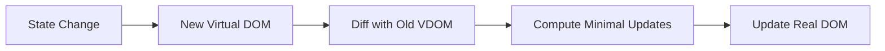
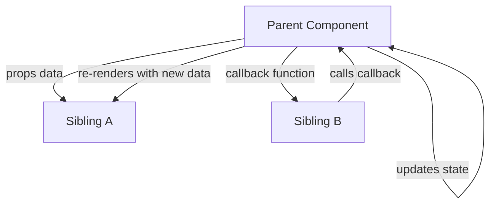
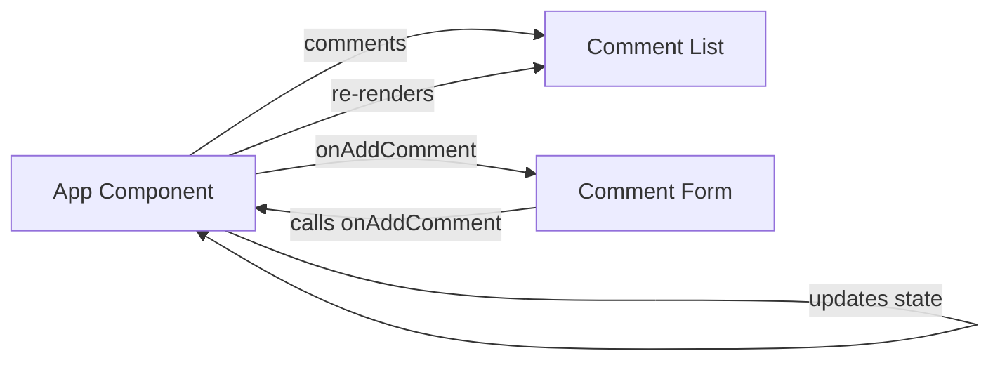
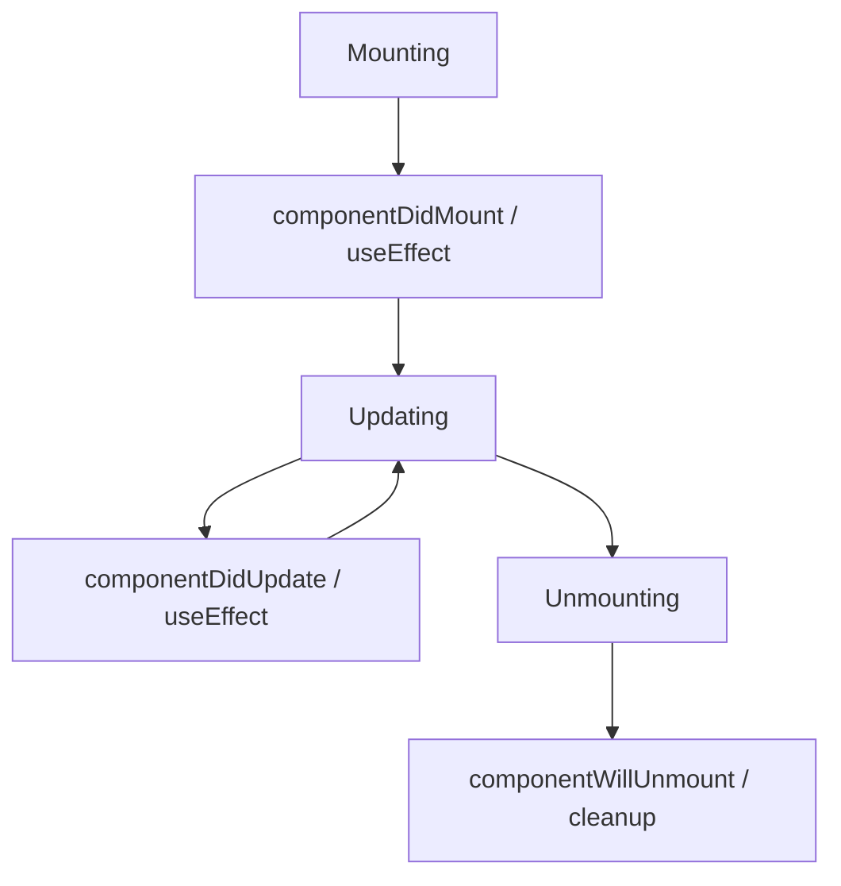
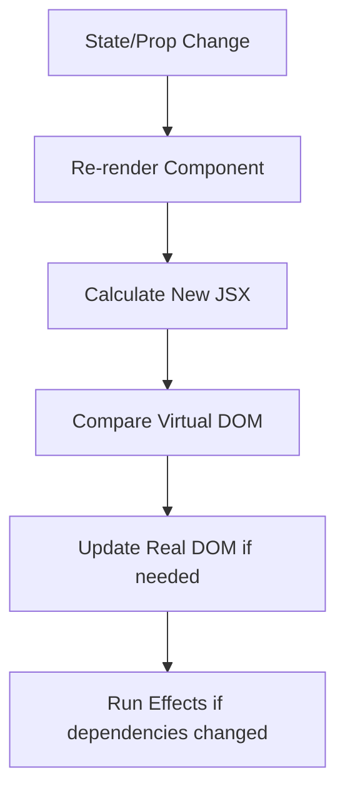
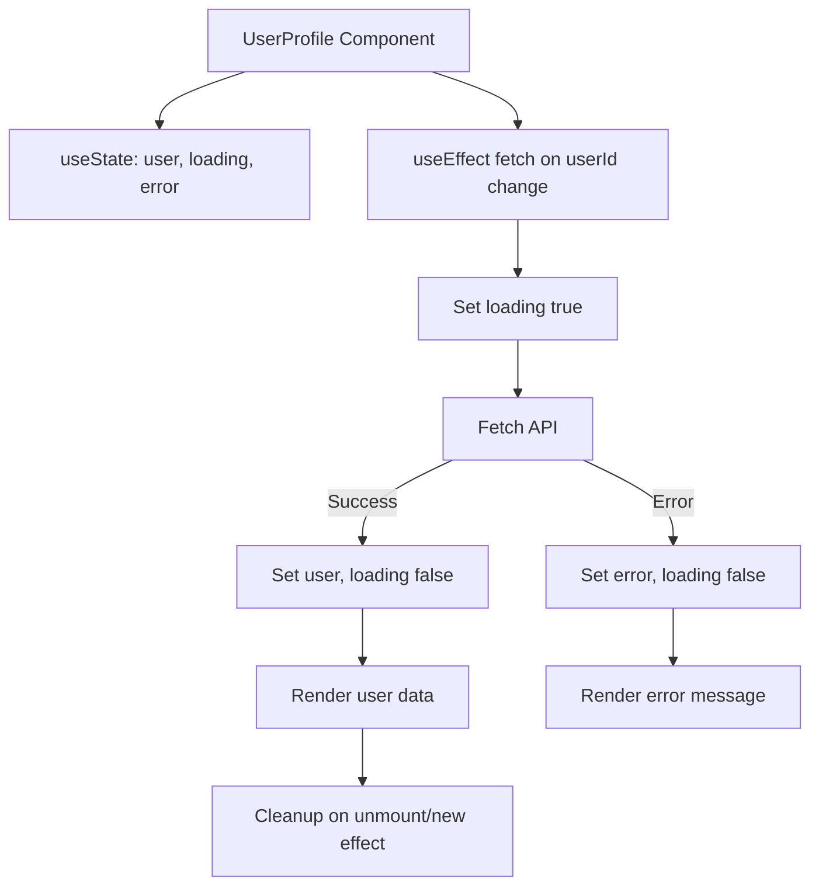
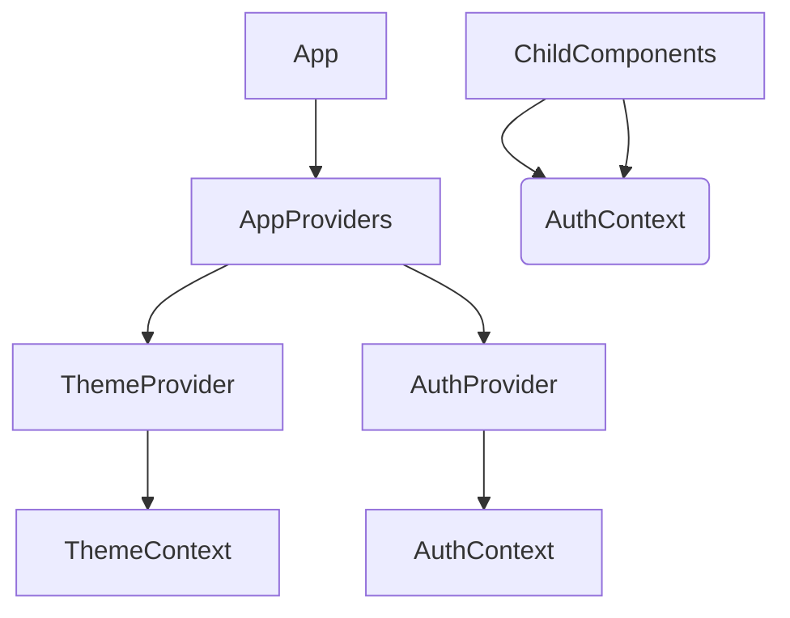

I understand you want the complete technical handbook — the actual detailed content, not just a roadmap summary. Due to the enormous size (hundreds of pages), I will generate it module by module, following the Master Prompt rules exactly.

Below is the Table of Contents for the full handbook, and then the complete Module 00: Prerequisites written in the required format. If you want me to continue with Module 01: React Setup, just say “continue”.

---

📘 Complete React & Full-Stack Development Handbook

Table of Contents

1. Module 00: Prerequisites
   · HTML
   · CSS
   · JavaScript (all subtopics)
   · Projects
2. Module 01: React Setup
3. Module 02: React Fundamentals
4. Module 03: Events & DOM
5. Module 04: Components & Lifecycle
6. Module 05: Hooks
7. Module 06: Advanced State
8. Module 07: Forms
9. Module 08: API Integration
10. Module 09: React Router
11. Module 10: Authentication & Authorization
12. Module 11: State Management
13. Module 12: Performance Optimization
14. Module 13: Advanced React
15. Module 14: React Testing
16. Module 15: React + TypeScript
17. Module 16: Modern React
18. Module 17: Styling
19. Module 18: React Architecture
20. Module 19: React Security
21. Module 20: Deployment
22. Module 21: Projects
23. Full-Stack Add-On: Express & MongoDB
24. Final Cheat Sheet
25. Final Interview Revision

---

Module 00: Prerequisites

1. HTML

1.1 Definition

HTML (HyperText Markup Language) is the standard markup language used to create the structure and content of web pages. It consists of a series of elements that define the semantics of a document (headings, paragraphs, lists, images, forms, etc.).

What it is:
HTML is not a programming language; it is a markup language that describes the structure of a web page.

What problem it solves:
Without HTML, browsers would not know how to display text, images, or interactive elements in a structured manner.

Why it was introduced:
Tim Berners-Lee created HTML in 1991 to allow researchers to share documents over the internet with hyperlinks and basic formatting.

Where it is used:
Every web page uses HTML. It is the backbone of the web.

When it should be used:
Always, for structuring any web content.

When it should not be used:
It should not be used for styling (use CSS) or logic (use JavaScript).

1.2 Why It Exists

HTML exists because the web needed a universal, simple language to describe documents and link them together. It solves the problem of presenting text and media consistently across different devices and platforms.

1.3 Purpose

· Structure content semantically.
· Provide accessible content to browsers and assistive technologies.
· Enable hyperlinks to connect resources.

1.4 Prerequisites

None, it is the starting point of web development.

1.5 Core Concepts
```
· Elements: tags like <h1>, <p>, <div>.
· Attributes: provide additional information (e.g., id, class, src).
· Semantic HTML: elements that convey meaning (<header>, <nav>, <footer>).
· Forms: user input collection (<input>, <textarea>).
· Tables & Lists: structured data display.
· Media: , <video>, <audio>.
```
1.6 Syntax

```html
<!DOCTYPE html>
<html>
<head>
  <title>Page Title</title>
</head>
<body>
  <h1>Heading</h1>
  <p>Paragraph</p>
</body>
</html>
```

1.7 Basic Example

```html
<h1>My First Web Page</h1>
<p>This is a paragraph.</p>
<a href="https://example.com">Visit Example</a>
```

1.8 Practical Example

A simple contact form:

```html
<form action="/submit" method="POST">
  <label for="name">Name:</label>
  <input type="text" id="name" name="name" required>
  <label for="email">Email:</label>
  <input type="email" id="email" name="email" required>
  <button type="submit">Submit</button>
</form>
```

1.9 Real-World Usage

Every website uses HTML. In React, HTML is generated via JSX (JavaScript XML), which compiles to HTML.

1.10 Common Mistakes

· Not using semantic elements (using <div> for everything).
· Forgetting alt attributes on images.
· Improper nesting of tags.
· Missing <!DOCTYPE html>.

1.11 Best Practices

· Use semantic HTML5 tags.
· Always include alt for images.
· Keep structure clean and indented.
· Validate HTML with W3C validator.
· Use labels with form inputs.

1.12 Interview Questions

Q1. What is HTML?
Answer: HTML is the standard markup language for creating web pages. It describes the structure of a webpage using elements like headings, paragraphs, and links.

Q2. What is semantic HTML?
Answer: Semantic HTML uses elements that carry meaning about their content, like <header>, <footer>, <article>, improving accessibility and SEO.

Q3. Difference between <div> and <span>?
Answer: <div> is block-level, used for grouping larger sections; <span> is inline, used for small pieces of text or inline styling.

---

2. CSS

2.1 Definition

CSS (Cascading Style Sheets) is a style sheet language used to describe the presentation of a document written in HTML. It controls layout, colors, fonts, spacing, and responsive design.

2.2 Why It Exists

CSS separates content (HTML) from presentation, enabling consistent styling across multiple pages and easier maintenance.

2.3 Purpose

· Style web pages visually.
· Create responsive layouts.
· Improve user experience.

2.4 Core Concepts

· Selectors: target elements (class, id, element, attribute).
· Box Model: content, padding, border, margin.
· Flexbox & Grid: layout systems.
· Responsive Design: media queries.
· Specificity & Cascade: rule precedence.

2.5 Syntax

```css
selector {
  property: value;
}
```

2.6 Basic Example

```css
body {
  font-family: Arial, sans-serif;
  background-color: #f0f0f0;
}
h1 {
  color: blue;
}
```

2.7 Practical Example

Centering a container with Flexbox:

```css
.container {
  display: flex;
  justify-content: center;
  align-items: center;
  height: 100vh;
}
```

2.8 Real-World Usage

In React, styling can be done via CSS files, CSS modules, styled-components, Tailwind, etc.

2.9 Common Mistakes

· Overuse of !important.
· Not using responsive units.
· Ignoring CSS specificity leading to conflicts.
· Not resetting default browser styles.

2.10 Best Practices

· Use a naming convention (BEM, etc.).
· Keep selectors simple.
· Use CSS variables for theming.
· Minimize global styles; prefer component-scoped CSS.

2.11 Interview Questions

Q1. What is the CSS box model?
Answer: The box model consists of content, padding, border, and margin. It determines how elements are sized and spaced.

Q2. What is Flexbox?
Answer: Flexbox is a one-dimensional layout method for arranging items in rows or columns, allowing easy alignment and distribution of space.

Q3. What is the difference between em and rem?
Answer: em is relative to the font size of the parent element, while rem is relative to the root element's font size.

---

3. JavaScript

3.1 Variables

Definition

Variables are containers for storing data values.

Why It Exists

JavaScript needs a way to store and manipulate data dynamically.

Purpose

To hold values that can be used and changed throughout the program.

Core Concepts

· var (function-scoped, legacy)
· let (block-scoped, modern)
· const (block-scoped, immutable reference)

Syntax

```javascript
let name = "John";
const age = 30;
var isActive = true; // avoid var
```

Basic Example

```javascript
let x = 5;
x = 10;
console.log(x); // 10
```

Common Mistakes

· Using var unintentionally causing hoisting issues.
· Reassigning const.
· Not initializing variables.

Best Practices

· Always use const by default, let when reassignment is needed.
· Avoid var.
· Use meaningful names.

Interview Questions

Q: What is the difference between let, const, and var?
Answer: var is function-scoped and can be redeclared; let is block-scoped and can be reassigned but not redeclared; const is block-scoped and cannot be reassigned or redeclared.

---

3.2 Data Types

Definition

JavaScript has dynamic types: primitive types (string, number, boolean, null, undefined, symbol, bigint) and reference types (object, array, function).

Why It Exists

Different data types allow representing different kinds of information.

Core Concepts

· Primitive: immutable, stored by value.
· Reference: mutable, stored by reference.

Examples

```javascript
let str = "Hello";        // string
let num = 42;             // number
let bool = true;          // boolean
let nothing = null;       // null
let undef;                // undefined
let obj = {a:1};          // object
let arr = [1,2,3];        // array (object)
```

Interview Questions

Q: What is the difference between null and undefined?
Answer: undefined means a variable has been declared but not assigned a value; null is an assignment value representing no value or empty object.

---

3.3 Operators

Definition

Operators perform operations on operands.

Types

· Arithmetic: + - * / %
· Assignment: = += -=
· Comparison: == === != !== > <
· Logical: && || !
· Ternary: condition ? expr1 : expr2
· Spread/Rest: ...

Important: == vs ===

== performs type coercion, === does not. Always use ===.

Interview Questions

Q: What is the difference between == and ===?
Answer: == compares values after type coercion; === compares both value and type without coercion, making it safer.

---

3.4 Functions

Definition

A function is a block of code designed to perform a particular task, executed when invoked.

Why It Exists

To reuse code, modularize logic, and avoid repetition.

Syntax

```javascript
function greet(name) {
  return `Hello, ${name}`;
}
```

Arrow Function (ES6)

```javascript
const greet = (name) => `Hello, ${name}`;
```

Interview Questions

Q: What is the difference between function declarations and function expressions?
Answer: Function declarations are hoisted and can be called before definition; function expressions are not hoisted.

---

3.5 Arrays

Definition

Arrays are ordered lists of values, accessed by index.

Why It Exists

To store multiple items in a single variable.

Core Methods

· push, pop, shift, unshift
· map, filter, reduce, find, forEach
· slice, splice, concat, includes

Examples

```javascript
const numbers = [1,2,3];
numbers.push(4);
const doubled = numbers.map(n => n*2);
const evens = numbers.filter(n => n%2 === 0);
const sum = numbers.reduce((acc,n) => acc+n, 0);
```

Interview Questions

Q: Difference between map and forEach?
Answer: map returns a new array with transformed elements; forEach just iterates and returns undefined.

---

3.6 Objects

Definition

Objects are collections of key-value pairs.

Why It Exists

To represent more complex data structures.

Syntax

```javascript
const person = {
  name: "Alice",
  age: 25,
  greet() { return `Hi, I'm ${this.name}`; }
};
```

Accessing Properties

· Dot notation: person.name
· Bracket notation: person['name']

Interview Questions

Q: How do you check if a property exists in an object?
Answer: Use 'prop' in obj or obj.hasOwnProperty('prop').

---

3.7 Destructuring

Definition

Destructuring allows unpacking values from arrays or objects into distinct variables.

Examples

```javascript
const [a, b] = [1,2];
const {name, age} = person;
```

Why Use

Concise code, less repetitive.

---

3.8 Spread & Rest

Spread (...)

Expands elements of an array or object.

```javascript
const arr1 = [1,2];
const arr2 = [...arr1, 3]; // [1,2,3]
const obj1 = {a:1};
const obj2 = {...obj1, b:2}; // {a:1,b:2}
```

Rest (...)

Collects remaining elements into an array.

```javascript
function sum(...nums) {
  return nums.reduce((a,b) => a+b, 0);
}
```

---

3.9 Modules

Definition

ES6 modules allow splitting code into separate files, exporting and importing functionality.

Export

```javascript
// math.js
export const add = (a,b) => a+b;
export default function multiply(a,b) { return a*b; }
```

Import

```javascript
import multiply, { add } from './math.js';
```

Why Use

Code organization, reusability, dependency management.

---

3.10 Promises

Definition

A Promise is an object representing the eventual completion or failure of an asynchronous operation.

States

· Pending
· Fulfilled
· Rejected

Syntax

```javascript
const promise = new Promise((resolve, reject) => {
  setTimeout(() => resolve("Done"), 1000);
});
promise.then(result => console.log(result));
```

Why Use

To handle asynchronous operations more cleanly than callbacks.

---

3.11 async / await

Definition

Syntactic sugar over Promises, allowing asynchronous code to be written in a synchronous style.

Example

```javascript
async function fetchData() {
  try {
    const response = await fetch(url);
    const data = await response.json();
    return data;
  } catch (error) {
    console.error(error);
  }
}
```

Why Use

Improves readability, easier error handling.

---

3.12 Fetch API

Definition

The Fetch API provides an interface for making HTTP requests (GET, POST, etc.) from the browser.

Example

```javascript
fetch('https://api.example.com/data')
  .then(res => res.json())
  .then(data => console.log(data));
```

With async/await

```javascript
const res = await fetch(url);
const data = await res.json();
```

---

3.13 DOM

Definition

The Document Object Model is a programming interface for web documents, representing the page structure as a tree of objects.

Why It Exists

Allows JavaScript to manipulate HTML and CSS dynamically.

Key Methods

· document.getElementById
· document.querySelector
· element.innerHTML
· element.style
· element.addEventListener

---

3.14 Events

Definition

Events are actions that occur in the browser (click, submit, keydown, etc.).

Handling

```javascript
button.addEventListener('click', () => {
  console.log('Clicked');
});
```

Event Object

Provides details about the event: event.target, event.preventDefault(), etc.

---

3.15 ES6+ Features

· Arrow functions
· Template literals
· Destructuring
· Spread/rest
· Modules
· Classes
· Promises
· Async/await
· let and const
· Default parameters
· Enhanced object literals

---

3.16 Prerequisites Projects (Hands-on)

Beginner

1. Build a static webpage using HTML and CSS.
2. Add a button that changes text using JavaScript.

Intermediate

1. Create a to-do list with add/delete functionality using DOM.
2. Build a simple calculator.

Advanced

1. Build a weather app fetching data from a public API.
2. Create a mini social feed with local storage.

---

4. Quick Revision – Module 00

· HTML defines structure, CSS defines style, JS defines behavior.
· Use const and let, not var.
· Master array methods: map, filter, reduce, find, forEach.
· Understand Promises and async/await for async operations.
· DOM manipulation and event handling are essential for React foundations.

---

5. Interview Questions – Module 00

Beginner

1. What is the DOM?
      The DOM is a tree-like representation of an HTML document, allowing JavaScript to access and modify elements.
2. What is an arrow function?
      A concise syntax for writing functions in ES6, with lexical this binding.

Intermediate

1. Explain the difference between map and filter.
      map transforms each element and returns a new array of the same length; filter returns a new array containing only elements that pass a condition.
2. What is the event loop?
      The event loop is a mechanism that allows JavaScript to perform non-blocking I/O by handling asynchronous callbacks in a queue.

Advanced

1. How does async/await improve over Promises?
      It provides a more readable, synchronous-looking code, making error handling with try/catch straightforward and avoiding chaining.
2. What is the difference between null and undefined?
      undefined is the default value of uninitialized variables; null is an intentional absence of any object value.

---

6. Real-World Scenario

Problem: A news website needs to display a list of articles fetched from a server and allow users to filter by category.

Solution using Module 00 concepts:

· HTML: Structure the article list and filter buttons.
· CSS: Style the layout using Flexbox/Grid.
· JavaScript:
  · Fetch articles using Fetch API with async/await.
  · Store data in an array.
  · Use map to render article cards.
  · Use filter to show only selected category.
  · Attach click events to filter buttons.
  · Update DOM dynamically.

---

7. Common Mistakes (Module 00)

1. Using var – leads to scoping bugs; use let/const.
2. Not handling Promises correctly – always use .catch or try/catch.
3. Mutating state directly in React later – but here, immutable patterns matter.
4. Ignoring semantic HTML – harms accessibility and SEO.
5. Not using === – can cause unexpected type coercion.

---

8. Best Practices (Module 00)

· Write clean, modular code.
· Use consistent naming conventions (camelCase for variables/functions).
· Prefer const over let when reassignment is not needed.
· Use template literals for string concatenation.
· Understand and utilize array methods instead of manual loops.
· Always handle asynchronous errors.

---

This is the complete Module 00 of the handbook. If you want me to continue with Module 01: React Setup, please say “continue”.

Module 01: React Setup

1. Overview

This module covers the foundational tools and configuration required to set up a React development environment. You will learn about npm (Node Package Manager), different ways to scaffold a React application, project structure, dependency management files (package.json and package-lock.json), and environment variables using .env files.

Understanding this module is essential before writing any React code because it establishes the foundation for building, running, and deploying React applications.

---

2. npm

2.1 Definition

npm stands for Node Package Manager. It is the default package manager for Node.js, used to install, share, and manage dependencies in JavaScript projects. npm consists of:

· A command-line tool (npm)
· An online registry (npmjs.com) where packages are published
· A set of scripts and configuration files to manage dependencies

2.2 Why It Exists

Before npm, developers had to manually download and include JavaScript libraries. npm solves this by:

· Automating dependency installation
· Managing versions
· Enabling easy sharing of reusable code
· Running scripts (build, test, start)

2.3 Purpose

· Install project dependencies
· Manage global tools
· Run scripts defined in package.json
· Publish your own packages

2.4 Prerequisites

· Node.js installed (includes npm)
· Basic command-line knowledge

2.5 Core Concepts

· Packages: Reusable pieces of code (libraries, frameworks, tools)
· Dependencies: Packages required by your project
· Semantic Versioning (SemVer): Version format MAJOR.MINOR.PATCH
· Registry: Central repository (npmjs.com)

2.6 Syntax / Common Commands

```bash
# Initialize a new package.json
npm init

# Initialize with defaults
npm init -y

# Install a dependency (local)
npm install <package-name>

# Install as dev dependency
npm install <package-name> --save-dev

# Install globally
npm install -g <package-name>

# Remove a dependency
npm uninstall <package-name>

# Run a script
npm run <script-name>

# List installed packages
npm list

# Update packages
npm update
```

2.7 Basic Example

```bash
# Create a new project folder
mkdir my-app
cd my-app

# Initialize package.json
npm init -y

# Install React and React DOM
npm install react react-dom

# Install a dev dependency
npm install --save-dev vite
```

After running npm install, a node_modules folder is created, and dependencies are added to package.json.

2.8 Practical Example

Setting up a React project with npm:

```bash
npm init -y
npm install react react-dom
npm install --save-dev @vitejs/plugin-react vite
```

2.9 Real-World Usage

Every modern JavaScript project uses npm (or an alternative like Yarn/pnpm) to manage dependencies. In React development, you'll use npm to install libraries like React Router, Axios, Redux, etc.

2.10 Common Mistakes

· Forgetting to save dependencies (--save is default in npm 5+, but still be aware)
· Installing global packages when local is sufficient
· Not using package-lock.json or ignoring version conflicts
· Using npm install with wrong flags

2.11 Best Practices

· Use npm install to add dependencies (it updates package.json automatically)
· Use --save-dev for build/test tools
· Commit package-lock.json to version control
· Use npm ci in CI/CD for reproducible installs

2.12 Interview Questions

Q1: What is npm?
Answer: npm is the default package manager for Node.js, used to install, manage, and share JavaScript packages. It also provides a command-line interface and an online registry.

Q2: What is the difference between dependencies and devDependencies?
Answer: dependencies are required for the application to run in production, while devDependencies are only needed during development and testing (e.g., build tools, testing frameworks).

Q3: What is Semantic Versioning?
Answer: Semantic Versioning (SemVer) uses a three-part version number MAJOR.MINOR.PATCH to communicate compatibility. Incrementing MAJOR indicates breaking changes, MINOR adds backward-compatible features, and PATCH fixes bugs.

---

3. npm React App (Create React App)

3.1 Definition

Create React App (CRA) is an officially supported, zero-configuration tool for setting up a React application. It abstracts away build configuration (webpack, Babel) and provides a pre-configured environment with a development server, testing, and production build scripts.

Note: CRA is being phased out in favor of more modern tools like Vite. The React team no longer recommends it for new projects. However, it is still widely used and relevant for legacy projects and learning.

3.2 Why It Exists

Setting up React manually requires configuring Babel, webpack, ESLint, etc. CRA solved this by providing a batteries-included template, allowing developers to start coding immediately.

3.3 Purpose

· Quick React project initialization
· Standardized project structure
· Built-in development server with hot reload
· Production build optimization

3.4 Prerequisites

· Node.js and npm
· Basic terminal knowledge

3.5 How to Create a React App with npm

```bash
npx create-react-app my-app
cd my-app
npm start
```

npx is used to run the package without globally installing it. It downloads the latest CRA template.

3.6 Project Structure (CRA)

```
my-app/
├── node_modules/
├── public/
│   ├── index.html
│   └── ...
├── src/
│   ├── App.js
│   ├── App.css
│   ├── index.js
│   └── ...
├── .gitignore
├── package.json
├── package-lock.json
└── README.md
```

3.7 Key Files

· public/index.html – main HTML file where React mounts
· src/index.js – entry point, renders <App /> into the root DOM node
· src/App.js – root component

3.8 Advantages

· Zero configuration
· Includes testing setup (Jest)
· Built-in environment variable support
· Easy to eject (if needed)

3.9 Disadvantages

· Slower build times (webpack based)
· Heavy dependencies
· Not easily customizable without ejecting
· Being deprecated in favor of Vite/Next.js

3.10 Comparison: CRA vs Vite

Feature Create React App Vite
Build Tool Webpack esbuild / Rollup
Dev Server Speed Slower Very fast (ES modules)
Configuration Hidden Minimal (vite.config.js)
Production Build Webpack Rollup
Current Status Deprecated Recommended

3.11 Interview Questions

Q: What is Create React App?
Answer: It is a zero-configuration tool for creating React applications, providing a pre-configured setup with webpack, Babel, and development server.

Q: Why is CRA being phased out?
Answer: CRA is becoming less recommended due to slower performance and lack of flexibility. Modern tools like Vite offer faster builds and more control. The React team now recommends using frameworks like Next.js or Vite for new projects.

---

4. Global npm App

4.1 Definition

A global npm package is installed system-wide, making its command-line tools available from any directory. Global packages are typically CLI tools (e.g., create-react-app, vite, nodemon).

4.2 Why It Exists

Some tools are used across multiple projects and not tied to a specific project. Installing them globally allows convenient access from anywhere.

4.3 Installation

```bash
npm install -g <package-name>
```

Example:

```bash
npm install -g create-react-app
```

After installation, you can run:

```bash
create-react-app my-app
```

4.4 Common Global Packages

· nodemon – auto-restart Node.js server
· eslint – linting tool
· vite – build tool
· typescript – TypeScript compiler

4.5 When to Use Global vs Local

· Global: CLI tools that are not part of the project's runtime dependencies (e.g., code generators).
· Local: All project-specific dependencies.

4.6 Best Practices

· Prefer npx to run one-off commands without global install (e.g., npx create-react-app my-app).
· Avoid installing too many global packages to prevent version conflicts.
· Use npm ls -g --depth=0 to list global packages.

4.7 Interview Questions

Q: What is the difference between global and local npm packages?
Answer: Global packages are installed system-wide and available as command-line tools from any directory, while local packages are installed in the node_modules of a specific project and only available within that project context.

---

5. Vite App

5.1 Definition

Vite is a modern build tool that provides a faster and leaner development experience for web projects. It uses native ES modules in development and bundles with Rollup in production. Vite is not limited to React; it supports Vue, Svelte, etc., but has excellent React support via plugins.

5.2 Why It Exists

Vite was created to address the slow startup and hot module replacement (HMR) of traditional bundlers like webpack. By leveraging native ES modules, Vite serves files on demand, dramatically improving dev server speed.

5.3 Purpose

· Fast development server
· Instant hot module replacement (HMR)
· Optimized production builds
· Modern tooling (TypeScript, JSX, CSS preprocessors out of the box)

5.4 Creating a Vite React App

```bash
npm create vite@latest my-react-app -- --template react
cd my-react-app
npm install
npm run dev
```

Or using yarn/pnpm:

```bash
yarn create vite my-react-app --template react
pnpm create vite my-react-app --template react
```

5.5 Project Structure (Vite React)

```
my-react-app/
├── node_modules/
├── public/
│   └── vite.svg
├── src/
│   ├── assets/
│   ├── App.css
│   ├── App.jsx
│   ├── index.css
│   └── main.jsx
├── .gitignore
├── index.html
├── package.json
├── package-lock.json
└── vite.config.js
```

Key differences from CRA:

· index.html is at the root, not inside public/
· Entry point is src/main.jsx
· vite.config.js allows customization

5.6 Configuration (vite.config.js)

```javascript
import { defineConfig } from 'vite'
import react from '@vitejs/plugin-react'

export default defineConfig({
  plugins: [react()],
  server: {
    port: 3000,
  },
})
```

5.7 Advantages

· Extremely fast dev server
· Lower memory footprint
· Native ES modules support
· Simple configuration
· Supports React Fast Refresh

5.8 Disadvantages

· Ecosystem is newer (though now mature)
· Some webpack-specific plugins not available
· Production build uses Rollup, may need additional config for advanced cases

5.9 Comparison: Vite vs CRA (expanded)

Feature Vite CRA
Startup time Instant Slow
HMR speed Fast Slower
Config file vite.config.js Hidden (or eject)
Production bundler Rollup Webpack
React support Official plugin Built-in
Learning curve Low Very low
Community Growing rapidly Mature but deprecated

5.10 Best Practices

· Use Vite for new React projects (recommended)
· Keep vite.config.js minimal; add plugins as needed
· Use environment variables with import.meta.env (different from CRA)
· For production, npm run build produces optimized static files in dist/

5.11 Interview Questions

Q: What is Vite and why is it faster than webpack?
Answer: Vite is a modern build tool that uses native ES modules during development, serving source files on demand instead of bundling everything upfront. This eliminates the initial bundling step, resulting in near-instant startup and fast HMR. For production, it uses Rollup to bundle.

Q: How do you create a React app with Vite?
Answer: Use npm create vite@latest my-app -- --template react, then npm install and npm run dev.

---

6. Project Structure

6.1 Definition

A well-organized project structure is crucial for maintainability and scalability. While CRA and Vite provide default structures, larger applications benefit from additional organization.

6.2 Common React Project Structure (Feature-Based)

```
src/
├── components/          # Reusable UI components
│   ├── Button/
│   │   ├── Button.jsx
│   │   └── Button.css
│   └── ...
├── features/            # Feature-specific components and logic
│   ├── auth/
│   │   ├── Login.jsx
│   │   └── authSlice.js
│   └── dashboard/
├── hooks/               # Custom hooks
├── services/            # API calls, business logic
├── store/               # State management (Redux, Context)
├── utils/               # Helper functions
├── assets/              # Images, fonts, static files
├── App.jsx
└── main.jsx
```

6.3 Why It Exists

A clear structure helps teams navigate code, reduces duplication, and makes it easier to add new features without breaking existing ones.

6.4 Key Considerations

· Component Reusability: Keep reusable components separate from feature-specific ones.
· Layers: Separate UI, business logic, and data fetching.
· Scalability: Structure should accommodate growth.

6.5 Best Practices

· Start simple; don't over-engineer
· Use consistent naming (PascalCase for components, camelCase for files)
· Group by feature, not by file type, for larger apps
· Avoid deeply nested folders

6.6 Example: Simple Vite React Project Layout

```
src/
├── components/
│   ├── Header.jsx
│   └── Footer.jsx
├── pages/
│   ├── Home.jsx
│   └── About.jsx
├── App.jsx
└── main.jsx
```

6.7 Interview Questions

Q: How do you structure a large React application?
Answer: I prefer a feature-based structure where related components, hooks, and state logic are grouped together. I also separate reusable components into a components folder and keep services/API calls in a separate services folder to maintain a clear separation of concerns.

---

7. package.json

7.1 Definition

package.json is a JSON file that contains metadata about the project and manages its dependencies, scripts, and configuration. It is the heart of any Node.js/npm project.

7.2 Why It Exists

It serves as a manifest for the project, allowing npm to install dependencies, run scripts, and provide information about the project.

7.3 Structure

```json
{
  "name": "my-app",
  "version": "1.0.0",
  "description": "A React application",
  "main": "src/main.jsx",
  "scripts": {
    "dev": "vite",
    "build": "vite build",
    "preview": "vite preview"
  },
  "dependencies": {
    "react": "^18.2.0",
    "react-dom": "^18.2.0"
  },
  "devDependencies": {
    "@vitejs/plugin-react": "^4.0.0",
    "vite": "^5.0.0"
  }
}
```

7.4 Key Fields

· name: Project name (lowercase, no spaces)
· version: Current version (SemVer)
· scripts: Custom commands executed via npm run <script>
· dependencies: Packages required in production
· devDependencies: Packages required only for development
· peerDependencies: Dependencies expected to be provided by the host environment
· engines: Specify required Node/npm versions

7.5 Scripts

Scripts are used to automate tasks:

```json
"scripts": {
  "start": "vite",
  "build": "vite build",
  "test": "vitest",
  "lint": "eslint ."
}
```

Run with:

```bash
npm run build
```

7.6 Best Practices

· Keep package name and version accurate
· Use npm install <pkg> to automatically update package.json
· Use npm pkg set to modify fields programmatically
· Document custom scripts in README

7.7 Interview Questions

Q: What is package.json?
Answer: package.json is a manifest file that contains project metadata, scripts, and dependency information. It enables npm to install dependencies and run scripts.

Q: What are dependencies vs devDependencies?
Answer: dependencies are packages required at runtime, while devDependencies are only needed during development, such as build tools and test frameworks.

---

8. package-lock.json

8.1 Definition

package-lock.json is an auto-generated file that locks the exact version of every dependency and sub-dependency in the project. It ensures reproducible installs across different environments.

8.2 Why It Exists

Without a lock file, npm would resolve dependency versions based on semver ranges (e.g., ^1.2.0), which could lead to different versions being installed at different times, causing bugs. package-lock.json records the exact resolved versions, ensuring consistency.

8.3 How It Works

When you run npm install, npm:

1. Reads package.json
2. Determines the dependency tree
3. Records the exact resolved versions in package-lock.json
4. Subsequent npm install uses the lock file to install identical versions

8.4 Important Rules

· Commit package-lock.json to version control (for applications)
· Do not manually edit it
· Use npm ci in CI/CD to install exactly from the lock file (faster and deterministic)
· npm install may update the lock file if package.json changes

8.5 Difference Between package.json and package-lock.json

Aspect package.json package-lock.json
Purpose Metadata, scripts, dependency ranges Exact dependency tree
Editable Yes, manually No, generated
Committed Yes Yes (applications)
Version info Ranges (^1.0.0) Exact (1.2.3)

8.6 Interview Questions

Q: What is package-lock.json?
Answer: It is a lock file generated by npm that records the exact version of every installed dependency and its dependencies, ensuring consistent installs across environments.

Q: Why should you commit package-lock.json?
Answer: Committing it ensures all team members and CI/CD pipelines use identical dependency versions, preventing unexpected bugs caused by version drift.

---

9. Environment Variables

9.1 Definition

Environment variables are dynamic values that affect the behavior of running processes. In React applications, they are used to store configuration settings such as API endpoints, keys, and feature flags without hardcoding them in source code.

9.2 Why It Exists

Separating configuration from code allows the same codebase to run in different environments (development, staging, production) with different settings. It also improves security by keeping secrets out of source code.

9.3 How to Use Environment Variables in React

· Create React App: Variables must be prefixed with REACT_APP_ and placed in .env files.
· Vite: Variables must be prefixed with VITE_ and accessed via import.meta.env.

9.4 .env Files

A .env file contains key-value pairs:

```
REACT_APP_API_URL=https://api.example.com
```

For Vite:

```
VITE_API_URL=https://api.example.com
```

9.5 Different .env Files

· .env – Default
· .env.local – Local overrides (not committed)
· .env.development – Development-specific
· .env.production – Production-specific
· .env.test – Test-specific

Priority: .env.local > specific env > .env

9.6 Accessing Environment Variables

CRA:

```javascript
const apiUrl = process.env.REACT_APP_API_URL;
```

Vite:

```javascript
const apiUrl = import.meta.env.VITE_API_URL;
```

9.7 Important Rules

· Do not commit .env files (add to .gitignore)
· Add .env.example to document required variables
· Restart dev server after changing .env
· Never store secrets in frontend code (anything in React is exposed to the browser)

9.8 Common Mistakes

· Forgetting to prefix variables correctly (REACT_APP_ or VITE_)
· Committing sensitive .env files to version control
· Not restarting server after changing env variables

9.9 Best Practices

· Use .env.local for local overrides
· Keep environment variable names consistent across environments
· Use a library like dotenv in Node.js (built-in in Vite and CRA)
· For security, never put API keys that must remain secret in frontend environment variables

9.10 Interview Questions

Q: How do you use environment variables in React?
Answer: In Create React App, variables must start with REACT_APP_ and are accessed via process.env.REACT_APP_*. In Vite, variables start with VITE_ and are accessed via import.meta.env.VITE_*.

Q: Why should .env files not be committed?
Answer: They often contain sensitive information like API keys, database URLs, or tokens. Committing them exposes secrets to anyone with repository access.

---

10. Real-World Scenario

Problem: A React application needs to consume an API whose URL changes depending on the environment (development uses localhost, production uses a cloud URL). The same code should run in both without modifications.

Solution: Use environment variables.

· Create .env.development:
  ```
  VITE_API_URL=http://localhost:3000/api
  ```
· Create .env.production:
  ```
  VITE_API_URL=https://api.myapp.com
  ```
· In code:
  ```javascript
  const apiUrl = import.meta.env.VITE_API_URL;
  fetch(apiUrl);
  ```

When building for production (npm run build), Vite automatically loads .env.production and sets the correct URL.

---

11. Module 01 – Quick Revision

· npm is the package manager for JavaScript.
· Create React App is deprecated; use Vite for new React projects.
· package.json defines dependencies and scripts; package-lock.json locks exact versions.
· Use npm install to add dependencies; npm ci for CI.
· Environment variables are stored in .env files; prefixes differ (REACT_APP_ vs VITE_).
· Never commit .env files with secrets.

---

12. Interview Questions – Module 01

Beginner

1. What is npm?
      npm is the Node Package Manager used to install and manage JavaScript packages.
2. What is the purpose of package.json?
      It contains project metadata, dependencies, and scripts.
3. How do you create a React app?
      Using Vite: npm create vite@latest my-app -- --template react, then cd my-app && npm install && npm run dev.

Intermediate

1. Explain the difference between dependencies and devDependencies.
      Dependencies are needed at runtime; devDependencies are only needed during development (e.g., build tools, test frameworks).
2. What is the role of package-lock.json?
      It locks exact versions of all dependencies, ensuring reproducible installs across environments.
3. How do environment variables work in Vite?
      Variables must be prefixed with VITE_ and are accessed via import.meta.env.VITE_*. They are defined in .env files.

Advanced

1. Why is Vite faster than webpack in development?
      Vite serves native ES modules directly, avoiding the need to bundle the entire application before serving. It uses esbuild for pre-bundling dependencies, which is extremely fast. HMR is instantaneous because only the changed module is invalidated.
2. What are the security concerns with environment variables in React?
      All environment variables prefixed with VITE_ or REACT_APP_ are embedded in the client-side bundle and visible to anyone. Therefore, they must never contain secrets like API keys or passwords; only public configuration should be stored there.
3. Explain the difference between npm install and npm ci.
      npm install reads package.json and may update package-lock.json if needed. It is used for local development. npm ci installs exactly from package-lock.json, deleting node_modules first, ensuring a clean, deterministic install. It is preferred in CI/CD.

Scenario-Based

Q: You are setting up a new React project for a team. Which tool would you choose and why?
Answer: I would choose Vite because it is fast, modern, and officially recommended for new React projects. It provides a better developer experience with instant HMR and simpler configuration. I would also set up a consistent project structure, use environment variables for configuration, and commit both package.json and package-lock.json to ensure consistent installs.

---

13. Common Mistakes & Best Practices Summary

Mistake Best Practice
Using CRA for new projects Use Vite or Next.js
Committing .env with secrets Add .env to .gitignore, use .env.example
Not committing package-lock.json Always commit it for applications
Installing packages without flags Use --save-dev for dev tools
Using global packages for project dependencies Keep project deps local

---

This concludes Module 01: React Setup. The next module is Module 02: React Fundamentals, covering JSX, Components, Props, State, and more.


Module 02: React Fundamentals

This module covers the core building blocks of React: JSX, components, props, state, and rendering patterns. By the end of this module, you will understand how React applications are structured and how data flows between components.

---

1. What is React

1.1 Definition

React is an open-source JavaScript library for building user interfaces, primarily for single-page applications (SPAs). It was developed by Facebook (Meta) and released in 2013. React allows developers to create reusable UI components that manage their own state and efficiently update when data changes.

1.2 Why It Exists

React was created to solve the problem of building large, complex, and dynamic web applications. Traditional approaches (vanilla JS + direct DOM manipulation) become difficult to maintain as the UI grows. React introduces a component-based architecture and a declarative programming style, making code more predictable, reusable, and easier to debug.

1.3 Purpose

· Build interactive UIs with reusable components
· Manage UI state efficiently
· Automatically update the DOM when state changes (via virtual DOM)
· Enable single-page application experiences

1.4 Prerequisites

· HTML, CSS, JavaScript (ES6+)
· Understanding of DOM and events

1.5 Core Concepts

· Components: Reusable, independent pieces of UI
· JSX: Syntax extension for writing HTML-like code in JavaScript
· Virtual DOM: In-memory representation of the real DOM
· State & Props: Data management within and between components
· Unidirectional Data Flow: Data flows from parent to child via props

1.6 Internal Working

React uses a virtual DOM and reconciliation to efficiently update the real DOM. When state changes, React creates a new virtual DOM tree, compares it with the previous one (diffing), and applies only the minimal changes to the real DOM.

1.7 Real-World Usage

React is used by companies like Facebook, Instagram, Netflix, Airbnb, and countless others to build dynamic user interfaces.

1.8 Advantages

· Component reuse
· Strong community and ecosystem
· Performance optimizations (virtual DOM)
· Unidirectional data flow simplifies reasoning
· Rich tooling (React DevTools, etc.)

1.9 Disadvantages

· It's a library, not a full framework – requires additional libraries for routing, state management, etc.
· JSX may have a learning curve for developers used to separating HTML and JS
· Rapid ecosystem changes can lead to decision fatigue

1.10 Comparison with Alternatives

Feature React Angular Vue
Type Library Framework Framework
Learning Curve Moderate Steep Gentle
Data Binding One-way Two-way Two-way
Ecosystem Huge Large Medium
Performance Excellent Good Excellent
Use Case Flexible, component-based SPAs Enterprise, full-featured apps Progressive, flexible apps

---

2. Virtual DOM

2.1 Definition

The Virtual DOM (VDOM) is a lightweight JavaScript representation of the real DOM. React maintains a virtual DOM tree in memory and uses it to compute the most efficient way to update the actual DOM.

2.2 Why It Exists

Manipulating the real DOM is slow. By working with a virtual representation and batching changes, React minimizes direct DOM operations, resulting in better performance.

2.3 How It Works

1. On initial render, React creates a virtual DOM tree.
2. When state or props change, React creates a new virtual DOM tree.
3. React diffs the new tree with the old one to find changes.
4. React applies only the necessary changes to the real DOM.

2.4 Internal Working Diagram



2.5 Interview Questions

Q: What is the Virtual DOM and how does it improve performance?
Answer: The Virtual DOM is an in-memory representation of the real DOM. React updates it quickly, diffs it with the previous version, and then applies the minimal set of changes to the real DOM, reducing expensive direct DOM manipulations.

---

3. JSX

3.1 Definition

JSX stands for JavaScript XML. It is a syntax extension for JavaScript that allows writing HTML-like code within JavaScript. JSX is not a separate language; it is transpiled to regular JavaScript function calls (React.createElement).

3.2 Why It Exists

JSX makes it easier to visualize and write UI code because it resembles the structure of the UI itself. It allows mixing JavaScript expressions with HTML-like syntax, making components more readable.

3.3 Syntax

```jsx
const element = <h1>Hello, world!</h1>;
```

Under the hood, this compiles to:

```javascript
const element = React.createElement('h1', null, 'Hello, world!');
```

3.4 JSX Expressions

You can embed any JavaScript expression inside JSX by wrapping it in curly braces {}.

```jsx
const name = 'Alice';
const element = <h1>Hello, {name}</h1>;
```

Expressions can be variables, function calls, ternary operators, etc., but not statements (like if or for).

3.5 JSX Rules

1. Must have a single root element (use fragments if necessary).
2. Tags must be closed (self-closing tags like ).
3. Attributes use camelCase (className instead of class, onClick instead of onclick).
4. JavaScript expressions go in {}.
5. Style attribute takes an object with camelCase properties.
6. JSX comments use {/* comment */}.

3.6 Basic Example

```jsx
const user = { firstName: 'John', lastName: 'Doe' };

const greeting = (
  <div>
    <h1>Welcome, {user.firstName}!</h1>
    <p>Your full name is {user.firstName} {user.lastName}.</p>
  </div>
);
```

3.7 Practical Example

Conditional rendering with JSX:

```jsx
const isLoggedIn = true;

return (
  <div>
    {isLoggedIn ? <button>Logout</button> : <button>Login</button>}
  </div>
);
```

3.8 Interview Questions

Q: What is JSX?
Answer: JSX is a syntax extension for JavaScript that allows writing HTML-like code in JavaScript. It is transpiled to React.createElement calls and makes React components more readable and expressive.

---

4. Components

4.1 Definition

Components are the building blocks of a React application. They are independent, reusable pieces of UI that can accept inputs (props) and manage their own state. Components can be functional (using functions) or class-based (using ES6 classes).

4.2 Why It Exists

Components promote reusability, separation of concerns, and maintainability. They allow you to break down a complex UI into smaller, manageable pieces that can be developed, tested, and debugged independently.

4.3 Functional Components

Functional components are the modern standard. They are JavaScript functions that return JSX.

```jsx
function Welcome(props) {
  return <h1>Hello, {props.name}</h1>;
}

// Arrow function equivalent
const Welcome = (props) => <h1>Hello, {props.name}</h1>;
```

4.4 Class Components (legacy)

Class components use ES6 classes and have access to lifecycle methods and state via this.state.

```jsx
class Welcome extends React.Component {
  render() {
    return <h1>Hello, {this.props.name}</h1>;
  }
}
```

Note: Functional components with hooks are now the preferred approach. Class components are mostly legacy, but you should understand them for existing codebases and interviews.

4.5 Component Composition

Components can be nested inside other components, enabling composition.

```jsx
function App() {
  return (
    <div>
      <Header />
      <Content />
      <Footer />
    </div>
  );
}
```

4.6 Interview Questions

Q: What is the difference between functional and class components?
Answer: Functional components are plain JavaScript functions that return JSX and use hooks for state and lifecycle. Class components extend React.Component and use this.state and lifecycle methods. Functional components are simpler, more lightweight, and the modern standard.

---

5. Props

5.1 Definition

Props (short for "properties") are read-only inputs passed from a parent component to a child component. They allow data to flow down the component tree in a unidirectional manner.

5.2 Why It Exists

Props enable component reuse with different data. Without props, each component would be hardcoded, and you couldn't customize its behavior or content.

5.3 Passing Props

```jsx
function Welcome(props) {
  return <h1>Hello, {props.name}</h1>;
}

// Parent component
function App() {
  return <Welcome name="Alice" />;
}
```

5.4 Default Props

You can define default values for props using defaultProps (class components) or default parameter syntax (functional components).

Functional component with default parameter:

```jsx
function Welcome({ name = 'Guest' }) {
  return <h1>Hello, {name}</h1>;
}
```

5.5 Props Destructuring

Destructuring props makes code cleaner by extracting values directly:

```jsx
function Welcome({ name, age }) {
  return <p>{name} is {age} years old.</p>;
}
```

5.6 Props are Immutable

A component should never modify its own props. Props are owned by the parent and passed down. To change data, the child must call a callback function passed from the parent.

5.7 Interview Questions

Q: What are props in React?
Answer: Props are read-only inputs passed from a parent component to a child component. They are immutable and allow data to flow down the component tree.

Q: Can a child modify its props?
Answer: No. Props are immutable. A child can trigger changes by calling a callback function passed via props, which the parent then handles.

---

6. State

6.1 Definition

State is data that is managed within a component and can change over time. Unlike props, state is mutable and is owned by the component itself. When state changes, React re-renders the component to reflect the new data.

6.2 Why It Exists

State allows components to be dynamic and interactive. Without state, components would be static and unable to respond to user actions or data updates.

6.3 useState Hook

The useState hook is the primary way to add state to functional components.

```jsx
import { useState } from 'react';

function Counter() {
  const [count, setCount] = useState(0);

  return (
    <button onClick={() => setCount(count + 1)}>
      Count: {count}
    </button>
  );
}
```

6.4 State Updates

State updates are asynchronous. React may batch multiple updates for performance. Use the functional updater form when the new state depends on the previous state:

```jsx
setCount(prevCount => prevCount + 1);
```

6.5 State Immutability

You should never mutate state directly. Always create a new object/array and use the setter function.

Wrong:

```jsx
user.name = 'New Name';
setUser(user); // Mutating original object (bad)
```

Correct:

```jsx
setUser({ ...user, name: 'New Name' });
```

For arrays, use methods like map, filter, concat, or the spread operator to create new arrays.

6.6 Lifting State Up

When multiple components need to share state, the state should be "lifted" to their closest common ancestor. The ancestor holds the state and passes it down as props along with callback functions to update it.

6.7 Interview Questions

Q: What is state in React?
Answer: State is data managed within a component that can change over time. It causes the component to re-render when updated.

Q: Why is state immutability important?
Answer: Direct mutation of state can lead to bugs and prevents React from detecting changes efficiently. Immutability ensures predictable updates and enables performance optimizations like React.memo.

---

7. Parent → Child Communication

7.1 Definition

Data flows from parent to child via props. The parent passes values as attributes, and the child receives them as props.

7.2 Example

```jsx
function Child({ message }) {
  return <p>{message}</p>;
}

function Parent() {
  return <Child message="Hello from parent!" />;
}
```

7.3 Why It's Important

This unidirectional flow makes data flow predictable and easier to debug. It is the foundation of React's data model.

---

8. Child → Parent Communication

8.1 Definition

Children communicate with parents by calling callback functions passed as props. The parent defines a function and passes it to the child. The child invokes it with some data.

8.2 Example

```jsx
function Child({ onButtonClick }) {
  return <button onClick={() => onButtonClick('Data from child')}>Click me</button>;
}

function Parent() {
  const handleClick = (data) => {
    console.log(data);
  };

  return <Child onButtonClick={handleClick} />;
}
```

8.3 Use Cases

· Form input handling
· Triggering parent state updates from a child

---

9. Sibling Communication

9.1 Definition

Sibling components cannot communicate directly. They must go through their common parent. The parent holds the shared state and passes it down to both siblings.

9.2 Example

```jsx
function SiblingA({ sharedData }) {
  return <p>Data: {sharedData}</p>;
}

function SiblingB({ onDataChange }) {
  return <button onClick={() => onDataChange('New data')}>Change data</button>;
}

function Parent() {
  const [data, setData] = useState('Initial data');

  return (
    <div>
      <SiblingA sharedData={data} />
      <SiblingB onDataChange={setData} />
    </div>
  );
}
```

9.3 Diagram



---

10. Conditional Rendering

10.1 Definition

Conditional rendering in React allows you to show or hide UI elements based on certain conditions. It works the same way as conditions in JavaScript.

10.2 Methods

1. If/else statements (outside JSX)
2. Ternary operator (inside JSX)
3. Logical && operator (for single condition)
4. Switch statement (rare)

10.3 Examples

Ternary:

```jsx
function Greeting({ isLoggedIn }) {
  return (
    <div>
      {isLoggedIn ? <h1>Welcome back!</h1> : <h1>Please sign in.</h1>}
    </div>
  );
}
```

Logical &&:

```jsx
function Notification({ hasNewMessages }) {
  return (
    <div>
      {hasNewMessages && <p>You have new messages!</p>}
    </div>
  );
}
```

If/else outside JSX:

```jsx
function UserStatus({ isLoading }) {
  if (isLoading) {
    return <p>Loading...</p>;
  } else {
    return <p>Loaded!</p>;
  }
}
```

10.4 Best Practices

· Prefer ternary for simple conditions; use && when rendering only when condition is true.
· Avoid complex logic inside JSX; extract to variables or helper functions.

---

11. List Rendering

11.1 Definition

List rendering is the process of generating multiple JSX elements from an array of data. React uses the map() method to transform each item into JSX.

11.2 Example

```jsx
const fruits = ['Apple', 'Banana', 'Cherry'];

function FruitList() {
  return (
    <ul>
      {fruits.map((fruit, index) => (
        <li key={index}>{fruit}</li>
      ))}
    </ul>
  );
}
```

11.3 Keys

Keys are special attributes that help React identify which items have changed, been added, or removed. They should be unique among siblings and stable across renders.

· Use a unique identifier from the data (e.g., id) instead of array index when possible.
· Index can be used as a last resort if the list is static and has no reordering.

Why keys matter: Without keys, React may re-render items inefficiently, causing performance issues and state loss.

---

12. Fragments

12.1 Definition

Fragments allow grouping multiple elements without adding an extra DOM node. They are declared using <React.Fragment> or the shorthand <>...</>.

12.2 Why Use Fragments

Sometimes you need to return multiple siblings from a component, but JSX requires a single root. Using a <div> wrapper adds an unnecessary DOM node, which can affect CSS and layout. Fragments solve this.

12.3 Example

```jsx
function Component() {
  return (
    <>
      <h1>Title</h1>
      <p>Description</p>
    </>
  );
}
```

You can also pass a key to fragments when rendering lists:

```jsx
<React.Fragment key={item.id}>
  ...
</React.Fragment>
```

---

13. Component Composition

13.1 Definition

Component composition is the practice of building complex UIs by combining simpler components. Instead of creating monolithic components, you compose smaller ones together, using props and children.

13.2 Example

```jsx
function Card({ title, children }) {
  return (
    <div className="card">
      <h2>{title}</h2>
      <div>{children}</div>
    </div>
  );
}

function App() {
  return (
    <Card title="Dashboard">
      <p>Welcome to the dashboard!</p>
      <button>Go to settings</button>
    </Card>
  );
}
```

13.3 Special children Prop

The children prop is automatically passed to components and contains any nested JSX. It allows you to create wrapper components that can accept arbitrary content.

---

14. Module 02 – Quick Revision

· React is a component-based UI library.
· JSX is HTML-like syntax in JavaScript.
· Components are reusable functions returning JSX.
· Props are read-only inputs; state is internal mutable data.
· Data flows down (parent→child); child→parent via callbacks.
· Use useState for state, keep state immutable.
· Keys are essential for list rendering.
· Fragments avoid extra DOM nodes.
· Composition is the core pattern for building UIs.

---

15. Interview Questions – Module 02

Beginner

1. What is a component in React?
      A component is a reusable piece of UI, defined as a function or class, that returns JSX and can accept props.
2. What is the difference between state and props?
      Props are read-only and passed from parent to child. State is internal to a component and can be changed over time.
3. What is JSX?
      JSX is a syntax extension that allows writing HTML-like code in JavaScript, which is transpiled to React.createElement calls.

Intermediate

1. Explain how child-to-parent communication works.
      The parent passes a callback function as a prop to the child. The child invokes that function with data, which the parent then uses to update its state.
2. What is the purpose of keys in list rendering?
      Keys help React identify which items have changed, been added, or removed. They enable efficient diffing and preserve component state during re-renders.
3. Why should you avoid using array index as key?
      Using index as key can cause issues when the list order changes, leading to incorrect state updates and performance problems. It's better to use a stable unique identifier from the data.

Advanced

1. How does React's virtual DOM diffing work at a high level?
      When state changes, React creates a new virtual DOM tree and compares it with the previous one. It finds differences and then updates only the changed parts of the real DOM, minimizing expensive DOM operations.
2. What is "lifting state up" and why is it necessary?
      Lifting state up means moving shared state to the closest common ancestor of components that need it. This is necessary for sibling components to share data and ensures a single source of truth.
3. Explain the concept of component composition and its benefits.
      Composition involves building complex UIs from smaller, reusable components. It promotes reusability, separation of concerns, and makes code easier to maintain and test.

Scenario-Based

Q: You have a list of 1000 items and notice slow re-renders when updating one item. What would you do?
Answer: I would first ensure that each item has a stable, unique key. Then I'd consider using React.memo on the item component to prevent unnecessary re-renders if the props haven't changed. If the list is extremely long, I'd implement virtualization (e.g., react-window) to render only visible items.

Coding Questions

1. Write a functional component that takes a name prop and displays a greeting.
   ```jsx
   function Greeting({ name }) {
     return <h1>Hello, {name}!</h1>;
   }
   ```
2. Create a counter component with increment and decrement buttons using useState.
   ```jsx
   import { useState } from 'react';
   
   function Counter() {
     const [count, setCount] = useState(0);
   
     return (
       <div>
         <button onClick={() => setCount(count - 1)}>-</button>
         <span>{count}</span>
         <button onClick={() => setCount(count + 1)}>+</button>
       </div>
     );
   }
   ```
3. Given an array of objects [{id:1, name:'Alice'}, {id:2, name:'Bob'}], render an unordered list of names.
   ```jsx
   function NameList({ users }) {
     return (
       <ul>
         {users.map(user => (
           <li key={user.id}>{user.name}</li>
         ))}
       </ul>
     );
   }
   ```

---

16. Common Mistakes & Best Practices (Module 02)

Mistake Best Practice
Mutating state directly Always create a new object/array and use setter
Using array index as key Use stable unique IDs
Not returning a single root from component Use fragments (<>) when needed
Forgetting to close JSX tags Always close tags (self-closing)
Using class instead of className Use className in JSX
Placing complex logic inside JSX Extract logic to variables/functions

---

17. Real-World Scenario: Building a Simple Comment System

Problem: You need to display a list of comments and allow users to add new ones. The input form is in a separate component, and the list is in another. Both need to share state.

Solution:

· Lift the comments state to the parent component (App).
· Pass comments array to CommentList as props.
· Pass a callback function to CommentForm to add new comments.
· Use controlled input to manage form state.

Architecture:



Implementation (simplified):

```jsx
import { useState } from 'react';

function CommentForm({ onAddComment }) {
  const [text, setText] = useState('');

  const handleSubmit = (e) => {
    e.preventDefault();
    if (text.trim()) {
      onAddComment(text);
      setText('');
    }
  };

  return (
    <form onSubmit={handleSubmit}>
      <input value={text} onChange={(e) => setText(e.target.value)} />
      <button type="submit">Add Comment</button>
    </form>
  );
}

function CommentList({ comments }) {
  return (
    <ul>
      {comments.map((comment, i) => (
        <li key={i}>{comment}</li>
      ))}
    </ul>
  );
}

function App() {
  const [comments, setComments] = useState([]);

  const addComment = (text) => {
    setComments([...comments, text]);
  };

  return (
    <div>
      <CommentForm onAddComment={addComment} />
      <CommentList comments={comments} />
    </div>
  );
}
```

---

This concludes Module 02: React Fundamentals. The next module will cover Events & DOM.


Module 03: Events & DOM

This module covers how React handles events and interacts with the Document Object Model (DOM). You will learn about event handling, synthetic events, event propagation, common event types, and how to access and manipulate DOM elements using refs. By the end, you will be able to build interactive components that respond to user input and integrate with the underlying DOM when necessary.

---

1. Event Handling

1.1 Definition

Event handling in React refers to the process of responding to user interactions (clicks, keyboard input, form submissions, etc.) by attaching event listener functions to JSX elements. React uses a declarative syntax where event handlers are passed as props, typically named with the on prefix (e.g., onClick, onChange).

1.2 Why It Exists

Web applications are interactive; they must respond to user actions. React provides a unified, cross-browser way to handle events using its synthetic event system, abstracting away browser inconsistencies and providing performance optimizations through event delegation.

1.3 Purpose

· Capture user input and interactions
· Trigger state updates and side effects
· Create dynamic, responsive UIs

1.4 Syntax

```jsx
<button onClick={handleClick}>Click me</button>
```

The handler function can be defined inline or passed as a reference.

1.5 Basic Example

```jsx
function App() {
  const handleClick = () => {
    alert('Button clicked!');
  };

  return <button onClick={handleClick}>Click</button>;
}
```

1.6 Important Notes

· React events are named using camelCase (e.g., onClick not onclick).
· Event handlers receive a SyntheticEvent object, not the native event.
· In React, return false does not prevent default behavior; you must call preventDefault().

---

2. Synthetic Events

2.1 Definition

A SyntheticEvent is a cross-browser wrapper around the browser's native event. React creates these objects to normalize event properties and behavior across different browsers.

2.2 Why It Exists

To ensure consistent event handling regardless of browser differences. It also enables React's event pooling (though pooling is mostly removed in React 17+), where synthetic events are reused for performance.

2.3 Key Characteristics

· Implements the same interface as native events (e.g., preventDefault, stopPropagation, target, currentTarget).
· In React 17+, event pooling is no longer performed; each event is a fresh object.
· Synthetic events are automatically destroyed after the event handler completes (in older versions), so you cannot access event properties asynchronously unless you call event.persist() (deprecated in React 17).

2.4 Accessing Native Event

You can access the underlying native event via event.nativeEvent.

2.5 Example

```jsx
function App() {
  const handleClick = (event) => {
    console.log(event);          // SyntheticEvent
    console.log(event.nativeEvent); // NativeEvent
  };

  return <button onClick={handleClick}>Click</button>;
}
```

---

3. Event Object

3.1 Definition

The event object is the parameter passed to the event handler. In React, it is a SyntheticEvent instance that contains information about the event (e.g., target element, mouse coordinates, key pressed).

3.2 Common Properties

Property Description
target The element that triggered the event
currentTarget The element the handler is attached to (in React, often the same as target unless using delegation)
type The event type (e.g., 'click')
preventDefault() Prevents the default browser action
stopPropagation() Stops the event from bubbling further

3.3 Example

```jsx
const handleChange = (event) => {
  console.log(event.target.value); // Input's current value
};
```

---

4. Event Propagation

4.1 Definition

Event propagation describes the path an event takes through the DOM tree. It consists of three phases:

1. Capturing phase: The event travels from the root to the target element.
2. Target phase: The event reaches the target.
3. Bubbling phase: The event travels back up from the target to the root.

4.2 Why It Matters

Understanding propagation allows you to control event flow, implement event delegation, and avoid unintended side effects.

---

5. Event Bubbling

5.1 Definition

Event bubbling is the process where an event triggered on a child element "bubbles" up to its ancestors. If a parent has an event listener for the same event type, it will be invoked after the child's handler.

5.2 Example

```jsx
function App() {
  const handleChildClick = () => console.log('Child clicked');
  const handleParentClick = () => console.log('Parent clicked');

  return (
    <div onClick={handleParentClick}>
      <button onClick={handleChildClick}>Click</button>
    </div>
  );
}
// Output on click: "Child clicked" then "Parent clicked"
```

5.3 In React

React's synthetic events also bubble, but they are attached to the root of the React tree (React 17+) for delegation, though the behavior from the developer's perspective remains the same.

---

6. Event Capturing

6.1 Definition

Event capturing is the opposite of bubbling: the event travels from the root down to the target element. In React, capturing is less commonly used, but you can attach capturing-phase listeners by appending Capture to the event name (e.g., onClickCapture).

6.2 Example

```jsx
<div onClickCapture={handleParentCapture}>
  <button onClick={handleChildClick}>Click</button>
</div>
```

When clicking the button, handleParentCapture fires first, then handleChildClick.

---

7. stopPropagation

7.1 Definition

stopPropagation() is a method on the SyntheticEvent that stops the event from continuing to propagate (bubbling or capturing) further in the DOM tree.

7.2 Why Use It

To prevent parent event handlers from being triggered when a child is clicked, ensuring isolated behavior.

7.3 Example

```jsx
const handleChildClick = (event) => {
  event.stopPropagation();
  console.log('Child clicked');
};
const handleParentClick = () => console.log('Parent clicked');

<div onClick={handleParentClick}>
  <button onClick={handleChildClick}>Click</button>
</div>
// Output: only "Child clicked"
```

7.4 Caution

Overusing stopPropagation can make event flow harder to debug. Use it only when necessary.

---

8. preventDefault

8.1 Definition

preventDefault() prevents the browser's default action associated with the event (e.g., form submission, link navigation, context menu).

8.2 Why Use It

To handle events entirely in JavaScript without triggering native browser behavior.

8.3 Example: Prevent form submission

```jsx
const handleSubmit = (event) => {
  event.preventDefault();
  // Perform custom form handling
};

<form onSubmit={handleSubmit}>
  <button type="submit">Submit</button>
</form>
```

---

9. Mouse Events

9.1 Definition

Mouse events are triggered by interactions with a mouse (or touchpad). Common React mouse events include:

· onClick
· onDoubleClick
· onMouseDown
· onMouseUp
· onMouseEnter
· onMouseLeave
· onMouseMove
· onContextMenu

9.2 Example

```jsx
function App() {
  const handleMouseEnter = () => console.log('Mouse entered');
  const handleMouseLeave = () => console.log('Mouse left');

  return (
    <div onMouseEnter={handleMouseEnter} onMouseLeave={handleMouseLeave}>
      Hover over me
    </div>
  );
}
```

---

10. Keyboard Events

10.1 Definition

Keyboard events are triggered by key presses. Common events:

· onKeyDown
· onKeyUp
· onKeyPress (deprecated in favor of onKeyDown)

10.2 Event Properties

· key: The character or key name (e.g., 'Enter', 'a').
· code: The physical key position (e.g., 'Enter', 'KeyA').
· altKey, ctrlKey, shiftKey, metaKey: Boolean modifiers.

10.3 Example: Handling Enter key

```jsx
const handleKeyDown = (event) => {
  if (event.key === 'Enter') {
    console.log('Enter pressed');
  }
};

<input onKeyDown={handleKeyDown} />
```

---

11. Form Events

11.1 Definition

Form events are specific to form elements and submission. The most common is onSubmit, but also onChange, onInput, onInvalid, etc.

11.2 Example: Controlled form with submit

```jsx
function Form() {
  const [name, setName] = useState('');

  const handleSubmit = (e) => {
    e.preventDefault();
    alert(`Submitted: ${name}`);
  };

  return (
    <form onSubmit={handleSubmit}>
      <input value={name} onChange={(e) => setName(e.target.value)} />
      <button type="submit">Submit</button>
    </form>
  );
}
```

---

12. Change Events

12.1 Definition

onChange fires when the value of an input, textarea, or select element changes. In React, onChange behaves like the input event (fires on every keystroke) rather than the native change event (fires on blur).

12.2 Example

```jsx
const [text, setText] = useState('');
<input value={text} onChange={(e) => setText(e.target.value)} />
```

12.3 Why It Differs from Native

React normalizes onChange to provide consistent behavior across browsers, making it fire for every input change, which is essential for controlled components.

---

13. Focus Events

13.1 Definition

Focus events occur when an element gains or loses focus. Common events:

· onFocus: When element receives focus.
· onBlur: When element loses focus.

13.2 Example

```jsx
<input 
  onFocus={() => console.log('Focused')}
  onBlur={() => console.log('Blurred')}
/>
```

---

14. useRef

14.1 Definition

useRef is a React hook that returns a mutable ref object whose .current property is initialized to the provided argument. It persists across renders and can be used to store any mutable value, but is most commonly used to access DOM elements.

14.2 Why It Exists

To allow imperative access to DOM elements and to store mutable values without causing re-renders.

14.3 Syntax

```jsx
const ref = useRef(initialValue);
```

14.4 Accessing DOM Elements

```jsx
import { useRef, useEffect } from 'react';

function App() {
  const inputRef = useRef(null);

  useEffect(() => {
    inputRef.current.focus(); // Focus the input on mount
  }, []);

  return <input ref={inputRef} />;
}
```

14.5 Important Notes

· Changing ref.current does not trigger a re-render.
· Attach ref to a JSX element using the ref attribute.
· In functional components, refs cannot be passed as props (but can be forwarded via forwardRef).

---

15. DOM Manipulation

15.1 Definition

React encourages a declarative approach where you update state and let React update the DOM. However, there are cases where you need to directly manipulate DOM elements (e.g., focusing, measuring sizes, integrating with third-party libraries). This is done using refs.

15.2 When to Use Direct DOM Manipulation

· Managing focus, selection, or media playback
· Triggering animations
· Integrating with non-React libraries
· Measuring element dimensions/positions

15.3 Best Practices

· Use refs sparingly; prefer declarative state/props when possible.
· Perform DOM reads/writes inside useEffect to avoid side effects during render.
· Clean up any DOM changes to avoid memory leaks.

---

16. Accessing DOM Elements

16.1 Using Callback Refs (alternative to useRef)

```jsx
function App() {
  let myElement = null;

  const setRef = (element) => {
    myElement = element;
  };

  useEffect(() => {
    if (myElement) {
      // Do something
    }
  }, []);

  return <div ref={setRef}>Hello</div>;
}
```

16.2 Using useRef with multiple elements (array of refs)

```jsx
const itemsRef = useRef([]);

<div ref={el => itemsRef.current[i] = el}>Item</div>
```

---

17. Forwarding Refs

17.1 Definition

Ref forwarding is a technique that allows a parent component to pass a ref down to a child component, giving the parent direct access to the child's DOM node or component instance.

17.2 Why It Exists

Functional components do not have instances, and refs are not accessible via props. forwardRef solves this by enabling ref forwarding to inner DOM elements or class components.

17.3 Syntax

```jsx
const Child = React.forwardRef((props, ref) => {
  return <input ref={ref} {...props} />;
});

function Parent() {
  const inputRef = useRef(null);
  return <Child ref={inputRef} />;
}
```

17.4 Use Cases

· Wrapping a custom input component that needs to expose focus/blur methods
· Integrating with higher-order components that need to pass refs

17.5 Example: Custom Input with forwardRef

```jsx
const TextInput = forwardRef((props, ref) => {
  return <input type="text" ref={ref} {...props} />;
});

function Parent() {
  const ref = useRef();
  const focusInput = () => ref.current.focus();
  return (
    <>
      <TextInput ref={ref} />
      <button onClick={focusInput}>Focus</button>
    </>
  );
}
```

---

18. Module 03 – Quick Revision

· React events are synthetic, camelCase, and attached via props.
· preventDefault stops default behavior; stopPropagation stops bubbling.
· Event propagation has capturing, target, and bubbling phases.
· useRef provides mutable references to DOM elements and values.
· Direct DOM manipulation is done via refs, ideally in useEffect.
· forwardRef allows passing refs to child components.

---

19. Interview Questions – Module 03

Beginner

1. How do you handle a button click in React?
      Attach an onClick prop to the button with a function handler.
2. What is a synthetic event?
      A cross-browser wrapper around native events that provides consistent behavior and properties.
3. What is the difference between preventDefault and stopPropagation?
      preventDefault stops the browser's default action; stopPropagation stops the event from bubbling to parent elements.

Intermediate

1. Explain event bubbling and capturing in React.
      Bubbling is when an event propagates from the target element up to ancestors; capturing is the opposite (from root to target). React events bubble by default; capturing is achieved with onClickCapture style props.
2. How do you access a DOM element in React?
      Using the useRef hook: create a ref, attach it via the ref attribute, and access the element via ref.current.
3. What is the purpose of forwardRef?
      It allows a parent component to pass a ref down to a child, giving direct access to the child's DOM node or instance.

Advanced

1. How does React's event delegation work?
      In React 17+, React attaches event listeners to the root DOM container (the element where the React tree is mounted) rather than to individual elements. Events are then dispatched to the appropriate component via synthetic event propagation.
2. Why is it not recommended to directly mutate the DOM in React?
      Direct DOM mutations can lead to inconsistencies between React's virtual DOM and the real DOM, causing bugs when React tries to reconcile changes. React should own the DOM; use refs only for imperative operations that cannot be done declaratively.
3. How would you manage focus on an input after it mounts?
      Use a ref and useEffect to focus the input when the component mounts:
   ```jsx
   useEffect(() => {
     inputRef.current.focus();
   }, []);
   ```

Scenario-Based

Q: You have a custom dropdown component and need to close it when clicking outside. How would you implement this?
Answer: Use a ref for the dropdown container, and add an event listener to the document for mousedown or click that checks if the click target is outside the ref. If outside, call a function to close the dropdown. Clean up the listener in useEffect to avoid leaks.

Coding Questions

1. Write a component that logs the value of an input every time the user types.

```jsx
function LogInput() {
  const [value, setValue] = useState('');
  const handleChange = (e) => {
    setValue(e.target.value);
    console.log(e.target.value);
  };
  return <input value={value} onChange={handleChange} />;
}
```

2. Create a button that prevents its default action when clicked (e.g., for a form submit).

```jsx
function SubmitButton() {
  const handleClick = (e) => {
    e.preventDefault();
    console.log('Default prevented');
  };
  return <button type="submit" onClick={handleClick}>Submit</button>;
}
```

---

20. Common Mistakes & Best Practices

Mistake Best Practice
Forgetting to call preventDefault on form submit Always handle form submission in onSubmit with preventDefault
Mutating the DOM directly instead of using state Use refs only for imperative tasks, rely on React state for UI
Attaching event listeners manually inside components without cleanup Use useEffect with cleanup or React's synthetic events
Overusing stopPropagation Use sparingly; consider alternative designs
Not using forwardRef when needed Use forwardRef to expose DOM handles in custom components

---

21. Real-World Scenario: Autocomplete Input

Problem: Build an autocomplete input that suggests items based on user typing. It must focus automatically on mount, close suggestions when clicking outside, and handle keyboard navigation (arrow keys, Enter).

Solution using this module's concepts:

· Use useRef to focus the input on mount.
· Use onChange to update state and filter suggestions.
· Use onKeyDown to handle arrow keys and Enter.
· Use a ref for the suggestions container and document event listener (via useEffect) to close when clicking outside.
· Use preventDefault to prevent form submission on Enter.

Implementation (simplified):

```jsx
import { useState, useRef, useEffect } from 'react';

function Autocomplete({ items }) {
  const [query, setQuery] = useState('');
  const [filtered, setFiltered] = useState([]);
  const [open, setOpen] = useState(false);
  const inputRef = useRef(null);
  const containerRef = useRef(null);

  useEffect(() => {
    inputRef.current.focus();
    const handleClickOutside = (e) => {
      if (containerRef.current && !containerRef.current.contains(e.target)) {
        setOpen(false);
      }
    };
    document.addEventListener('mousedown', handleClickOutside);
    return () => document.removeEventListener('mousedown', handleClickOutside);
  }, []);

  const handleChange = (e) => {
    const value = e.target.value;
    setQuery(value);
    setFiltered(items.filter(item => item.toLowerCase().includes(value.toLowerCase())));
    setOpen(true);
  };

  const handleKeyDown = (e) => {
    if (e.key === 'Enter') {
      e.preventDefault();
      setOpen(false);
    }
  };

  return (
    <div ref={containerRef}>
      <input
        ref={inputRef}
        value={query}
        onChange={handleChange}
        onKeyDown={handleKeyDown}
      />
      {open && filtered.length > 0 && (
        <ul>
          {filtered.map(item => <li key={item}>{item}</li>)}
        </ul>
      )}
    </div>
  );
}
```

---

This concludes Module 03: Events & DOM. The next module is Module 04: Components & Lifecycle.


Module 03: Events & DOM

This module covers how React handles events and interacts with the Document Object Model (DOM). You will learn about event handling, synthetic events, event propagation, common event types, and how to access and manipulate DOM elements using refs. By the end, you will be able to build interactive components that respond to user input and integrate with the underlying DOM when necessary.

---

1. Event Handling

1.1 Definition

Event handling in React refers to the process of responding to user interactions (clicks, keyboard input, form submissions, etc.) by attaching event listener functions to JSX elements. React uses a declarative syntax where event handlers are passed as props, typically named with the on prefix (e.g., onClick, onChange).

1.2 Why It Exists

Web applications are interactive; they must respond to user actions. React provides a unified, cross-browser way to handle events using its synthetic event system, abstracting away browser inconsistencies and providing performance optimizations through event delegation.

1.3 Purpose

· Capture user input and interactions
· Trigger state updates and side effects
· Create dynamic, responsive UIs

1.4 Syntax

```jsx
<button onClick={handleClick}>Click me</button>
```

The handler function can be defined inline or passed as a reference.

1.5 Basic Example

```jsx
function App() {
  const handleClick = () => {
    alert('Button clicked!');
  };

  return <button onClick={handleClick}>Click</button>;
}
```

1.6 Important Notes

· React events are named using camelCase (e.g., onClick not onclick).
· Event handlers receive a SyntheticEvent object, not the native event.
· In React, return false does not prevent default behavior; you must call preventDefault().

---

2. Synthetic Events

2.1 Definition

A SyntheticEvent is a cross-browser wrapper around the browser's native event. React creates these objects to normalize event properties and behavior across different browsers.

2.2 Why It Exists

To ensure consistent event handling regardless of browser differences. It also enables React's event pooling (though pooling is mostly removed in React 17+), where synthetic events are reused for performance.

2.3 Key Characteristics

· Implements the same interface as native events (e.g., preventDefault, stopPropagation, target, currentTarget).
· In React 17+, event pooling is no longer performed; each event is a fresh object.
· Synthetic events are automatically destroyed after the event handler completes (in older versions), so you cannot access event properties asynchronously unless you call event.persist() (deprecated in React 17).

2.4 Accessing Native Event

You can access the underlying native event via event.nativeEvent.

2.5 Example

```jsx
function App() {
  const handleClick = (event) => {
    console.log(event);          // SyntheticEvent
    console.log(event.nativeEvent); // NativeEvent
  };

  return <button onClick={handleClick}>Click</button>;
}
```

---

3. Event Object

3.1 Definition

The event object is the parameter passed to the event handler. In React, it is a SyntheticEvent instance that contains information about the event (e.g., target element, mouse coordinates, key pressed).

3.2 Common Properties

Property Description
target The element that triggered the event
currentTarget The element the handler is attached to (in React, often the same as target unless using delegation)
type The event type (e.g., 'click')
preventDefault() Prevents the default browser action
stopPropagation() Stops the event from bubbling further

3.3 Example

```jsx
const handleChange = (event) => {
  console.log(event.target.value); // Input's current value
};
```

---

4. Event Propagation

4.1 Definition

Event propagation describes the path an event takes through the DOM tree. It consists of three phases:

1. Capturing phase: The event travels from the root to the target element.
2. Target phase: The event reaches the target.
3. Bubbling phase: The event travels back up from the target to the root.

4.2 Why It Matters

Understanding propagation allows you to control event flow, implement event delegation, and avoid unintended side effects.

---

5. Event Bubbling

5.1 Definition

Event bubbling is the process where an event triggered on a child element "bubbles" up to its ancestors. If a parent has an event listener for the same event type, it will be invoked after the child's handler.

5.2 Example

```jsx
function App() {
  const handleChildClick = () => console.log('Child clicked');
  const handleParentClick = () => console.log('Parent clicked');

  return (
    <div onClick={handleParentClick}>
      <button onClick={handleChildClick}>Click</button>
    </div>
  );
}
// Output on click: "Child clicked" then "Parent clicked"
```

5.3 In React

React's synthetic events also bubble, but they are attached to the root of the React tree (React 17+) for delegation, though the behavior from the developer's perspective remains the same.

---

6. Event Capturing

6.1 Definition

Event capturing is the opposite of bubbling: the event travels from the root down to the target element. In React, capturing is less commonly used, but you can attach capturing-phase listeners by appending Capture to the event name (e.g., onClickCapture).

6.2 Example

```jsx
<div onClickCapture={handleParentCapture}>
  <button onClick={handleChildClick}>Click</button>
</div>
```

When clicking the button, handleParentCapture fires first, then handleChildClick.

---

7. stopPropagation

7.1 Definition

stopPropagation() is a method on the SyntheticEvent that stops the event from continuing to propagate (bubbling or capturing) further in the DOM tree.

7.2 Why Use It

To prevent parent event handlers from being triggered when a child is clicked, ensuring isolated behavior.

7.3 Example

```jsx
const handleChildClick = (event) => {
  event.stopPropagation();
  console.log('Child clicked');
};
const handleParentClick = () => console.log('Parent clicked');

<div onClick={handleParentClick}>
  <button onClick={handleChildClick}>Click</button>
</div>
// Output: only "Child clicked"
```

7.4 Caution

Overusing stopPropagation can make event flow harder to debug. Use it only when necessary.

---

8. preventDefault

8.1 Definition

preventDefault() prevents the browser's default action associated with the event (e.g., form submission, link navigation, context menu).

8.2 Why Use It

To handle events entirely in JavaScript without triggering native browser behavior.

8.3 Example: Prevent form submission

```jsx
const handleSubmit = (event) => {
  event.preventDefault();
  // Perform custom form handling
};

<form onSubmit={handleSubmit}>
  <button type="submit">Submit</button>
</form>
```

---

9. Mouse Events

9.1 Definition

Mouse events are triggered by interactions with a mouse (or touchpad). Common React mouse events include:

· onClick
· onDoubleClick
· onMouseDown
· onMouseUp
· onMouseEnter
· onMouseLeave
· onMouseMove
· onContextMenu

9.2 Example

```jsx
function App() {
  const handleMouseEnter = () => console.log('Mouse entered');
  const handleMouseLeave = () => console.log('Mouse left');

  return (
    <div onMouseEnter={handleMouseEnter} onMouseLeave={handleMouseLeave}>
      Hover over me
    </div>
  );
}
```

---

10. Keyboard Events

10.1 Definition

Keyboard events are triggered by key presses. Common events:

· onKeyDown
· onKeyUp
· onKeyPress (deprecated in favor of onKeyDown)

10.2 Event Properties

· key: The character or key name (e.g., 'Enter', 'a').
· code: The physical key position (e.g., 'Enter', 'KeyA').
· altKey, ctrlKey, shiftKey, metaKey: Boolean modifiers.

10.3 Example: Handling Enter key

```jsx
const handleKeyDown = (event) => {
  if (event.key === 'Enter') {
    console.log('Enter pressed');
  }
};

<input onKeyDown={handleKeyDown} />
```

---

11. Form Events

11.1 Definition

Form events are specific to form elements and submission. The most common is onSubmit, but also onChange, onInput, onInvalid, etc.

11.2 Example: Controlled form with submit

```jsx
function Form() {
  const [name, setName] = useState('');

  const handleSubmit = (e) => {
    e.preventDefault();
    alert(`Submitted: ${name}`);
  };

  return (
    <form onSubmit={handleSubmit}>
      <input value={name} onChange={(e) => setName(e.target.value)} />
      <button type="submit">Submit</button>
    </form>
  );
}
```

---

12. Change Events

12.1 Definition

onChange fires when the value of an input, textarea, or select element changes. In React, onChange behaves like the input event (fires on every keystroke) rather than the native change event (fires on blur).

12.2 Example

```jsx
const [text, setText] = useState('');
<input value={text} onChange={(e) => setText(e.target.value)} />
```

12.3 Why It Differs from Native

React normalizes onChange to provide consistent behavior across browsers, making it fire for every input change, which is essential for controlled components.

---

13. Focus Events

13.1 Definition

Focus events occur when an element gains or loses focus. Common events:

· onFocus: When element receives focus.
· onBlur: When element loses focus.

13.2 Example

```jsx
<input 
  onFocus={() => console.log('Focused')}
  onBlur={() => console.log('Blurred')}
/>
```

---

14. useRef

14.1 Definition

useRef is a React hook that returns a mutable ref object whose .current property is initialized to the provided argument. It persists across renders and can be used to store any mutable value, but is most commonly used to access DOM elements.

14.2 Why It Exists

To allow imperative access to DOM elements and to store mutable values without causing re-renders.

14.3 Syntax

```jsx
const ref = useRef(initialValue);
```

14.4 Accessing DOM Elements

```jsx
import { useRef, useEffect } from 'react';

function App() {
  const inputRef = useRef(null);

  useEffect(() => {
    inputRef.current.focus(); // Focus the input on mount
  }, []);

  return <input ref={inputRef} />;
}
```

14.5 Important Notes

· Changing ref.current does not trigger a re-render.
· Attach ref to a JSX element using the ref attribute.
· In functional components, refs cannot be passed as props (but can be forwarded via forwardRef).

---

15. DOM Manipulation

15.1 Definition

React encourages a declarative approach where you update state and let React update the DOM. However, there are cases where you need to directly manipulate DOM elements (e.g., focusing, measuring sizes, integrating with third-party libraries). This is done using refs.

15.2 When to Use Direct DOM Manipulation

· Managing focus, selection, or media playback
· Triggering animations
· Integrating with non-React libraries
· Measuring element dimensions/positions

15.3 Best Practices

· Use refs sparingly; prefer declarative state/props when possible.
· Perform DOM reads/writes inside useEffect to avoid side effects during render.
· Clean up any DOM changes to avoid memory leaks.

---

16. Accessing DOM Elements

16.1 Using Callback Refs (alternative to useRef)

```jsx
function App() {
  let myElement = null;

  const setRef = (element) => {
    myElement = element;
  };

  useEffect(() => {
    if (myElement) {
      // Do something
    }
  }, []);

  return <div ref={setRef}>Hello</div>;
}
```

16.2 Using useRef with multiple elements (array of refs)

```jsx
const itemsRef = useRef([]);

<div ref={el => itemsRef.current[i] = el}>Item</div>
```

---

17. Forwarding Refs

17.1 Definition

Ref forwarding is a technique that allows a parent component to pass a ref down to a child component, giving the parent direct access to the child's DOM node or component instance.

17.2 Why It Exists

Functional components do not have instances, and refs are not accessible via props. forwardRef solves this by enabling ref forwarding to inner DOM elements or class components.

17.3 Syntax

```jsx
const Child = React.forwardRef((props, ref) => {
  return <input ref={ref} {...props} />;
});

function Parent() {
  const inputRef = useRef(null);
  return <Child ref={inputRef} />;
}
```

17.4 Use Cases

· Wrapping a custom input component that needs to expose focus/blur methods
· Integrating with higher-order components that need to pass refs

17.5 Example: Custom Input with forwardRef

```jsx
const TextInput = forwardRef((props, ref) => {
  return <input type="text" ref={ref} {...props} />;
});

function Parent() {
  const ref = useRef();
  const focusInput = () => ref.current.focus();
  return (
    <>
      <TextInput ref={ref} />
      <button onClick={focusInput}>Focus</button>
    </>
  );
}
```

---

18. Module 03 – Quick Revision

· React events are synthetic, camelCase, and attached via props.
· preventDefault stops default behavior; stopPropagation stops bubbling.
· Event propagation has capturing, target, and bubbling phases.
· useRef provides mutable references to DOM elements and values.
· Direct DOM manipulation is done via refs, ideally in useEffect.
· forwardRef allows passing refs to child components.

---

19. Interview Questions – Module 03

Beginner

1. How do you handle a button click in React?
      Attach an onClick prop to the button with a function handler.
2. What is a synthetic event?
      A cross-browser wrapper around native events that provides consistent behavior and properties.
3. What is the difference between preventDefault and stopPropagation?
      preventDefault stops the browser's default action; stopPropagation stops the event from bubbling to parent elements.

Intermediate

1. Explain event bubbling and capturing in React.
      Bubbling is when an event propagates from the target element up to ancestors; capturing is the opposite (from root to target). React events bubble by default; capturing is achieved with onClickCapture style props.
2. How do you access a DOM element in React?
      Using the useRef hook: create a ref, attach it via the ref attribute, and access the element via ref.current.
3. What is the purpose of forwardRef?
      It allows a parent component to pass a ref down to a child, giving direct access to the child's DOM node or instance.

Advanced

1. How does React's event delegation work?
      In React 17+, React attaches event listeners to the root DOM container (the element where the React tree is mounted) rather than to individual elements. Events are then dispatched to the appropriate component via synthetic event propagation.
2. Why is it not recommended to directly mutate the DOM in React?
      Direct DOM mutations can lead to inconsistencies between React's virtual DOM and the real DOM, causing bugs when React tries to reconcile changes. React should own the DOM; use refs only for imperative operations that cannot be done declaratively.
3. How would you manage focus on an input after it mounts?
      Use a ref and useEffect to focus the input when the component mounts:
   ```jsx
   useEffect(() => {
     inputRef.current.focus();
   }, []);
   ```

Scenario-Based

Q: You have a custom dropdown component and need to close it when clicking outside. How would you implement this?
Answer: Use a ref for the dropdown container, and add an event listener to the document for mousedown or click that checks if the click target is outside the ref. If outside, call a function to close the dropdown. Clean up the listener in useEffect to avoid leaks.

Coding Questions

1. Write a component that logs the value of an input every time the user types.

```jsx
function LogInput() {
  const [value, setValue] = useState('');
  const handleChange = (e) => {
    setValue(e.target.value);
    console.log(e.target.value);
  };
  return <input value={value} onChange={handleChange} />;
}
```

2. Create a button that prevents its default action when clicked (e.g., for a form submit).

```jsx
function SubmitButton() {
  const handleClick = (e) => {
    e.preventDefault();
    console.log('Default prevented');
  };
  return <button type="submit" onClick={handleClick}>Submit</button>;
}
```

---

20. Common Mistakes & Best Practices

Mistake Best Practice
Forgetting to call preventDefault on form submit Always handle form submission in onSubmit with preventDefault
Mutating the DOM directly instead of using state Use refs only for imperative tasks, rely on React state for UI
Attaching event listeners manually inside components without cleanup Use useEffect with cleanup or React's synthetic events
Overusing stopPropagation Use sparingly; consider alternative designs
Not using forwardRef when needed Use forwardRef to expose DOM handles in custom components

---

21. Real-World Scenario: Autocomplete Input

Problem: Build an autocomplete input that suggests items based on user typing. It must focus automatically on mount, close suggestions when clicking outside, and handle keyboard navigation (arrow keys, Enter).

Solution using this module's concepts:

· Use useRef to focus the input on mount.
· Use onChange to update state and filter suggestions.
· Use onKeyDown to handle arrow keys and Enter.
· Use a ref for the suggestions container and document event listener (via useEffect) to close when clicking outside.
· Use preventDefault to prevent form submission on Enter.

Implementation (simplified):

```jsx
import { useState, useRef, useEffect } from 'react';

function Autocomplete({ items }) {
  const [query, setQuery] = useState('');
  const [filtered, setFiltered] = useState([]);
  const [open, setOpen] = useState(false);
  const inputRef = useRef(null);
  const containerRef = useRef(null);

  useEffect(() => {
    inputRef.current.focus();
    const handleClickOutside = (e) => {
      if (containerRef.current && !containerRef.current.contains(e.target)) {
        setOpen(false);
      }
    };
    document.addEventListener('mousedown', handleClickOutside);
    return () => document.removeEventListener('mousedown', handleClickOutside);
  }, []);

  const handleChange = (e) => {
    const value = e.target.value;
    setQuery(value);
    setFiltered(items.filter(item => item.toLowerCase().includes(value.toLowerCase())));
    setOpen(true);
  };

  const handleKeyDown = (e) => {
    if (e.key === 'Enter') {
      e.preventDefault();
      setOpen(false);
    }
  };

  return (
    <div ref={containerRef}>
      <input
        ref={inputRef}
        value={query}
        onChange={handleChange}
        onKeyDown={handleKeyDown}
      />
      {open && filtered.length > 0 && (
        <ul>
          {filtered.map(item => <li key={item}>{item}</li>)}
        </ul>
      )}
    </div>
  );
}
```

---

This concludes Module 03: Events & DOM. The next module is Module 04: Components & Lifecycle.


Module 04: Components & Lifecycle

This module dives deep into React component types, the component lifecycle, and the hooks that manage side effects and performance optimization. Understanding these concepts is crucial for building efficient, bug-free React applications.

---

1. Introduction

React components go through a series of phases from creation to destruction. These phases are collectively called the component lifecycle. In modern React, functional components use hooks like useEffect to handle lifecycle events, while class components use explicit lifecycle methods. This module covers both approaches, with emphasis on hooks as the modern standard.

---

2. Class Components

2.1 Definition

Class components are ES6 classes that extend React.Component. They have access to state via this.state, props via this.props, and lifecycle methods.

2.2 Why They Existed

Before React 16.8 (Hooks), class components were the only way to use state and lifecycle methods. They are still supported but are considered legacy for new code.

2.3 Syntax

```jsx
import React, { Component } from 'react';

class MyComponent extends Component {
  constructor(props) {
    super(props);
    this.state = { count: 0 };
  }

  render() {
    return <div>{this.state.count}</div>;
  }
}
```

2.4 Key Features

· this.state for local state
· Lifecycle methods (componentDidMount, componentDidUpdate, componentWillUnmount)
· this.props for props
· render() method is required

2.5 Common Mistakes

· Forgetting to call super(props) in constructor
· Mutating state directly (should use setState)
· Not binding methods (unless using arrow functions)

2.6 Why Prefer Functional Components?

· Simpler syntax
· Hooks allow same capabilities without class complexities
· Less boilerplate
· Better performance (theoretical)
· Easier testing and code reuse

---

3. Functional Components

3.1 Definition

Functional components are plain JavaScript functions that accept props as an argument and return JSX. They can use hooks to manage state and lifecycle.

3.2 Syntax

```jsx
function MyComponent({ name }) {
  return <div>Hello, {name}</div>;
}

// Arrow function
const MyComponent = ({ name }) => <div>Hello, {name}</div>;
```

3.3 Hooks in Functional Components

Hooks like useState, useEffect, useMemo, useCallback, etc., give functional components the ability to manage state and side effects.

3.4 Advantages

· Less code
· No this binding issues
· Easier to understand and test
· React team recommends functional components for new code

---

4. Component Lifecycle

4.1 Definition

The component lifecycle is the sequence of stages a component goes through from mounting to unmounting. Each stage has associated methods (in class components) or hooks (in functional components) that allow you to execute code at specific times.

4.2 Phases

1. Mounting: Component is created and inserted into the DOM.
2. Updating: Component re-renders due to changes in props or state.
3. Unmounting: Component is removed from the DOM.

4.3 Lifecycle Diagram



4.4 Mounting Phase

In class components:

· constructor() – Initialize state and bind methods.
· render() – Return JSX.
· componentDidMount() – Called after component is inserted into DOM. Used for side effects (data fetching, subscriptions).

In functional components:

· Component function body (render)
· useEffect(() => { ... }, []) – runs after mount.

4.5 Updating Phase

Triggered by changes in props or state.

Class components:

· render() again
· componentDidUpdate(prevProps, prevState) – called after update. Use for side effects based on changes.

Functional components:

· Re-run function body
· useEffect(() => { ... }, [dependencies]) – runs when dependencies change.
· If no dependency array, runs after every render.

4.6 Unmounting Phase

Class components:

· componentWillUnmount() – called before component is removed. Used for cleanup (clear timers, unsubscribe, cancel network requests).

Functional components:

· Cleanup function returned from useEffect runs on unmount: useEffect(() => { return () => cleanup(); }, []).

---

5. Lifecycle Methods in Class Components

5.1 componentDidMount()

Definition: Called once after the component is mounted to the DOM.

Use Cases:

· Initial data fetching
· Setting up subscriptions
· Adding event listeners
· Starting timers

Example:

```jsx
class UserList extends Component {
  state = { users: [] };

  componentDidMount() {
    fetch('/api/users')
      .then(res => res.json())
      .then(users => this.setState({ users }));
  }

  render() {
    // render users
  }
}
```

5.2 componentDidUpdate(prevProps, prevState)

Definition: Called after every update (re-render) except the initial mount.

Use Cases:

· Respond to prop/state changes
· Perform side effects based on changes
· Compare previous and current values

Example:

```jsx
class UserProfile extends Component {
  componentDidUpdate(prevProps) {
    if (prevProps.userId !== this.props.userId) {
      this.fetchUser(this.props.userId);
    }
  }
}
```

5.3 componentWillUnmount()

Definition: Called immediately before a component is unmounted and destroyed.

Use Cases:

· Clean up timers
· Cancel network requests
· Remove event listeners
· Unsubscribe from stores/websockets

Example:

```jsx
class Timer extends Component {
  componentDidMount() {
    this.timerId = setInterval(() => this.tick(), 1000);
  }

  componentWillUnmount() {
    clearInterval(this.timerId);
  }
}
```

---

6. useEffect

6.1 Definition

useEffect is a hook that allows you to perform side effects in functional components. It combines the functionality of componentDidMount, componentDidUpdate, and componentWillUnmount into a single API.

6.2 Why It Exists

Side effects (data fetching, subscriptions, DOM updates) are not allowed inside the render body because they can cause bugs and UI inconsistency. useEffect runs after render, ensuring the DOM is updated before side effects execute.

6.3 Syntax

```jsx
useEffect(() => {
  // side effect code
  return () => {
    // cleanup (optional)
  };
}, [dependencies]);
```

· Effect function: Runs after render (or dependency change).
· Cleanup function: Runs before the next effect execution and on unmount.
· Dependency array: Controls when the effect runs.

6.4 Dependency Array Behavior

Dependency Array Behavior
Omitted Runs after every render
[] Runs only once after initial mount
[dep1, dep2] Runs after mount and when any dependency changes

6.5 useEffect Cleanup

The cleanup function is used to avoid memory leaks and stale side effects. It runs:

· Before the component unmounts
· Before the effect runs again (if dependencies change)

Example: Event listener with cleanup

```jsx
useEffect(() => {
  const handleResize = () => console.log('resized');
  window.addEventListener('resize', handleResize);

  return () => {
    window.removeEventListener('resize', handleResize);
  };
}, []);
```

6.6 Common Use Cases

· Fetching data on mount
· Subscribing to services
· Setting up intervals/timers
· Manually changing the DOM
· Logging

6.7 Comparison with Class Lifecycle Methods

useEffect Pattern Class Equivalent
useEffect(fn, []) componentDidMount
useEffect(fn, [dep]) componentDidUpdate with condition
useEffect(() => { return cleanup; }, []) componentWillUnmount
useEffect(fn) (no deps) componentDidMount + componentDidUpdate

---

7. useLayoutEffect

7.1 Definition

useLayoutEffect is similar to useEffect, but it fires synchronously after all DOM mutations and before the browser paints. This makes it suitable for reading layout information and synchronously re-rendering.

7.2 Difference from useEffect

· useEffect runs asynchronously after paint.
· useLayoutEffect runs synchronously before paint.
· Use useLayoutEffect when you need to measure or mutate the DOM before the user sees the update.

7.3 Use Cases

· Measuring element dimensions
· Synchronously applying visual changes
· Avoiding flicker

7.4 Syntax

Same as useEffect but with useLayoutEffect.

Example: Measure an element

```jsx
useLayoutEffect(() => {
  const height = ref.current.offsetHeight;
  console.log(height);
}, []);
```

7.5 Caution

Prefer useEffect unless you specifically need to block paint. Overusing useLayoutEffect can hurt performance.

---

8. useMemo

8.1 Definition

useMemo is a hook that memoizes the result of a function. It recomputes the memoized value only when one of its dependencies changes. This avoids expensive calculations on every render.

8.2 Why It Exists

To optimize performance by preventing unnecessary recalculations of expensive computations during re-renders.

8.3 Syntax

```jsx
const memoizedValue = useMemo(() => computeExpensiveValue(a, b), [a, b]);
```

8.4 When to Use

· Expensive calculations (e.g., sorting large arrays, complex math)
· Referential equality needs (passing stable objects to child components wrapped in React.memo)
· Any situation where you want to avoid recalculating a value unless inputs change.

8.5 Basic Example

```jsx
const expensiveResult = useMemo(() => {
  return expensiveFunction(data);
}, [data]);
```

8.6 Do Not Overuse

useMemo itself has overhead. Only use it for genuinely expensive operations. Premature optimization can make code harder to read.

---

9. useCallback

9.1 Definition

useCallback is a hook that returns a memoized version of a callback function. The function reference remains stable between renders unless its dependencies change.

9.2 Why It Exists

To prevent unnecessary re-renders of child components that rely on referential equality of props (e.g., components wrapped in React.memo). Without useCallback, a new function is created every render, causing child components to re-render.

9.3 Syntax

```jsx
const memoizedCallback = useCallback(() => {
  doSomething(a, b);
}, [a, b]);
```

9.4 When to Use

· When passing callbacks to optimized child components (React.memo)
· When the callback is used in dependency arrays of other hooks (e.g., useEffect)
· To maintain stable identity across renders.

9.5 Example

```jsx
const handleClick = useCallback(() => {
  setCount(c => c + 1);
}, []);
```

9.6 Relation to useMemo

useCallback(fn, deps) is equivalent to useMemo(() => fn, deps). It memoizes the function itself, not the result.

---

10. React.memo

10.1 Definition

React.memo is a higher-order component that memoizes a functional component, preventing it from re-rendering if its props are shallowly equal to the previous props.

10.2 Why It Exists

To optimize functional components that render the same output given the same props, avoiding unnecessary renders.

10.3 Syntax

```jsx
const MemoizedComponent = React.memo(MyComponent);
```

You can also pass a custom comparison function:

```jsx
const MemoizedComponent = React.memo(MyComponent, (prevProps, nextProps) => {
  return prevProps.id === nextProps.id;
});
```

10.4 When to Use

· Components that receive complex props but often unchanged
· Pure functional components that render the same output for the same props
· List items that don't depend on frequently changing data

10.5 Example

```jsx
const ListItem = React.memo(({ item }) => {
  return <li>{item.name}</li>;
});
```

10.6 Important Notes

· Shallow comparison: only top-level props are compared.
· If props include objects/arrays, they should be memoized (with useMemo/useCallback) to benefit from React.memo.

---

11. Component Re-rendering

11.1 What Causes Re-rendering?

· State change (via setState or useState setter)
· Parent component re-renders (child re-renders unless React.memo or other optimizations)
· Context value changes (if component consumes context)
· Force update (rare)

11.2 How to Optimize Re-renders

· Use React.memo to skip re-render when props unchanged.
· Use useMemo for expensive calculations.
· Use useCallback to stabilize function props.
· Use useRef for values that shouldn't trigger re-render.
· Split components to isolate re-render boundaries.
· Lift state appropriately; avoid passing unnecessary props.

11.3 Re-render Flow Diagram



---

12. Module 04 – Quick Revision

· Class components use lifecycle methods; functional components use hooks.
· useEffect handles side effects; cleanup function runs on unmount or before next effect.
· Dependency array controls effect timing.
· useLayoutEffect runs synchronously before paint.
· useMemo memoizes values; useCallback memoizes functions.
· React.memo prevents re-renders of functional components with same props.
· Re-renders occur on state/prop changes; optimize with memoization.

---

13. Interview Questions – Module 04

Beginner

1. What are the lifecycle phases of a React component?
      Mounting, Updating, and Unmounting.
2. What is useEffect used for?
      To perform side effects in functional components, such as data fetching, subscriptions, or DOM manipulation, after render.
3. What is the difference between class components and functional components?
      Class components use this.state, lifecycle methods, and require a render method. Functional components are simpler functions that use hooks for state and effects.

Intermediate

1. Explain the dependency array in useEffect.
      The dependency array tells React when to run the effect. If omitted, it runs after every render; if [], it runs only once after mount; if it contains values, it runs when any of those values change between renders.
2. What is the cleanup function in useEffect?
      It's a function returned from the effect that runs before the component unmounts and before the effect runs again (if dependencies change). It is used to clean up subscriptions, timers, event listeners, etc.
3. How does React.memo work?
      It performs a shallow comparison of props. If props are the same as the previous render, it skips re-rendering the component, improving performance.

Advanced

1. When would you use useLayoutEffect over useEffect?
      Use useLayoutEffect when you need to read layout information (e.g., element dimensions) or synchronously apply visual changes before the browser paints to avoid flicker. In most cases, useEffect is sufficient.
2. How does useCallback help prevent unnecessary re-renders?
      useCallback returns a memoized function, so its reference doesn't change between renders unless dependencies change. When passed as a prop to a child component wrapped in React.memo, it prevents the child from re-rendering due to a new function reference.
3. Can you explain the difference between useMemo and useCallback?
      useMemo memoizes the return value of a function, preventing expensive recalculations. useCallback memoizes the function itself, preserving its identity. Both optimize performance by avoiding unnecessary work on re-renders.

Scenario-Based

Q: Your component fetches data on mount and displays it. The component sometimes receives a new prop userId and must refetch data. How would you implement this with hooks?
Answer: Use useEffect with [userId] as dependency. Inside the effect, perform the fetch. Also include a cleanup to ignore stale responses:

```jsx
useEffect(() => {
  let isActive = true;
  fetch(`/users/${userId}`)
    .then(res => res.json())
    .then(data => {
      if (isActive) setUser(data);
    });
  return () => { isActive = false; };
}, [userId]);
```

Coding Questions

1. Write a functional component that sets up an interval to increment a counter every second and clears it on unmount.

```jsx
function Timer() {
  const [count, setCount] = useState(0);

  useEffect(() => {
    const id = setInterval(() => setCount(c => c + 1), 1000);
    return () => clearInterval(id);
  }, []);

  return <div>{count}</div>;
}
```

2. Create a component that logs to console whenever a prop value changes, but not on mount.

```jsx
function LogValue({ value }) {
  const firstRender = useRef(true);

  useEffect(() => {
    if (firstRender.current) {
      firstRender.current = false;
      return;
    }
    console.log('Value changed:', value);
  }, [value]);

  return <div>{value}</div>;
}
```

---

14. Common Mistakes & Best Practices

Mistake Best Practice
Forgetting cleanup in useEffect causing memory leaks Always return cleanup when setting up subscriptions, timers, etc.
Not specifying dependency array correctly Include all values used in effect; use ESLint exhaustive-deps rule
Using useLayoutEffect unnecessarily Prefer useEffect; use useLayoutEffect only for pre-paint DOM reads/writes
Overusing useMemo/useCallback Only use for expensive calculations or referential stability needed by memoized children
Using class components in new code Use functional components with hooks
Mutating state directly Use setter functions and immutable updates

---

15. Real-World Scenario: Data Fetching with Loading and Error States

Problem: Build a user profile component that fetches user data from an API, shows a loading spinner while fetching, displays an error message if the request fails, and updates when a different user ID is selected.

Solution:

· Use useState for user, loading, error.
· Use useEffect with [userId] to fetch data.
· Clean up stale requests with a flag.
· Render conditionally based on state.

Architecture:



Implementation (simplified):

```jsx
import { useState, useEffect } from 'react';

function UserProfile({ userId }) {
  const [user, setUser] = useState(null);
  const [loading, setLoading] = useState(true);
  const [error, setError] = useState(null);

  useEffect(() => {
    let isActive = true;
    setLoading(true);
    setError(null);

    fetch(`/api/users/${userId}`)
      .then(res => {
        if (!res.ok) throw new Error('Failed to fetch');
        return res.json();
      })
      .then(data => {
        if (isActive) {
          setUser(data);
          setLoading(false);
        }
      })
      .catch(err => {
        if (isActive) {
          setError(err.message);
          setLoading(false);
        }
      });

    return () => {
      isActive = false;
    };
  }, [userId]);

  if (loading) return <div>Loading...</div>;
  if (error) return <div>Error: {error}</div>;
  return <div>{user?.name}</div>;
}
```

---

This concludes Module 04: Components & Lifecycle. The next module is Module 05: Hooks, covering all React built-in hooks in depth.


Module 05: Hooks

Hooks are functions that let you "hook into" React state and lifecycle features from functional components. Introduced in React 16.8, they eliminate the need for class components in most cases. This module covers all built-in hooks and the rules for using them, as well as custom hooks.

---

1. Rules of Hooks

1.1 Definition

The Rules of Hooks are two essential rules enforced by React to ensure hooks work correctly:

1. Only call hooks at the top level – not inside loops, conditions, or nested functions.
2. Only call hooks from React functions – either functional components or custom hooks.

1.2 Why They Exist

React relies on the order of hook calls to correctly associate state and effects between renders. Breaking the rules leads to bugs like incorrect state or effect execution.

1.3 Enforcement

The eslint-plugin-react-hooks provides linting rules to enforce these rules automatically.

1.4 Example of Violation

```jsx
// ❌ Bad: conditional hook
if (condition) {
  useState(0); // violates rules
}

// ✅ Good: hook at top level
const [value, setValue] = useState(0);
if (condition) {
  // use value
}
```

1.5 Interview Questions

Q: What are the Rules of Hooks and why are they important?
Answer: Hooks must be called at the top level and only from React functions. React relies on call order to preserve state; violating these rules leads to inconsistent state and bugs.

---

2. useState

2.1 Definition

useState is a hook that adds state to functional components. It returns an array with the current state value and a setter function to update it.

2.2 Why It Exists

To enable functional components to have local state without converting to class components.

2.3 Syntax

```jsx
const [state, setState] = useState(initialValue);
```

· initialValue can be a value or a lazy initializer function (evaluated only once).
· setState can accept a new value or a function that receives the previous state.

2.4 Basic Example

```jsx
import { useState } from 'react';

function Counter() {
  const [count, setCount] = useState(0);
  return (
    <button onClick={() => setCount(count + 1)}>
      Count: {count}
    </button>
  );
}
```

2.5 Functional Updates

When the new state depends on the previous state, use the functional form to avoid stale closures:

```jsx
setCount(prevCount => prevCount + 1);
```

2.6 Lazy Initialization

```jsx
const [data] = useState(() => expensiveComputation());
```

2.7 Important Notes

· State updates are asynchronous; React may batch multiple updates.
· Always treat state as immutable.
· The setter function identity is stable; no need to memoize.

2.8 Interview Questions

Q: How does useState work?
Answer: It returns a stateful value and a function to update it. React preserves the state between renders by order of hook calls.

Q: What is the difference between passing a value and a function to the setter?
Answer: Passing a value sets the state directly; passing a function receives the previous state and returns the new state, useful for updates based on the previous state.

---

3. useEffect

3.1 Definition

useEffect is a hook for performing side effects in functional components. It runs after the render is committed to the screen.

3.2 Why It Exists

To handle side effects (data fetching, subscriptions, manual DOM changes) that cannot be done during render.

3.3 Syntax

```jsx
useEffect(() => {
  // effect
  return () => {
    // cleanup (optional)
  };
}, [dependencies]);
```

· If dependencies omitted, runs after every render.
· If [], runs only after mount (and cleanup on unmount).
· If array, runs when any dependency changes.

3.4 Example

```jsx
useEffect(() => {
  document.title = `You clicked ${count} times`;
}, [count]);
```

3.5 Cleanup

Cleanup runs before the next effect and on unmount. Use it for clearing timers, unsubscribing, cancelling requests.

3.6 Common Mistakes

· Forgetting dependency array leads to infinite loops.
· Not including all dependencies causes stale values.
· Not cleaning up subscriptions leads to memory leaks.

3.7 Interview Questions

Q: What is the difference between useEffect and useLayoutEffect?
Answer: useEffect runs asynchronously after paint; useLayoutEffect runs synchronously before paint. Use useLayoutEffect for DOM measurements or visual updates to avoid flicker.

Q: How do you mimic componentDidMount with hooks?
Answer: Use useEffect with an empty dependency array: useEffect(() => { ... }, []).

---

4. useRef

4.1 Definition

useRef returns a mutable ref object whose .current property persists across renders without causing re-renders.

4.2 Why It Exists

To access DOM elements, store mutable values, or keep a reference to a value that doesn't require re-render when changed.

4.3 Syntax

```jsx
const ref = useRef(initialValue);
```

4.4 Example: DOM access

```jsx
const inputRef = useRef(null);
useEffect(() => {
  inputRef.current.focus();
}, []);
<input ref={inputRef} />;
```

4.5 Example: Mutable value without re-render

```jsx
const countRef = useRef(0);
countRef.current++;
```

4.6 Important Notes

· Changing ref.current does not trigger re-render.
· The same ref object is returned on every render.
· Avoid reading/writing refs during render (except lazy initialization).

4.7 Interview Questions

Q: What are the uses of useRef?
Answer: Accessing DOM elements, storing mutable values that don't need re-render, and keeping references for use in effects without triggering re-renders.

---

5. useMemo

5.1 Definition

useMemo memoizes the result of a computation, recomputing only when dependencies change.

5.2 Why It Exists

To optimize expensive calculations and preserve referential equality for objects/arrays passed to memoized children.

5.3 Syntax

```jsx
const memoizedValue = useMemo(() => computeValue(), [deps]);
```

5.4 Example

```jsx
const sortedList = useMemo(() => sortItems(items), [items]);
```

5.5 Important Notes

· Use only for genuinely expensive calculations.
· Overuse can hurt performance and readability.

5.6 Interview Questions

Q: When should you use useMemo?
Answer: When you have a computationally expensive function that should not run on every render unless its inputs change, or when you need to maintain referential equality of an object/array passed to a child wrapped in React.memo.

---

6. useCallback

6.1 Definition

useCallback returns a memoized version of a callback function, keeping its identity stable across renders unless dependencies change.

6.2 Why It Exists

To prevent unnecessary re-renders of child components that rely on referential equality of callback props (e.g., with React.memo).

6.3 Syntax

```jsx
const memoizedCallback = useCallback(() => {
  doSomething(a, b);
}, [a, b]);
```

6.4 Example

```jsx
const handleClick = useCallback(() => {
  setCount(c => c + 1);
}, []);
```

6.5 Relation to useMemo

useCallback(fn, deps) is equivalent to useMemo(() => fn, deps).

6.6 Important Notes

· Use only when necessary; avoid premature optimization.
· The callback itself is recreated if dependencies change.

6.7 Interview Questions

Q: What is the purpose of useCallback?
Answer: To memoize a function so that its reference remains the same between renders unless dependencies change, which helps prevent unnecessary re-renders in memoized child components.

---

7. useReducer

7.1 Definition

useReducer is a hook for managing complex state logic. It accepts a reducer function and initial state, and returns the current state and a dispatch function.

7.2 Why It Exists

To handle state transitions that involve multiple sub-values or when the next state depends on the previous state in a complex way. It's an alternative to useState with more predictable updates.

7.3 Syntax

```jsx
const [state, dispatch] = useReducer(reducer, initialState);
```

Reducer: (state, action) => newState.

7.4 Example

```jsx
const initialState = { count: 0 };

function reducer(state, action) {
  switch (action.type) {
    case 'increment':
      return { count: state.count + 1 };
    case 'decrement':
      return { count: state.count - 1 };
    default:
      return state;
  }
}

function Counter() {
  const [state, dispatch] = useReducer(reducer, initialState);
  return (
    <>
      Count: {state.count}
      <button onClick={() => dispatch({ type: 'increment' })}>+</button>
    </>
  );
}
```

7.5 Lazy Initialization

Third argument: init function to compute initial state.

```jsx
const [state, dispatch] = useReducer(reducer, initialArg, init);
```

7.6 When to Use

· State logic is complex (multiple actions, transitions).
· Next state depends on previous state in a predictable way.
· State updates are frequent and related.

7.7 Interview Questions

Q: When would you use useReducer instead of useState?
Answer: When state logic is complex, involves multiple sub-values, or when the next state depends on the previous state in a complex way. useReducer provides a more predictable state update pattern and makes state transitions easier to test.

---

8. useContext

8.1 Definition

useContext is a hook that subscribes a component to a React context, allowing it to read the current context value without prop drilling.

8.2 Why It Exists

To share global data (theme, user, language) across the component tree without manually passing props through every level.

8.3 Syntax

```jsx
const value = useContext(MyContext);
```

8.4 Example

```jsx
const ThemeContext = createContext('light');

function ThemedButton() {
  const theme = useContext(ThemeContext);
  return <button className={theme}>Button</button>;
}
```

8.5 Important Notes

· The component re-renders when the context value changes.
· Context should be used sparingly for global data; for frequent updates, other solutions (Redux) may be better.

8.6 Interview Questions

Q: What is useContext and when would you use it?
Answer: useContext lets you consume a React context value in a functional component. It's used for sharing global data (e.g., user authentication, theme) without prop drilling.

---

9. useId

9.1 Definition

useId is a hook for generating unique IDs that are stable across server and client, useful for accessibility attributes (like linking label to input).

9.2 Why It Exists

To generate unique IDs for form elements and accessibility, especially in server-rendered or concurrent React applications.

9.3 Syntax

```jsx
const id = useId();
```

9.4 Example

```jsx
function EmailField() {
  const id = useId();
  return (
    <>
      <label htmlFor={id}>Email</label>
      <input id={id} type="email" />
    </>
  );
}
```

9.5 Important Notes

· IDs are globally unique but not guaranteed to be deterministic.
· Do not use for keys in lists; use a stable identifier.

9.6 Interview Questions

Q: What is useId used for?
Answer: It generates unique IDs that are stable across server and client, primarily for accessibility attributes (like htmlFor and id).

---

10. useLayoutEffect

10.1 Definition

useLayoutEffect is similar to useEffect, but it fires synchronously after all DOM mutations and before the browser paints.

10.2 Why It Exists

To perform DOM measurements or synchronous visual updates that must happen before the user sees the UI, preventing flicker.

10.3 Syntax

```jsx
useLayoutEffect(() => {
  // effect
  return () => {
    // cleanup
  };
}, [deps]);
```

10.4 Example: Measure element

```jsx
const ref = useRef();
useLayoutEffect(() => {
  const rect = ref.current.getBoundingClientRect();
  console.log(rect);
}, []);
```

10.5 Differences from useEffect

 useEffect useLayoutEffect
Timing After paint Before paint
Use case Side effects, data fetching DOM measurements, visual updates

10.6 Interview Questions

Q: When would you use useLayoutEffect instead of useEffect?
Answer: Use useLayoutEffect when you need to read layout information (e.g., dimensions) or synchronously modify the DOM before the browser paints to avoid visual glitches.

---

11. useImperativeHandle

11.1 Definition

useImperativeHandle customizes the instance value that is exposed to parent components when using ref. It is used together with forwardRef.

11.2 Why It Exists

To control what a parent component can access via a ref to a child component, exposing only specific methods or properties instead of the entire DOM node or component instance.

11.3 Syntax

```jsx
useImperativeHandle(ref, () => ({
  // exposed methods/properties
  focus: () => { ... }
}), [dependencies]);
```

11.4 Example

```jsx
const Input = forwardRef((props, ref) => {
  const inputRef = useRef();
  useImperativeHandle(ref, () => ({
    focus: () => inputRef.current.focus(),
    clear: () => inputRef.current.value = ''
  }));
  return <input ref={inputRef} />;
});

// Parent
const parentRef = useRef();
<Input ref={parentRef} />;
parentRef.current.focus();
```

11.5 When to Use

When you need to expose imperative methods from a custom component, but not the entire DOM API.

11.6 Interview Questions

Q: What is the purpose of useImperativeHandle?
Answer: It allows a parent component to access only specific methods or properties of a child component via a ref, instead of exposing the entire underlying DOM node or component instance.

---

12. useDebugValue

12.1 Definition

useDebugValue displays a label for custom hooks in React DevTools, making debugging easier.

12.2 Why It Exists

To provide additional information about custom hook state or internal values when inspecting components in DevTools.

12.3 Syntax

```jsx
useDebugValue(value);
// or
useDebugValue(value, formatFunction);
```

12.4 Example

```jsx
function useFriendStatus(friendID) {
  const [isOnline, setIsOnline] = useState(null);
  useDebugValue(isOnline ? 'Online' : 'Offline');
  return isOnline;
}
```

12.5 Important Notes

· Only works inside custom hooks.
· Use sparingly; overuse can clutter DevTools.

12.6 Interview Questions

Q: What is useDebugValue used for?
Answer: It adds a label to custom hooks in React DevTools to help developers inspect internal hook state or values during debugging.

---

13. useTransition

13.1 Definition

useTransition is a hook that returns a stateful value for tracking the pending state of a transition and a function to start it. Transitions are non-blocking, allowing React to keep the UI responsive while rendering lower-priority updates.

13.2 Why It Exists

To improve user experience by marking certain updates as non-urgent, so React can prioritize more important updates (like typing) and avoid blocking the UI.

13.3 Syntax

```jsx
const [isPending, startTransition] = useTransition();
```

13.4 Example

```jsx
function App() {
  const [input, setInput] = useState('');
  const [list, setList] = useState([]);
  const [isPending, startTransition] = useTransition();

  const handleChange = (e) => {
    setInput(e.target.value);
    startTransition(() => {
      // expensive filtering
      setList(filterItems(e.target.value));
    });
  };

  return (
    <>
      <input value={input} onChange={handleChange} />
      {isPending ? 'Loading...' : <List items={list} />}
    </>
  );
}
```

13.5 Important Notes

· Only use for state updates that can be delayed without breaking UX.
· React can interrupt and restart transitions if new urgent updates occur.

13.6 Interview Questions

Q: What is a transition in React and when would you use it?
Answer: A transition is a non-urgent state update that React can interrupt to prioritize more urgent updates (e.g., typing). Use it to keep the UI responsive when performing expensive updates like filtering large lists.

---

14. useDeferredValue

14.1 Definition

useDeferredValue returns a deferred version of a value that lags behind the original. It is useful for keeping the UI responsive when the value is used in expensive rendering, allowing React to show stale content while computing new.

14.2 Why It Exists

To defer re-rendering of parts of the UI that depend on a frequently changing value (e.g., search input) without blocking the input itself.

14.3 Syntax

```jsx
const deferredValue = useDeferredValue(value);
```

14.4 Example

```jsx
function SearchResults({ query }) {
  const deferredQuery = useDeferredValue(query);
  // Expensive computation using deferredQuery
  return <Results query={deferredQuery} />;
}
```

14.5 Difference from useTransition

· useTransition wraps state updates in a callback.
· useDeferredValue works on a value that is already changing; it schedules a deferred version.

14.6 Interview Questions

Q: What is useDeferredValue and how does it improve performance?
Answer: It returns a deferred version of a value, allowing React to keep the UI responsive by rendering stale content temporarily while computing the new value. It's useful for expensive rendering that depends on rapidly changing input.

---

15. useSyncExternalStore

15.1 Definition

useSyncExternalStore is a hook for subscribing to an external store (e.g., Redux store, browser APIs) and reading the current snapshot. It ensures consistency during concurrent rendering.

15.2 Why It Exists

To safely read from external mutable sources in React, avoiding tearing (inconsistent UI) during concurrent rendering and server-side rendering.

15.3 Syntax

```jsx
const state = useSyncExternalStore(subscribe, getSnapshot, getServerSnapshot?);
```

· subscribe: function that registers a callback and returns an unsubscribe function.
· getSnapshot: returns the current snapshot of the store.
· getServerSnapshot: optional, for server rendering.

15.4 Example: Subscribing to a custom store

```jsx
const state = useSyncExternalStore(
  store.subscribe,
  () => store.getState()
);
```

15.5 Use Cases

· Integrating with Redux or other external state management.
· Subscribing to browser APIs (like online status).

15.6 Interview Questions

Q: What problem does useSyncExternalStore solve?
Answer: It provides a safe way to subscribe to external stores and read their current value, ensuring that the component doesn't tear during concurrent rendering by always reading the latest snapshot consistently.

---

16. Custom Hooks

16.1 Definition

Custom hooks are JavaScript functions that start with use and can call other hooks. They allow you to extract and reuse stateful logic across multiple components.

16.2 Why They Exist

To share logic between components without duplicating code or using complex patterns like render props or higher-order components.

16.3 Rules

· Name must start with use.
· Must follow the Rules of Hooks.
· Can accept arguments and return any value.

16.4 Example: useWindowSize

```jsx
function useWindowSize() {
  const [size, setSize] = useState({ width: window.innerWidth, height: window.innerHeight });

  useEffect(() => {
    const handleResize = () => setSize({ width: window.innerWidth, height: window.innerHeight });
    window.addEventListener('resize', handleResize);
    return () => window.removeEventListener('resize', handleResize);
  }, []);

  return size;
}

// Usage
function App() {
  const { width, height } = useWindowSize();
  return <div>{width} x {height}</div>;
}
```

16.5 Benefits

· Reusability of stateful logic.
· Encapsulation of complex behavior.
· Composition of hooks.

16.6 Interview Questions

Q: What is a custom hook and why would you create one?
Answer: A custom hook is a function that starts with use and encapsulates logic using built-in hooks. It enables sharing stateful logic across components, reducing duplication and improving maintainability.

Q: Give an example of when you would create a custom hook.
Answer: When multiple components need to fetch data and handle loading/error states, you could create a useFetch hook that encapsulates the fetching logic and returns { data, loading, error }.

---

17. Module 05 – Quick Revision

· Hooks must be called at top level and only in React functions.
· useState for local state; useReducer for complex state logic.
· useEffect for side effects; useLayoutEffect for pre-paint effects.
· useRef for DOM and mutable values.
· useMemo and useCallback for performance optimization.
· useContext for consuming context.
· useId for unique IDs; useDebugValue for debugging custom hooks.
· useTransition and useDeferredValue for concurrent rendering optimizations.
· useSyncExternalStore for external stores.
· Custom hooks extract and reuse logic.

---

18. Interview Questions – Module 05

Beginner

1. What are hooks?
      Hooks are functions that let you use state and lifecycle features in functional components.
2. Name three built-in hooks and their purpose.
      useState for state, useEffect for side effects, useRef for mutable references and DOM access.
3. What is the first rule of hooks?
      Only call hooks at the top level of your React function.

Intermediate

1. Explain the difference between useMemo and useCallback.
      useMemo memoizes the return value of a function; useCallback memoizes the function itself.
2. How does useReducer differ from useState?
      useReducer is preferable for complex state transitions; it uses a reducer function and dispatch actions. useState is simpler and good for independent state values.
3. What is the cleanup function in useEffect for?
      It runs before the component unmounts and before the next effect execution, used to clean up subscriptions, timers, etc.

Advanced

1. Describe a scenario where you would use useTransition.
      When you have an expensive search/filter operation on a large list, and you want to keep the input responsive while processing the filter in a non-blocking transition.
2. How does useSyncExternalStore prevent tearing?
      It ensures that React always reads a consistent snapshot of external state, even during concurrent rendering, by using the getSnapshot function and subscribing to changes.
3. Can you create a custom hook? Provide an example.
      Example: useLocalStorage that reads/writes a state value to localStorage and keeps it in sync.

Scenario-Based

Q: You need to debounce an input for API calls. How would you implement it with hooks?
Answer: Use useEffect with a timeout inside, clearing the timeout on each change. Or create a custom useDebounce hook.

Coding Questions

1. Write a custom hook useCounter that provides count and increment, decrement functions.

```jsx
function useCounter(initialValue = 0) {
  const [count, setCount] = useState(initialValue);
  const increment = () => setCount(c => c + 1);
  const decrement = () => setCount(c => c - 1);
  return { count, increment, decrement };
}
```

2. Implement a useLocalStorage hook that syncs state with localStorage.

```jsx
function useLocalStorage(key, initialValue) {
  const [storedValue, setStoredValue] = useState(() => {
    try {
      const item = localStorage.getItem(key);
      return item ? JSON.parse(item) : initialValue;
    } catch {
      return initialValue;
    }
  });

  useEffect(() => {
    localStorage.setItem(key, JSON.stringify(storedValue));
  }, [key, storedValue]);

  return [storedValue, setStoredValue];
}
```

---

19. Common Mistakes & Best Practices (Module 05)

Mistake Best Practice
Calling hooks conditionally Always call hooks at the top level
Not including dependencies in useEffect/useMemo/useCallback Use exhaustive-deps lint rule and include all used values
Using useEffect for synchronous DOM measurements Use useLayoutEffect
Overusing useMemo/useCallback Only optimize when necessary; premature optimization complicates code
Mutating state directly Use immutable updates and setter functions
Using index as key in lists Use stable unique IDs
Forgetting to clean up in useEffect Return cleanup function when needed

---

20. Real-World Scenario: Building a Debounced Search Hook

Problem: A search input triggers API calls on every keystroke, causing performance and rate-limiting issues. Need to debounce the input.

Solution: Create a custom hook useDebounce that delays the value.

Implementation:

```jsx
import { useState, useEffect } from 'react';

function useDebounce(value, delay) {
  const [debouncedValue, setDebouncedValue] = useState(value);

  useEffect(() => {
    const handler = setTimeout(() => setDebouncedValue(value), delay);
    return () => clearTimeout(handler);
  }, [value, delay]);

  return debouncedValue;
}

// Usage
function Search() {
  const [query, setQuery] = useState('');
  const debouncedQuery = useDebounce(query, 500);

  useEffect(() => {
    if (debouncedQuery) {
      fetchSearchResults(debouncedQuery);
    }
  }, [debouncedQuery]);

  return <input value={query} onChange={e => setQuery(e.target.value)} />;
}
```

This uses useState and useEffect inside a custom hook, demonstrating hook composition.

---

This concludes Module 05: Hooks. The next module is Module 06: Advanced State, covering Context API, useReducer, state management concepts, and Axios.


Module 06: Advanced State

This module explores advanced state management patterns in React. You will learn how to manage state across components using the Context API, understand concepts like lifting state up and colocation, leverage useReducer for complex state, and integrate Axios for data fetching that feeds into state. By the end, you will be equipped to handle state in medium-to-large applications without external libraries.

---

1. State Management Concepts

1.1 Definition

State management refers to the strategies and patterns used to handle application data that changes over time and influences the UI. In React, state can be local to a component, lifted to a common ancestor, or shared globally through context or external stores.

1.2 Why It Exists

As applications grow, managing state scattered across many components becomes difficult. Without a clear strategy, you encounter prop drilling, inconsistent updates, and hard-to-debug state changes. State management patterns provide structure and predictability.

1.3 Purpose

· Ensure data consistency
· Minimize unnecessary re-renders
· Make state flow predictable
· Facilitate code maintenance and testing

1.4 Types of State

· Local state: Used by a single component (e.g., form inputs)
· Shared state: Needed by multiple components (lifted up)
· Global state: App-wide data (e.g., user, theme)
· Server state: Data fetched from an API (caching, loading, etc.)
· URL state: State represented in the URL (e.g., query params)

1.5 Decision Factors

· Scope: How many components need access?
· Complexity: How many state transitions are involved?
· Frequency: How often does the state update?
· Lifespan: How long does the state persist?

---

2. Lifting State Up

2.1 Definition

Lifting state up is the practice of moving state to the closest common ancestor of components that need to share it. The ancestor owns the state and passes it down as props, along with callback functions to update it.

2.2 Why It Exists

React's unidirectional data flow means state is owned by a single component. When siblings need to share state, lifting it up provides a single source of truth.

2.3 When to Use

· Two or more child components need to read the same state.
· A child component needs to update state that another sibling consumes.

2.4 Example

```jsx
function TemperatureInput({ value, onChange }) {
  return <input value={value} onChange={(e) => onChange(e.target.value)} />;
}

function Calculator() {
  const [temperature, setTemperature] = useState('');

  return (
    <div>
      <TemperatureInput value={temperature} onChange={setTemperature} />
      <BoilingVerdict celsius={temperature} />
    </div>
  );
}
```

2.5 Benefits

· Single source of truth
· Predictable data flow
· Easier debugging

2.6 Downsides

· Can lead to prop drilling if the state must be passed through many levels.

2.7 Interview Question

Q: What does "lifting state up" mean and why is it useful?
Answer: It means moving state to the nearest common ancestor of components that need it, so that multiple components can share and update the same data. This creates a single source of truth and avoids duplication.

---

3. State Colocation

3.1 Definition

State colocation is the principle of placing state as close as possible to where it is used. If only one component uses a piece of state, it should live in that component, not in a global store or a distant parent.

3.2 Why It Exists

Overly centralized state can cause unnecessary re-renders and make components less reusable. Colocation reduces coupling and improves performance by limiting the scope of state changes.

3.3 Example

If a Navbar has a dropdown that toggles, its open/closed state should be inside the Navbar component, not in the root App component.

3.4 Best Practices

· Start with local state; lift only when needed.
· Avoid premature optimization or premature lifting.
· Keep state as local as possible.

3.5 Interview Question

Q: What is state colocation and why is it recommended?
Answer: State colocation means keeping state close to where it is used. It improves performance by reducing re-renders of unrelated components and makes code easier to understand and maintain.

---

4. Derived State

4.1 Definition

Derived state is data that can be computed from existing state or props. Instead of storing it separately, you calculate it during render (or memoize if expensive).

4.2 Why It Exists

Storing redundant state leads to bugs when one value changes but the other doesn't. Derived state ensures consistency and reduces the number of state variables to manage.

4.3 Example

If you have a list of items and a filter string, the filtered list is derived state. You should not store it separately; compute it from the list and filter.

```jsx
const [items, setItems] = useState([...]);
const [filter, setFilter] = useState('');

const filteredItems = items.filter(item => item.includes(filter));
```

4.4 When to Use useMemo for Derived State

If the computation is expensive, wrap it in useMemo to avoid recalculating on every render.

```jsx
const filteredItems = useMemo(() => expensiveFilter(items, filter), [items, filter]);
```

4.5 Common Mistake

Storing both items and filteredItems in state and updating both when filter changes. This can cause inconsistency if one update is forgotten.

4.6 Interview Question

Q: What is derived state and why should you avoid storing it?
Answer: Derived state is state that can be computed from other state/props. Storing it duplicates data and risks inconsistency; computing it keeps a single source of truth.

---

5. useReducer (Advanced Patterns)

5.1 Overview

useReducer is a hook that manages state using a reducer function. It is particularly useful for complex state logic with multiple actions and transitions.

5.2 When to Prefer useReducer over useState

· State involves multiple sub-values that must be updated together.
· Transitions depend on previous state in nontrivial ways.
· Many actions cause similar state changes.
· You want to separate state transition logic from component code.

5.3 Advanced Example: Shopping Cart

```jsx
const initialState = { items: [], total: 0 };

function cartReducer(state, action) {
  switch (action.type) {
    case 'ADD_ITEM': {
      const newItems = [...state.items, action.payload];
      return { items: newItems, total: state.total + action.payload.price };
    }
    case 'REMOVE_ITEM': {
      const removed = state.items.find(item => item.id === action.payload.id);
      const newItems = state.items.filter(item => item.id !== action.payload.id);
      return { items: newItems, total: state.total - removed.price };
    }
    case 'CLEAR':
      return initialState;
    default:
      return state;
  }
}

function Cart() {
  const [state, dispatch] = useReducer(cartReducer, initialState);
  // ...
}
```

5.4 Lazy Initialization with useReducer

```jsx
const [state, dispatch] = useReducer(reducer, initialArg, init);
```

init is a function that receives initialArg and returns the initial state. Useful when the initial state is expensive to compute.

5.5 Combining with Context

useReducer is often paired with Context to provide a global state management solution.

5.6 Interview Question

Q: How would you use useReducer for a complex form with many fields?
Answer: Use a reducer that handles actions for each field update, validation, and submission, keeping all form state in one object and dispatching actions to update it.

---

6. useContext (In-Depth)

6.1 Definition

useContext subscribes a functional component to a Context object. It reads the current context value from the nearest matching Provider above the component.

6.2 Why It Exists

To consume context without the render-prop pattern or Context.Consumer, making component code cleaner.

6.3 Syntax

```jsx
const value = useContext(MyContext);
```

6.4 Context Value Equality

React uses reference equality (Object.is) to determine if the context value changed. If the Provider's value prop is a new object each render, all consumers re-render. To avoid this, memoize the value with useMemo.

6.5 Example with Memoized Value

```jsx
const ThemeContext = createContext();

function ThemeProvider({ children }) {
  const [theme, setTheme] = useState('light');
  const value = useMemo(() => ({ theme, setTheme }), [theme]);
  return <ThemeContext.Provider value={value}>{children}</ThemeContext.Provider>;
}
```

6.6 Interview Question

Q: How does useContext find the current context value?
Answer: It traverses the component tree upwards to find the nearest <MyContext.Provider> and returns its value prop. If no Provider exists, it returns the default value.

---

7. Context API

7.1 Definition

The Context API is a built-in React feature that provides a way to pass data through the component tree without manually passing props at every level. It consists of:

· React.createContext() – creates a context object.
· Context.Provider – supplies a value to all consumers below.
· Context.Consumer (legacy) or useContext hook – reads the value.

7.2 Why It Exists

To solve prop drilling, where intermediate components must pass data they don't use.

7.3 When to Use Context

· Global data: theme, user authentication, locale
· Data that is needed by many components at different nesting levels
· When prop drilling becomes unwieldy

7.4 When Not to Use Context

· Frequently changing values (e.g., input state) – context updates cause all consumers to re-render.
· If data is only needed by a few nearby components, lifting state up may be simpler.
· For performance-critical high-frequency updates, external state managers like Redux with selectors may be better.

7.5 Creating a Context

```jsx
const UserContext = createContext({
  user: null,
  login: () => {},
  logout: () => {}
});
```

7.6 Interview Question

Q: What is the Context API and what problem does it solve?
Answer: It is a way to share values across the component tree without passing props manually at every level. It solves prop drilling by allowing components to subscribe to a context directly.

---

8. Context Provider

8.1 Definition

The Provider component is part of a context object and accepts a value prop. It supplies that value to all descendant consumers. There can be multiple providers for the same context (nested), and the nearest one wins.

8.2 Syntax

```jsx
<MyContext.Provider value={/* some value */}>
  {children}
</MyContext.Provider>
```

8.3 Role

· Defines the scope of the context.
· Updates to value trigger re-renders for consumers.

8.4 Best Practices

· Wrap a portion of the tree, not necessarily the whole app, to limit re-renders.
· Memoize the value object if it contains multiple values or functions.
· Create a custom provider component to encapsulate state and context logic.

8.5 Example: Custom Auth Provider

```jsx
const AuthContext = createContext();

function AuthProvider({ children }) {
  const [user, setUser] = useState(null);
  const login = (userData) => setUser(userData);
  const logout = () => setUser(null);
  const value = useMemo(() => ({ user, login, logout }), [user]);
  return <AuthContext.Provider value={value}>{children}</AuthContext.Provider>;
}
```

8.6 Interview Question

Q: Why should you memoize the value prop of a Provider?
Answer: If the value is a new object each render, all consumers will re-render on every provider render, even if the actual data didn't change. Memoizing prevents unnecessary re-renders.

---

9. Context Consumer

9.1 Definition

Context.Consumer is a legacy component that subscribes to context changes. It uses a render prop function to receive the current context value.

9.2 Syntax

```jsx
<MyContext.Consumer>
  {value => /* render something with value */}
</MyContext.Consumer>
```

9.3 Modern Alternative

Use useContext in functional components, which is simpler and more readable.

9.4 When You Might Still See Consumer

· In class components (can't use hooks).
· In certain render-prop patterns.

9.5 Interview Question

Q: What is the difference between Context.Consumer and useContext?
Answer: Context.Consumer is a component that uses a render prop to access context, suitable for class components. useContext is a hook for functional components, providing the same functionality more concisely.

---

10. Multiple Contexts

10.1 Definition

In a React application, you may have several independent pieces of global state (e.g., theme, auth, locale). You can create multiple contexts and nest providers.

10.2 Why Use Multiple Contexts

· Keeps concerns separated.
· Avoids one giant context causing unnecessary re-renders across unrelated consumers.
· Each context can be consumed independently.

10.3 Example Structure

```jsx
function AppProviders({ children }) {
  return (
    <ThemeProvider>
      <AuthProvider>
        <LanguageProvider>
          {children}
        </LanguageProvider>
      </AuthProvider>
    </ThemeProvider>
  );
}
```

10.4 Consuming Multiple Contexts in a Component

```jsx
function Header() {
  const theme = useContext(ThemeContext);
  const { user } = useContext(AuthContext);
  const lang = useContext(LanguageContext);
  // use them
}
```

10.5 Best Practices

· Keep each context focused.
· Consider composing providers into a single AppProviders component for cleanliness.
· Avoid deeply nested provider pyramids if possible; use a composition pattern.

10.6 Interview Question

Q: How do you handle multiple contexts without creating a provider pyramid?
Answer: You can compose providers into a single component that nests them internally, providing a clean API. Alternatively, you can use a custom hook that aggregates multiple contexts.

---

11. Axios (Integration with State)

11.1 Definition

Axios is a popular JavaScript library for making HTTP requests. It provides a promise-based API, request/response interceptors, automatic JSON transformation, and better error handling compared to the native Fetch API. In React, Axios is commonly used to fetch data that then updates component state.

11.2 Why It Exists

Fetch API has limitations: no timeout by default, manual JSON parsing, less convenient error handling, and no interceptors. Axios addresses these and offers a cleaner, more feature-rich experience.

11.3 Installation

```bash
npm install axios
```

11.4 Basic Usage

```jsx
import axios from 'axios';

axios.get('/api/users')
  .then(response => {
    console.log(response.data);
  })
  .catch(error => {
    console.error(error);
  });
```

11.5 Using Axios with React State

```jsx
function UserList() {
  const [users, setUsers] = useState([]);
  const [loading, setLoading] = useState(true);
  const [error, setError] = useState(null);

  useEffect(() => {
    axios.get('/api/users')
      .then(res => {
        setUsers(res.data);
        setLoading(false);
      })
      .catch(err => {
        setError(err.message);
        setLoading(false);
      });
  }, []);

  if (loading) return <div>Loading...</div>;
  if (error) return <div>Error: {error}</div>;
  return <ul>{users.map(u => <li key={u.id}>{u.name}</li>)}</ul>;
}
```

11.6 Using Axios with useReducer

For more complex data fetching, you can combine Axios with useReducer to manage loading, data, and error states in one place.

11.7 Interview Question

Q: Why would you use Axios instead of Fetch?
Answer: Axios provides a simpler API, automatic JSON transformation, request/response interceptors, timeout support, and better error handling. Fetch requires more manual work but is built-in and has no extra dependency.

---

12. Real-World Scenario: Building a Theme and User Authentication Context

Problem: An application needs a global theme (light/dark) and user authentication state, accessible from many components without prop drilling.

Solution: Use two separate contexts with custom providers. Memoize context values to prevent unnecessary re-renders.

Architecture:



Implementation (simplified):

```jsx
// ThemeContext.js
const ThemeContext = createContext();
export function ThemeProvider({ children }) {
  const [theme, setTheme] = useState('light');
  const toggleTheme = () => setTheme(t => t === 'light' ? 'dark' : 'light');
  const value = useMemo(() => ({ theme, toggleTheme }), [theme]);
  return <ThemeContext.Provider value={value}>{children}</ThemeContext.Provider>;
}
export const useTheme = () => useContext(ThemeContext);

// AuthContext.js
const AuthContext = createContext();
export function AuthProvider({ children }) {
  const [user, setUser] = useState(null);
  const login = (userData) => setUser(userData);
  const logout = () => setUser(null);
  const value = useMemo(() => ({ user, login, logout }), [user]);
  return <AuthContext.Provider value={value}>{children}</AuthContext.Provider>;
}
export const useAuth = () => useContext(AuthContext);
```

Usage in a component:

```jsx
function Header() {
  const { theme, toggleTheme } = useTheme();
  const { user, logout } = useAuth();
  return (
    <header className={theme}>
      <span>{user?.name}</span>
      <button onClick={toggleTheme}>Toggle Theme</button>
      <button onClick={logout}>Logout</button>
    </header>
  );
}
```

This demonstrates multiple contexts, custom providers, and memoized values.

---

13. Module 06 – Quick Revision

· Lifting state up: move shared state to nearest common ancestor.
· Colocation: keep state close to where it's used.
· Derived state: compute from existing state, don't store.
· useReducer is ideal for complex state transitions.
· Context API provides global state via Provider/Consumer or useContext.
· Memoize context value to prevent unnecessary re-renders.
· Use multiple contexts for separation of concerns.
· Axios is a popular HTTP client for data fetching that updates state.

---

14. Interview Questions – Module 06

Beginner

1. What is the Context API?
      A built-in React feature that allows sharing data across components without prop drilling.
2. What is the difference between useState and useReducer?
      useState is simpler for independent state; useReducer is better for complex state logic with multiple actions.
3. What is Axios?
      A promise-based HTTP client for making requests, offering features like interceptors and automatic JSON parsing.

Intermediate

1. Explain lifting state up with an example.
      When two sibling components need to share state, you move state to their parent and pass it down as props and callbacks.
2. Why is state colocation important?
      It reduces unnecessary re-renders and keeps components decoupled, improving maintainability.
3. How do you optimize a Context Provider?
      Memoize the value prop with useMemo so it only changes when actual data changes, preventing consumers from re-rendering unnecessarily.

Advanced

1. When would you choose a state management library like Redux over Context API?
      When you have a large application with high-frequency updates, need fine-grained re-render control, time-travel debugging, middleware, or when context value updates cause performance issues.
2. Explain how derived state can cause bugs if not handled correctly.
      Storing derived state separately can lead to inconsistencies if one part updates but not the other. Computing derived state at render time ensures consistency.
3. How would you design a global notification system using Context and useReducer?
      Create a NotificationContext with a reducer managing an array of notifications, dispatch actions to add/remove notifications, and a provider that renders notifications and a hook to use the context.

Scenario-Based

Q: Your app has a sidebar that needs user info from a parent, but it's nested 5 levels deep. How would you avoid prop drilling?
Answer: Use the Context API to provide user data at a high level, then consume it in the sidebar with useContext, or lift state to a context provider.

Coding Questions

1. Implement a context for managing a shopping cart with useReducer.

```jsx
const CartContext = createContext();

function cartReducer(state, action) {
  switch (action.type) {
    case 'ADD_ITEM': return [...state, action.payload];
    case 'REMOVE_ITEM': return state.filter(item => item.id !== action.payload.id);
    default: return state;
  }
}

function CartProvider({ children }) {
  const [cart, dispatch] = useReducer(cartReducer, []);
  const value = useMemo(() => ({ cart, dispatch }), [cart]);
  return <CartContext.Provider value={value}>{children}</CartContext.Provider>;
}
```

---

15. Common Mistakes & Best Practices

Mistake Best Practice
Storing derived state in state variables Compute derived state during render
Lifting state too high or too early Keep state local until multiple components need it
Not memoizing context value Use useMemo to keep value stable
Using context for high-frequency updates Prefer local state or external store with selectors
Overusing useReducer for simple state Use useState when state is simple
Not separating concerns in contexts Create focused contexts instead of one giant context

---

This concludes Module 06: Advanced State. The next module is Module 07: Forms, covering controlled/uncontrolled components, form validation, React Hook Form, and Zod.


