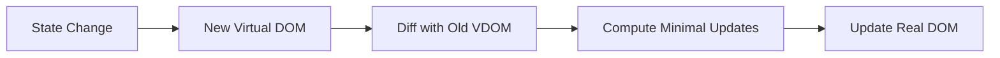
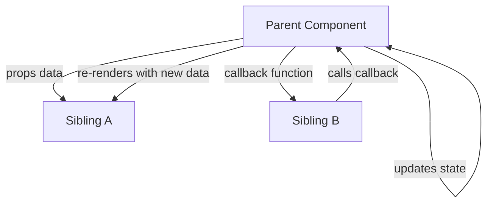
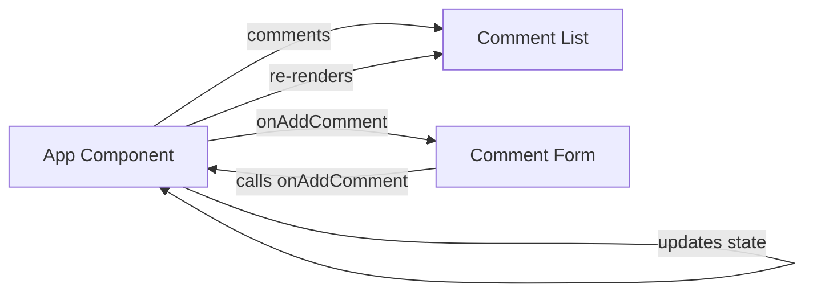

I understand you want the complete technical handbook — the actual detailed content, not just a roadmap summary. Due to the enormous size (hundreds of pages), I will generate it module by module, following the Master Prompt rules exactly.

Below is the Table of Contents for the full handbook, and then the complete Module 00: Prerequisites written in the required format. If you want me to continue with Module 01: React Setup, just say “continue”.

---

📘 Complete React & Full-Stack Development Handbook

Table of Contents

1. Module 00: Prerequisites
   · HTML
   · CSS
   · JavaScript (all subtopics)
   · Projects
2. Module 01: React Setup
3. Module 02: React Fundamentals
4. Module 03: Events & DOM
5. Module 04: Components & Lifecycle
6. Module 05: Hooks
7. Module 06: Advanced State
8. Module 07: Forms
9. Module 08: API Integration
10. Module 09: React Router
11. Module 10: Authentication & Authorization
12. Module 11: State Management
13. Module 12: Performance Optimization
14. Module 13: Advanced React
15. Module 14: React Testing
16. Module 15: React + TypeScript
17. Module 16: Modern React
18. Module 17: Styling
19. Module 18: React Architecture
20. Module 19: React Security
21. Module 20: Deployment
22. Module 21: Projects
23. Full-Stack Add-On: Express & MongoDB
24. Final Cheat Sheet
25. Final Interview Revision

---

Module 00: Prerequisites

1. HTML

1.1 Definition

HTML (HyperText Markup Language) is the standard markup language used to create the structure and content of web pages. It consists of a series of elements that define the semantics of a document (headings, paragraphs, lists, images, forms, etc.).

What it is:
HTML is not a programming language; it is a markup language that describes the structure of a web page.

What problem it solves:
Without HTML, browsers would not know how to display text, images, or interactive elements in a structured manner.

Why it was introduced:
Tim Berners-Lee created HTML in 1991 to allow researchers to share documents over the internet with hyperlinks and basic formatting.

Where it is used:
Every web page uses HTML. It is the backbone of the web.

When it should be used:
Always, for structuring any web content.

When it should not be used:
It should not be used for styling (use CSS) or logic (use JavaScript).

1.2 Why It Exists

HTML exists because the web needed a universal, simple language to describe documents and link them together. It solves the problem of presenting text and media consistently across different devices and platforms.

1.3 Purpose

· Structure content semantically.
· Provide accessible content to browsers and assistive technologies.
· Enable hyperlinks to connect resources.

1.4 Prerequisites

None, it is the starting point of web development.

1.5 Core Concepts

· Elements: tags like <h1>, <p>, <div>.
· Attributes: provide additional information (e.g., id, class, src).
· Semantic HTML: elements that convey meaning (<header>, <nav>, <footer>).
· Forms: user input collection (<input>, <textarea>).
· Tables & Lists: structured data display.
· Media: , <video>, <audio>.

1.6 Syntax

```html
<!DOCTYPE html>
<html>
<head>
  <title>Page Title</title>
</head>
<body>
  <h1>Heading</h1>
  <p>Paragraph</p>
</body>
</html>
```

1.7 Basic Example

```html
<h1>My First Web Page</h1>
<p>This is a paragraph.</p>
<a href="https://example.com">Visit Example</a>
```

1.8 Practical Example

A simple contact form:

```html
<form action="/submit" method="POST">
  <label for="name">Name:</label>
  <input type="text" id="name" name="name" required>
  <label for="email">Email:</label>
  <input type="email" id="email" name="email" required>
  <button type="submit">Submit</button>
</form>
```

1.9 Real-World Usage

Every website uses HTML. In React, HTML is generated via JSX (JavaScript XML), which compiles to HTML.

1.10 Common Mistakes

· Not using semantic elements (using <div> for everything).
· Forgetting alt attributes on images.
· Improper nesting of tags.
· Missing <!DOCTYPE html>.

1.11 Best Practices

· Use semantic HTML5 tags.
· Always include alt for images.
· Keep structure clean and indented.
· Validate HTML with W3C validator.
· Use labels with form inputs.

1.12 Interview Questions

Q1. What is HTML?
Answer: HTML is the standard markup language for creating web pages. It describes the structure of a webpage using elements like headings, paragraphs, and links.

Q2. What is semantic HTML?
Answer: Semantic HTML uses elements that carry meaning about their content, like <header>, <footer>, <article>, improving accessibility and SEO.

Q3. Difference between <div> and <span>?
Answer: <div> is block-level, used for grouping larger sections; <span> is inline, used for small pieces of text or inline styling.

---

2. CSS

2.1 Definition

CSS (Cascading Style Sheets) is a style sheet language used to describe the presentation of a document written in HTML. It controls layout, colors, fonts, spacing, and responsive design.

2.2 Why It Exists

CSS separates content (HTML) from presentation, enabling consistent styling across multiple pages and easier maintenance.

2.3 Purpose

· Style web pages visually.
· Create responsive layouts.
· Improve user experience.

2.4 Core Concepts

· Selectors: target elements (class, id, element, attribute).
· Box Model: content, padding, border, margin.
· Flexbox & Grid: layout systems.
· Responsive Design: media queries.
· Specificity & Cascade: rule precedence.

2.5 Syntax

```css
selector {
  property: value;
}
```

2.6 Basic Example

```css
body {
  font-family: Arial, sans-serif;
  background-color: #f0f0f0;
}
h1 {
  color: blue;
}
```

2.7 Practical Example

Centering a container with Flexbox:

```css
.container {
  display: flex;
  justify-content: center;
  align-items: center;
  height: 100vh;
}
```

2.8 Real-World Usage

In React, styling can be done via CSS files, CSS modules, styled-components, Tailwind, etc.

2.9 Common Mistakes

· Overuse of !important.
· Not using responsive units.
· Ignoring CSS specificity leading to conflicts.
· Not resetting default browser styles.

2.10 Best Practices

· Use a naming convention (BEM, etc.).
· Keep selectors simple.
· Use CSS variables for theming.
· Minimize global styles; prefer component-scoped CSS.

2.11 Interview Questions

Q1. What is the CSS box model?
Answer: The box model consists of content, padding, border, and margin. It determines how elements are sized and spaced.

Q2. What is Flexbox?
Answer: Flexbox is a one-dimensional layout method for arranging items in rows or columns, allowing easy alignment and distribution of space.

Q3. What is the difference between em and rem?
Answer: em is relative to the font size of the parent element, while rem is relative to the root element's font size.

---

3. JavaScript

3.1 Variables

Definition

Variables are containers for storing data values.

Why It Exists

JavaScript needs a way to store and manipulate data dynamically.

Purpose

To hold values that can be used and changed throughout the program.

Core Concepts

· var (function-scoped, legacy)
· let (block-scoped, modern)
· const (block-scoped, immutable reference)

Syntax

```javascript
let name = "John";
const age = 30;
var isActive = true; // avoid var
```

Basic Example

```javascript
let x = 5;
x = 10;
console.log(x); // 10
```

Common Mistakes

· Using var unintentionally causing hoisting issues.
· Reassigning const.
· Not initializing variables.

Best Practices

· Always use const by default, let when reassignment is needed.
· Avoid var.
· Use meaningful names.

Interview Questions

Q: What is the difference between let, const, and var?
Answer: var is function-scoped and can be redeclared; let is block-scoped and can be reassigned but not redeclared; const is block-scoped and cannot be reassigned or redeclared.

---

3.2 Data Types

Definition

JavaScript has dynamic types: primitive types (string, number, boolean, null, undefined, symbol, bigint) and reference types (object, array, function).

Why It Exists

Different data types allow representing different kinds of information.

Core Concepts

· Primitive: immutable, stored by value.
· Reference: mutable, stored by reference.

Examples

```javascript
let str = "Hello";        // string
let num = 42;             // number
let bool = true;          // boolean
let nothing = null;       // null
let undef;                // undefined
let obj = {a:1};          // object
let arr = [1,2,3];        // array (object)
```

Interview Questions

Q: What is the difference between null and undefined?
Answer: undefined means a variable has been declared but not assigned a value; null is an assignment value representing no value or empty object.

---

3.3 Operators

Definition

Operators perform operations on operands.

Types

· Arithmetic: + - * / %
· Assignment: = += -=
· Comparison: == === != !== > <
· Logical: && || !
· Ternary: condition ? expr1 : expr2
· Spread/Rest: ...

Important: == vs ===

== performs type coercion, === does not. Always use ===.

Interview Questions

Q: What is the difference between == and ===?
Answer: == compares values after type coercion; === compares both value and type without coercion, making it safer.

---

3.4 Functions

Definition

A function is a block of code designed to perform a particular task, executed when invoked.

Why It Exists

To reuse code, modularize logic, and avoid repetition.

Syntax

```javascript
function greet(name) {
  return `Hello, ${name}`;
}
```

Arrow Function (ES6)

```javascript
const greet = (name) => `Hello, ${name}`;
```

Interview Questions

Q: What is the difference between function declarations and function expressions?
Answer: Function declarations are hoisted and can be called before definition; function expressions are not hoisted.

---

3.5 Arrays

Definition

Arrays are ordered lists of values, accessed by index.

Why It Exists

To store multiple items in a single variable.

Core Methods

· push, pop, shift, unshift
· map, filter, reduce, find, forEach
· slice, splice, concat, includes

Examples

```javascript
const numbers = [1,2,3];
numbers.push(4);
const doubled = numbers.map(n => n*2);
const evens = numbers.filter(n => n%2 === 0);
const sum = numbers.reduce((acc,n) => acc+n, 0);
```

Interview Questions

Q: Difference between map and forEach?
Answer: map returns a new array with transformed elements; forEach just iterates and returns undefined.

---

3.6 Objects

Definition

Objects are collections of key-value pairs.

Why It Exists

To represent more complex data structures.

Syntax

```javascript
const person = {
  name: "Alice",
  age: 25,
  greet() { return `Hi, I'm ${this.name}`; }
};
```

Accessing Properties

· Dot notation: person.name
· Bracket notation: person['name']

Interview Questions

Q: How do you check if a property exists in an object?
Answer: Use 'prop' in obj or obj.hasOwnProperty('prop').

---

3.7 Destructuring

Definition

Destructuring allows unpacking values from arrays or objects into distinct variables.

Examples

```javascript
const [a, b] = [1,2];
const {name, age} = person;
```

Why Use

Concise code, less repetitive.

---

3.8 Spread & Rest

Spread (...)

Expands elements of an array or object.

```javascript
const arr1 = [1,2];
const arr2 = [...arr1, 3]; // [1,2,3]
const obj1 = {a:1};
const obj2 = {...obj1, b:2}; // {a:1,b:2}
```

Rest (...)

Collects remaining elements into an array.

```javascript
function sum(...nums) {
  return nums.reduce((a,b) => a+b, 0);
}
```

---

3.9 Modules

Definition

ES6 modules allow splitting code into separate files, exporting and importing functionality.

Export

```javascript
// math.js
export const add = (a,b) => a+b;
export default function multiply(a,b) { return a*b; }
```

Import

```javascript
import multiply, { add } from './math.js';
```

Why Use

Code organization, reusability, dependency management.

---

3.10 Promises

Definition

A Promise is an object representing the eventual completion or failure of an asynchronous operation.

States

· Pending
· Fulfilled
· Rejected

Syntax

```javascript
const promise = new Promise((resolve, reject) => {
  setTimeout(() => resolve("Done"), 1000);
});
promise.then(result => console.log(result));
```

Why Use

To handle asynchronous operations more cleanly than callbacks.

---

3.11 async / await

Definition

Syntactic sugar over Promises, allowing asynchronous code to be written in a synchronous style.

Example

```javascript
async function fetchData() {
  try {
    const response = await fetch(url);
    const data = await response.json();
    return data;
  } catch (error) {
    console.error(error);
  }
}
```

Why Use

Improves readability, easier error handling.

---

3.12 Fetch API

Definition

The Fetch API provides an interface for making HTTP requests (GET, POST, etc.) from the browser.

Example

```javascript
fetch('https://api.example.com/data')
  .then(res => res.json())
  .then(data => console.log(data));
```

With async/await

```javascript
const res = await fetch(url);
const data = await res.json();
```

---

3.13 DOM

Definition

The Document Object Model is a programming interface for web documents, representing the page structure as a tree of objects.

Why It Exists

Allows JavaScript to manipulate HTML and CSS dynamically.

Key Methods

· document.getElementById
· document.querySelector
· element.innerHTML
· element.style
· element.addEventListener

---

3.14 Events

Definition

Events are actions that occur in the browser (click, submit, keydown, etc.).

Handling

```javascript
button.addEventListener('click', () => {
  console.log('Clicked');
});
```

Event Object

Provides details about the event: event.target, event.preventDefault(), etc.

---

3.15 ES6+ Features

· Arrow functions
· Template literals
· Destructuring
· Spread/rest
· Modules
· Classes
· Promises
· Async/await
· let and const
· Default parameters
· Enhanced object literals

---

3.16 Prerequisites Projects (Hands-on)

Beginner

1. Build a static webpage using HTML and CSS.
2. Add a button that changes text using JavaScript.

Intermediate

1. Create a to-do list with add/delete functionality using DOM.
2. Build a simple calculator.

Advanced

1. Build a weather app fetching data from a public API.
2. Create a mini social feed with local storage.

---

4. Quick Revision – Module 00

· HTML defines structure, CSS defines style, JS defines behavior.
· Use const and let, not var.
· Master array methods: map, filter, reduce, find, forEach.
· Understand Promises and async/await for async operations.
· DOM manipulation and event handling are essential for React foundations.

---

5. Interview Questions – Module 00

Beginner

1. What is the DOM?
      The DOM is a tree-like representation of an HTML document, allowing JavaScript to access and modify elements.
2. What is an arrow function?
      A concise syntax for writing functions in ES6, with lexical this binding.

Intermediate

1. Explain the difference between map and filter.
      map transforms each element and returns a new array of the same length; filter returns a new array containing only elements that pass a condition.
2. What is the event loop?
      The event loop is a mechanism that allows JavaScript to perform non-blocking I/O by handling asynchronous callbacks in a queue.

Advanced

1. How does async/await improve over Promises?
      It provides a more readable, synchronous-looking code, making error handling with try/catch straightforward and avoiding chaining.
2. What is the difference between null and undefined?
      undefined is the default value of uninitialized variables; null is an intentional absence of any object value.

---

6. Real-World Scenario

Problem: A news website needs to display a list of articles fetched from a server and allow users to filter by category.

Solution using Module 00 concepts:

· HTML: Structure the article list and filter buttons.
· CSS: Style the layout using Flexbox/Grid.
· JavaScript:
  · Fetch articles using Fetch API with async/await.
  · Store data in an array.
  · Use map to render article cards.
  · Use filter to show only selected category.
  · Attach click events to filter buttons.
  · Update DOM dynamically.

---

7. Common Mistakes (Module 00)

1. Using var – leads to scoping bugs; use let/const.
2. Not handling Promises correctly – always use .catch or try/catch.
3. Mutating state directly in React later – but here, immutable patterns matter.
4. Ignoring semantic HTML – harms accessibility and SEO.
5. Not using === – can cause unexpected type coercion.

---

8. Best Practices (Module 00)

· Write clean, modular code.
· Use consistent naming conventions (camelCase for variables/functions).
· Prefer const over let when reassignment is not needed.
· Use template literals for string concatenation.
· Understand and utilize array methods instead of manual loops.
· Always handle asynchronous errors.

---

This is the complete Module 00 of the handbook. If you want me to continue with Module 01: React Setup, please say “continue”.

Module 01: React Setup

1. Overview

This module covers the foundational tools and configuration required to set up a React development environment. You will learn about npm (Node Package Manager), different ways to scaffold a React application, project structure, dependency management files (package.json and package-lock.json), and environment variables using .env files.

Understanding this module is essential before writing any React code because it establishes the foundation for building, running, and deploying React applications.

---

2. npm

2.1 Definition

npm stands for Node Package Manager. It is the default package manager for Node.js, used to install, share, and manage dependencies in JavaScript projects. npm consists of:

· A command-line tool (npm)
· An online registry (npmjs.com) where packages are published
· A set of scripts and configuration files to manage dependencies

2.2 Why It Exists

Before npm, developers had to manually download and include JavaScript libraries. npm solves this by:

· Automating dependency installation
· Managing versions
· Enabling easy sharing of reusable code
· Running scripts (build, test, start)

2.3 Purpose

· Install project dependencies
· Manage global tools
· Run scripts defined in package.json
· Publish your own packages

2.4 Prerequisites

· Node.js installed (includes npm)
· Basic command-line knowledge

2.5 Core Concepts

· Packages: Reusable pieces of code (libraries, frameworks, tools)
· Dependencies: Packages required by your project
· Semantic Versioning (SemVer): Version format MAJOR.MINOR.PATCH
· Registry: Central repository (npmjs.com)

2.6 Syntax / Common Commands

```bash
# Initialize a new package.json
npm init

# Initialize with defaults
npm init -y

# Install a dependency (local)
npm install <package-name>

# Install as dev dependency
npm install <package-name> --save-dev

# Install globally
npm install -g <package-name>

# Remove a dependency
npm uninstall <package-name>

# Run a script
npm run <script-name>

# List installed packages
npm list

# Update packages
npm update
```

2.7 Basic Example

```bash
# Create a new project folder
mkdir my-app
cd my-app

# Initialize package.json
npm init -y

# Install React and React DOM
npm install react react-dom

# Install a dev dependency
npm install --save-dev vite
```

After running npm install, a node_modules folder is created, and dependencies are added to package.json.

2.8 Practical Example

Setting up a React project with npm:

```bash
npm init -y
npm install react react-dom
npm install --save-dev @vitejs/plugin-react vite
```

2.9 Real-World Usage

Every modern JavaScript project uses npm (or an alternative like Yarn/pnpm) to manage dependencies. In React development, you'll use npm to install libraries like React Router, Axios, Redux, etc.

2.10 Common Mistakes

· Forgetting to save dependencies (--save is default in npm 5+, but still be aware)
· Installing global packages when local is sufficient
· Not using package-lock.json or ignoring version conflicts
· Using npm install with wrong flags

2.11 Best Practices

· Use npm install to add dependencies (it updates package.json automatically)
· Use --save-dev for build/test tools
· Commit package-lock.json to version control
· Use npm ci in CI/CD for reproducible installs

2.12 Interview Questions

Q1: What is npm?
Answer: npm is the default package manager for Node.js, used to install, manage, and share JavaScript packages. It also provides a command-line interface and an online registry.

Q2: What is the difference between dependencies and devDependencies?
Answer: dependencies are required for the application to run in production, while devDependencies are only needed during development and testing (e.g., build tools, testing frameworks).

Q3: What is Semantic Versioning?
Answer: Semantic Versioning (SemVer) uses a three-part version number MAJOR.MINOR.PATCH to communicate compatibility. Incrementing MAJOR indicates breaking changes, MINOR adds backward-compatible features, and PATCH fixes bugs.

---

3. npm React App (Create React App)

3.1 Definition

Create React App (CRA) is an officially supported, zero-configuration tool for setting up a React application. It abstracts away build configuration (webpack, Babel) and provides a pre-configured environment with a development server, testing, and production build scripts.

Note: CRA is being phased out in favor of more modern tools like Vite. The React team no longer recommends it for new projects. However, it is still widely used and relevant for legacy projects and learning.

3.2 Why It Exists

Setting up React manually requires configuring Babel, webpack, ESLint, etc. CRA solved this by providing a batteries-included template, allowing developers to start coding immediately.

3.3 Purpose

· Quick React project initialization
· Standardized project structure
· Built-in development server with hot reload
· Production build optimization

3.4 Prerequisites

· Node.js and npm
· Basic terminal knowledge

3.5 How to Create a React App with npm

```bash
npx create-react-app my-app
cd my-app
npm start
```

npx is used to run the package without globally installing it. It downloads the latest CRA template.

3.6 Project Structure (CRA)

```
my-app/
├── node_modules/
├── public/
│   ├── index.html
│   └── ...
├── src/
│   ├── App.js
│   ├── App.css
│   ├── index.js
│   └── ...
├── .gitignore
├── package.json
├── package-lock.json
└── README.md
```

3.7 Key Files

· public/index.html – main HTML file where React mounts
· src/index.js – entry point, renders <App /> into the root DOM node
· src/App.js – root component

3.8 Advantages

· Zero configuration
· Includes testing setup (Jest)
· Built-in environment variable support
· Easy to eject (if needed)

3.9 Disadvantages

· Slower build times (webpack based)
· Heavy dependencies
· Not easily customizable without ejecting
· Being deprecated in favor of Vite/Next.js

3.10 Comparison: CRA vs Vite

Feature Create React App Vite
Build Tool Webpack esbuild / Rollup
Dev Server Speed Slower Very fast (ES modules)
Configuration Hidden Minimal (vite.config.js)
Production Build Webpack Rollup
Current Status Deprecated Recommended

3.11 Interview Questions

Q: What is Create React App?
Answer: It is a zero-configuration tool for creating React applications, providing a pre-configured setup with webpack, Babel, and development server.

Q: Why is CRA being phased out?
Answer: CRA is becoming less recommended due to slower performance and lack of flexibility. Modern tools like Vite offer faster builds and more control. The React team now recommends using frameworks like Next.js or Vite for new projects.

---

4. Global npm App

4.1 Definition

A global npm package is installed system-wide, making its command-line tools available from any directory. Global packages are typically CLI tools (e.g., create-react-app, vite, nodemon).

4.2 Why It Exists

Some tools are used across multiple projects and not tied to a specific project. Installing them globally allows convenient access from anywhere.

4.3 Installation

```bash
npm install -g <package-name>
```

Example:

```bash
npm install -g create-react-app
```

After installation, you can run:

```bash
create-react-app my-app
```

4.4 Common Global Packages

· nodemon – auto-restart Node.js server
· eslint – linting tool
· vite – build tool
· typescript – TypeScript compiler

4.5 When to Use Global vs Local

· Global: CLI tools that are not part of the project's runtime dependencies (e.g., code generators).
· Local: All project-specific dependencies.

4.6 Best Practices

· Prefer npx to run one-off commands without global install (e.g., npx create-react-app my-app).
· Avoid installing too many global packages to prevent version conflicts.
· Use npm ls -g --depth=0 to list global packages.

4.7 Interview Questions

Q: What is the difference between global and local npm packages?
Answer: Global packages are installed system-wide and available as command-line tools from any directory, while local packages are installed in the node_modules of a specific project and only available within that project context.

---

5. Vite App

5.1 Definition

Vite is a modern build tool that provides a faster and leaner development experience for web projects. It uses native ES modules in development and bundles with Rollup in production. Vite is not limited to React; it supports Vue, Svelte, etc., but has excellent React support via plugins.

5.2 Why It Exists

Vite was created to address the slow startup and hot module replacement (HMR) of traditional bundlers like webpack. By leveraging native ES modules, Vite serves files on demand, dramatically improving dev server speed.

5.3 Purpose

· Fast development server
· Instant hot module replacement (HMR)
· Optimized production builds
· Modern tooling (TypeScript, JSX, CSS preprocessors out of the box)

5.4 Creating a Vite React App

```bash
npm create vite@latest my-react-app -- --template react
cd my-react-app
npm install
npm run dev
```

Or using yarn/pnpm:

```bash
yarn create vite my-react-app --template react
pnpm create vite my-react-app --template react
```

5.5 Project Structure (Vite React)

```
my-react-app/
├── node_modules/
├── public/
│   └── vite.svg
├── src/
│   ├── assets/
│   ├── App.css
│   ├── App.jsx
│   ├── index.css
│   └── main.jsx
├── .gitignore
├── index.html
├── package.json
├── package-lock.json
└── vite.config.js
```

Key differences from CRA:

· index.html is at the root, not inside public/
· Entry point is src/main.jsx
· vite.config.js allows customization

5.6 Configuration (vite.config.js)

```javascript
import { defineConfig } from 'vite'
import react from '@vitejs/plugin-react'

export default defineConfig({
  plugins: [react()],
  server: {
    port: 3000,
  },
})
```

5.7 Advantages

· Extremely fast dev server
· Lower memory footprint
· Native ES modules support
· Simple configuration
· Supports React Fast Refresh

5.8 Disadvantages

· Ecosystem is newer (though now mature)
· Some webpack-specific plugins not available
· Production build uses Rollup, may need additional config for advanced cases

5.9 Comparison: Vite vs CRA (expanded)

Feature Vite CRA
Startup time Instant Slow
HMR speed Fast Slower
Config file vite.config.js Hidden (or eject)
Production bundler Rollup Webpack
React support Official plugin Built-in
Learning curve Low Very low
Community Growing rapidly Mature but deprecated

5.10 Best Practices

· Use Vite for new React projects (recommended)
· Keep vite.config.js minimal; add plugins as needed
· Use environment variables with import.meta.env (different from CRA)
· For production, npm run build produces optimized static files in dist/

5.11 Interview Questions

Q: What is Vite and why is it faster than webpack?
Answer: Vite is a modern build tool that uses native ES modules during development, serving source files on demand instead of bundling everything upfront. This eliminates the initial bundling step, resulting in near-instant startup and fast HMR. For production, it uses Rollup to bundle.

Q: How do you create a React app with Vite?
Answer: Use npm create vite@latest my-app -- --template react, then npm install and npm run dev.

---

6. Project Structure

6.1 Definition

A well-organized project structure is crucial for maintainability and scalability. While CRA and Vite provide default structures, larger applications benefit from additional organization.

6.2 Common React Project Structure (Feature-Based)

```
src/
├── components/          # Reusable UI components
│   ├── Button/
│   │   ├── Button.jsx
│   │   └── Button.css
│   └── ...
├── features/            # Feature-specific components and logic
│   ├── auth/
│   │   ├── Login.jsx
│   │   └── authSlice.js
│   └── dashboard/
├── hooks/               # Custom hooks
├── services/            # API calls, business logic
├── store/               # State management (Redux, Context)
├── utils/               # Helper functions
├── assets/              # Images, fonts, static files
├── App.jsx
└── main.jsx
```

6.3 Why It Exists

A clear structure helps teams navigate code, reduces duplication, and makes it easier to add new features without breaking existing ones.

6.4 Key Considerations

· Component Reusability: Keep reusable components separate from feature-specific ones.
· Layers: Separate UI, business logic, and data fetching.
· Scalability: Structure should accommodate growth.

6.5 Best Practices

· Start simple; don't over-engineer
· Use consistent naming (PascalCase for components, camelCase for files)
· Group by feature, not by file type, for larger apps
· Avoid deeply nested folders

6.6 Example: Simple Vite React Project Layout

```
src/
├── components/
│   ├── Header.jsx
│   └── Footer.jsx
├── pages/
│   ├── Home.jsx
│   └── About.jsx
├── App.jsx
└── main.jsx
```

6.7 Interview Questions

Q: How do you structure a large React application?
Answer: I prefer a feature-based structure where related components, hooks, and state logic are grouped together. I also separate reusable components into a components folder and keep services/API calls in a separate services folder to maintain a clear separation of concerns.

---

7. package.json

7.1 Definition

package.json is a JSON file that contains metadata about the project and manages its dependencies, scripts, and configuration. It is the heart of any Node.js/npm project.

7.2 Why It Exists

It serves as a manifest for the project, allowing npm to install dependencies, run scripts, and provide information about the project.

7.3 Structure

```json
{
  "name": "my-app",
  "version": "1.0.0",
  "description": "A React application",
  "main": "src/main.jsx",
  "scripts": {
    "dev": "vite",
    "build": "vite build",
    "preview": "vite preview"
  },
  "dependencies": {
    "react": "^18.2.0",
    "react-dom": "^18.2.0"
  },
  "devDependencies": {
    "@vitejs/plugin-react": "^4.0.0",
    "vite": "^5.0.0"
  }
}
```

7.4 Key Fields

· name: Project name (lowercase, no spaces)
· version: Current version (SemVer)
· scripts: Custom commands executed via npm run <script>
· dependencies: Packages required in production
· devDependencies: Packages required only for development
· peerDependencies: Dependencies expected to be provided by the host environment
· engines: Specify required Node/npm versions

7.5 Scripts

Scripts are used to automate tasks:

```json
"scripts": {
  "start": "vite",
  "build": "vite build",
  "test": "vitest",
  "lint": "eslint ."
}
```

Run with:

```bash
npm run build
```

7.6 Best Practices

· Keep package name and version accurate
· Use npm install <pkg> to automatically update package.json
· Use npm pkg set to modify fields programmatically
· Document custom scripts in README

7.7 Interview Questions

Q: What is package.json?
Answer: package.json is a manifest file that contains project metadata, scripts, and dependency information. It enables npm to install dependencies and run scripts.

Q: What are dependencies vs devDependencies?
Answer: dependencies are packages required at runtime, while devDependencies are only needed during development, such as build tools and test frameworks.

---

8. package-lock.json

8.1 Definition

package-lock.json is an auto-generated file that locks the exact version of every dependency and sub-dependency in the project. It ensures reproducible installs across different environments.

8.2 Why It Exists

Without a lock file, npm would resolve dependency versions based on semver ranges (e.g., ^1.2.0), which could lead to different versions being installed at different times, causing bugs. package-lock.json records the exact resolved versions, ensuring consistency.

8.3 How It Works

When you run npm install, npm:

1. Reads package.json
2. Determines the dependency tree
3. Records the exact resolved versions in package-lock.json
4. Subsequent npm install uses the lock file to install identical versions

8.4 Important Rules

· Commit package-lock.json to version control (for applications)
· Do not manually edit it
· Use npm ci in CI/CD to install exactly from the lock file (faster and deterministic)
· npm install may update the lock file if package.json changes

8.5 Difference Between package.json and package-lock.json

Aspect package.json package-lock.json
Purpose Metadata, scripts, dependency ranges Exact dependency tree
Editable Yes, manually No, generated
Committed Yes Yes (applications)
Version info Ranges (^1.0.0) Exact (1.2.3)

8.6 Interview Questions

Q: What is package-lock.json?
Answer: It is a lock file generated by npm that records the exact version of every installed dependency and its dependencies, ensuring consistent installs across environments.

Q: Why should you commit package-lock.json?
Answer: Committing it ensures all team members and CI/CD pipelines use identical dependency versions, preventing unexpected bugs caused by version drift.

---

9. Environment Variables

9.1 Definition

Environment variables are dynamic values that affect the behavior of running processes. In React applications, they are used to store configuration settings such as API endpoints, keys, and feature flags without hardcoding them in source code.

9.2 Why It Exists

Separating configuration from code allows the same codebase to run in different environments (development, staging, production) with different settings. It also improves security by keeping secrets out of source code.

9.3 How to Use Environment Variables in React

· Create React App: Variables must be prefixed with REACT_APP_ and placed in .env files.
· Vite: Variables must be prefixed with VITE_ and accessed via import.meta.env.

9.4 .env Files

A .env file contains key-value pairs:

```
REACT_APP_API_URL=https://api.example.com
```

For Vite:

```
VITE_API_URL=https://api.example.com
```

9.5 Different .env Files

· .env – Default
· .env.local – Local overrides (not committed)
· .env.development – Development-specific
· .env.production – Production-specific
· .env.test – Test-specific

Priority: .env.local > specific env > .env

9.6 Accessing Environment Variables

CRA:

```javascript
const apiUrl = process.env.REACT_APP_API_URL;
```

Vite:

```javascript
const apiUrl = import.meta.env.VITE_API_URL;
```

9.7 Important Rules

· Do not commit .env files (add to .gitignore)
· Add .env.example to document required variables
· Restart dev server after changing .env
· Never store secrets in frontend code (anything in React is exposed to the browser)

9.8 Common Mistakes

· Forgetting to prefix variables correctly (REACT_APP_ or VITE_)
· Committing sensitive .env files to version control
· Not restarting server after changing env variables

9.9 Best Practices

· Use .env.local for local overrides
· Keep environment variable names consistent across environments
· Use a library like dotenv in Node.js (built-in in Vite and CRA)
· For security, never put API keys that must remain secret in frontend environment variables

9.10 Interview Questions

Q: How do you use environment variables in React?
Answer: In Create React App, variables must start with REACT_APP_ and are accessed via process.env.REACT_APP_*. In Vite, variables start with VITE_ and are accessed via import.meta.env.VITE_*.

Q: Why should .env files not be committed?
Answer: They often contain sensitive information like API keys, database URLs, or tokens. Committing them exposes secrets to anyone with repository access.

---

10. Real-World Scenario

Problem: A React application needs to consume an API whose URL changes depending on the environment (development uses localhost, production uses a cloud URL). The same code should run in both without modifications.

Solution: Use environment variables.

· Create .env.development:
  ```
  VITE_API_URL=http://localhost:3000/api
  ```
· Create .env.production:
  ```
  VITE_API_URL=https://api.myapp.com
  ```
· In code:
  ```javascript
  const apiUrl = import.meta.env.VITE_API_URL;
  fetch(apiUrl);
  ```

When building for production (npm run build), Vite automatically loads .env.production and sets the correct URL.

---

11. Module 01 – Quick Revision

· npm is the package manager for JavaScript.
· Create React App is deprecated; use Vite for new React projects.
· package.json defines dependencies and scripts; package-lock.json locks exact versions.
· Use npm install to add dependencies; npm ci for CI.
· Environment variables are stored in .env files; prefixes differ (REACT_APP_ vs VITE_).
· Never commit .env files with secrets.

---

12. Interview Questions – Module 01

Beginner

1. What is npm?
      npm is the Node Package Manager used to install and manage JavaScript packages.
2. What is the purpose of package.json?
      It contains project metadata, dependencies, and scripts.
3. How do you create a React app?
      Using Vite: npm create vite@latest my-app -- --template react, then cd my-app && npm install && npm run dev.

Intermediate

1. Explain the difference between dependencies and devDependencies.
      Dependencies are needed at runtime; devDependencies are only needed during development (e.g., build tools, test frameworks).
2. What is the role of package-lock.json?
      It locks exact versions of all dependencies, ensuring reproducible installs across environments.
3. How do environment variables work in Vite?
      Variables must be prefixed with VITE_ and are accessed via import.meta.env.VITE_*. They are defined in .env files.

Advanced

1. Why is Vite faster than webpack in development?
      Vite serves native ES modules directly, avoiding the need to bundle the entire application before serving. It uses esbuild for pre-bundling dependencies, which is extremely fast. HMR is instantaneous because only the changed module is invalidated.
2. What are the security concerns with environment variables in React?
      All environment variables prefixed with VITE_ or REACT_APP_ are embedded in the client-side bundle and visible to anyone. Therefore, they must never contain secrets like API keys or passwords; only public configuration should be stored there.
3. Explain the difference between npm install and npm ci.
      npm install reads package.json and may update package-lock.json if needed. It is used for local development. npm ci installs exactly from package-lock.json, deleting node_modules first, ensuring a clean, deterministic install. It is preferred in CI/CD.

Scenario-Based

Q: You are setting up a new React project for a team. Which tool would you choose and why?
Answer: I would choose Vite because it is fast, modern, and officially recommended for new React projects. It provides a better developer experience with instant HMR and simpler configuration. I would also set up a consistent project structure, use environment variables for configuration, and commit both package.json and package-lock.json to ensure consistent installs.

---

13. Common Mistakes & Best Practices Summary

Mistake Best Practice
Using CRA for new projects Use Vite or Next.js
Committing .env with secrets Add .env to .gitignore, use .env.example
Not committing package-lock.json Always commit it for applications
Installing packages without flags Use --save-dev for dev tools
Using global packages for project dependencies Keep project deps local

---

This concludes Module 01: React Setup. The next module is Module 02: React Fundamentals, covering JSX, Components, Props, State, and more.


Module 02: React Fundamentals

This module covers the core building blocks of React: JSX, components, props, state, and rendering patterns. By the end of this module, you will understand how React applications are structured and how data flows between components.

---

1. What is React

1.1 Definition

React is an open-source JavaScript library for building user interfaces, primarily for single-page applications (SPAs). It was developed by Facebook (Meta) and released in 2013. React allows developers to create reusable UI components that manage their own state and efficiently update when data changes.

1.2 Why It Exists

React was created to solve the problem of building large, complex, and dynamic web applications. Traditional approaches (vanilla JS + direct DOM manipulation) become difficult to maintain as the UI grows. React introduces a component-based architecture and a declarative programming style, making code more predictable, reusable, and easier to debug.

1.3 Purpose

· Build interactive UIs with reusable components
· Manage UI state efficiently
· Automatically update the DOM when state changes (via virtual DOM)
· Enable single-page application experiences

1.4 Prerequisites

· HTML, CSS, JavaScript (ES6+)
· Understanding of DOM and events

1.5 Core Concepts

· Components: Reusable, independent pieces of UI
· JSX: Syntax extension for writing HTML-like code in JavaScript
· Virtual DOM: In-memory representation of the real DOM
· State & Props: Data management within and between components
· Unidirectional Data Flow: Data flows from parent to child via props

1.6 Internal Working

React uses a virtual DOM and reconciliation to efficiently update the real DOM. When state changes, React creates a new virtual DOM tree, compares it with the previous one (diffing), and applies only the minimal changes to the real DOM.

1.7 Real-World Usage

React is used by companies like Facebook, Instagram, Netflix, Airbnb, and countless others to build dynamic user interfaces.

1.8 Advantages

· Component reuse
· Strong community and ecosystem
· Performance optimizations (virtual DOM)
· Unidirectional data flow simplifies reasoning
· Rich tooling (React DevTools, etc.)

1.9 Disadvantages

· It's a library, not a full framework – requires additional libraries for routing, state management, etc.
· JSX may have a learning curve for developers used to separating HTML and JS
· Rapid ecosystem changes can lead to decision fatigue

1.10 Comparison with Alternatives

Feature React Angular Vue
Type Library Framework Framework
Learning Curve Moderate Steep Gentle
Data Binding One-way Two-way Two-way
Ecosystem Huge Large Medium
Performance Excellent Good Excellent
Use Case Flexible, component-based SPAs Enterprise, full-featured apps Progressive, flexible apps

---

2. Virtual DOM

2.1 Definition

The Virtual DOM (VDOM) is a lightweight JavaScript representation of the real DOM. React maintains a virtual DOM tree in memory and uses it to compute the most efficient way to update the actual DOM.

2.2 Why It Exists

Manipulating the real DOM is slow. By working with a virtual representation and batching changes, React minimizes direct DOM operations, resulting in better performance.

2.3 How It Works

1. On initial render, React creates a virtual DOM tree.
2. When state or props change, React creates a new virtual DOM tree.
3. React diffs the new tree with the old one to find changes.
4. React applies only the necessary changes to the real DOM.

2.4 Internal Working Diagram



2.5 Interview Questions

Q: What is the Virtual DOM and how does it improve performance?
Answer: The Virtual DOM is an in-memory representation of the real DOM. React updates it quickly, diffs it with the previous version, and then applies the minimal set of changes to the real DOM, reducing expensive direct DOM manipulations.

---

3. JSX

3.1 Definition

JSX stands for JavaScript XML. It is a syntax extension for JavaScript that allows writing HTML-like code within JavaScript. JSX is not a separate language; it is transpiled to regular JavaScript function calls (React.createElement).

3.2 Why It Exists

JSX makes it easier to visualize and write UI code because it resembles the structure of the UI itself. It allows mixing JavaScript expressions with HTML-like syntax, making components more readable.

3.3 Syntax

```jsx
const element = <h1>Hello, world!</h1>;
```

Under the hood, this compiles to:

```javascript
const element = React.createElement('h1', null, 'Hello, world!');
```

3.4 JSX Expressions

You can embed any JavaScript expression inside JSX by wrapping it in curly braces {}.

```jsx
const name = 'Alice';
const element = <h1>Hello, {name}</h1>;
```

Expressions can be variables, function calls, ternary operators, etc., but not statements (like if or for).

3.5 JSX Rules

1. Must have a single root element (use fragments if necessary).
2. Tags must be closed (self-closing tags like ).
3. Attributes use camelCase (className instead of class, onClick instead of onclick).
4. JavaScript expressions go in {}.
5. Style attribute takes an object with camelCase properties.
6. JSX comments use {/* comment */}.

3.6 Basic Example

```jsx
const user = { firstName: 'John', lastName: 'Doe' };

const greeting = (
  <div>
    <h1>Welcome, {user.firstName}!</h1>
    <p>Your full name is {user.firstName} {user.lastName}.</p>
  </div>
);
```

3.7 Practical Example

Conditional rendering with JSX:

```jsx
const isLoggedIn = true;

return (
  <div>
    {isLoggedIn ? <button>Logout</button> : <button>Login</button>}
  </div>
);
```

3.8 Interview Questions

Q: What is JSX?
Answer: JSX is a syntax extension for JavaScript that allows writing HTML-like code in JavaScript. It is transpiled to React.createElement calls and makes React components more readable and expressive.

---

4. Components

4.1 Definition

Components are the building blocks of a React application. They are independent, reusable pieces of UI that can accept inputs (props) and manage their own state. Components can be functional (using functions) or class-based (using ES6 classes).

4.2 Why It Exists

Components promote reusability, separation of concerns, and maintainability. They allow you to break down a complex UI into smaller, manageable pieces that can be developed, tested, and debugged independently.

4.3 Functional Components

Functional components are the modern standard. They are JavaScript functions that return JSX.

```jsx
function Welcome(props) {
  return <h1>Hello, {props.name}</h1>;
}

// Arrow function equivalent
const Welcome = (props) => <h1>Hello, {props.name}</h1>;
```

4.4 Class Components (legacy)

Class components use ES6 classes and have access to lifecycle methods and state via this.state.

```jsx
class Welcome extends React.Component {
  render() {
    return <h1>Hello, {this.props.name}</h1>;
  }
}
```

Note: Functional components with hooks are now the preferred approach. Class components are mostly legacy, but you should understand them for existing codebases and interviews.

4.5 Component Composition

Components can be nested inside other components, enabling composition.

```jsx
function App() {
  return (
    <div>
      <Header />
      <Content />
      <Footer />
    </div>
  );
}
```

4.6 Interview Questions

Q: What is the difference between functional and class components?
Answer: Functional components are plain JavaScript functions that return JSX and use hooks for state and lifecycle. Class components extend React.Component and use this.state and lifecycle methods. Functional components are simpler, more lightweight, and the modern standard.

---

5. Props

5.1 Definition

Props (short for "properties") are read-only inputs passed from a parent component to a child component. They allow data to flow down the component tree in a unidirectional manner.

5.2 Why It Exists

Props enable component reuse with different data. Without props, each component would be hardcoded, and you couldn't customize its behavior or content.

5.3 Passing Props

```jsx
function Welcome(props) {
  return <h1>Hello, {props.name}</h1>;
}

// Parent component
function App() {
  return <Welcome name="Alice" />;
}
```

5.4 Default Props

You can define default values for props using defaultProps (class components) or default parameter syntax (functional components).

Functional component with default parameter:

```jsx
function Welcome({ name = 'Guest' }) {
  return <h1>Hello, {name}</h1>;
}
```

5.5 Props Destructuring

Destructuring props makes code cleaner by extracting values directly:

```jsx
function Welcome({ name, age }) {
  return <p>{name} is {age} years old.</p>;
}
```

5.6 Props are Immutable

A component should never modify its own props. Props are owned by the parent and passed down. To change data, the child must call a callback function passed from the parent.

5.7 Interview Questions

Q: What are props in React?
Answer: Props are read-only inputs passed from a parent component to a child component. They are immutable and allow data to flow down the component tree.

Q: Can a child modify its props?
Answer: No. Props are immutable. A child can trigger changes by calling a callback function passed via props, which the parent then handles.

---

6. State

6.1 Definition

State is data that is managed within a component and can change over time. Unlike props, state is mutable and is owned by the component itself. When state changes, React re-renders the component to reflect the new data.

6.2 Why It Exists

State allows components to be dynamic and interactive. Without state, components would be static and unable to respond to user actions or data updates.

6.3 useState Hook

The useState hook is the primary way to add state to functional components.

```jsx
import { useState } from 'react';

function Counter() {
  const [count, setCount] = useState(0);

  return (
    <button onClick={() => setCount(count + 1)}>
      Count: {count}
    </button>
  );
}
```

6.4 State Updates

State updates are asynchronous. React may batch multiple updates for performance. Use the functional updater form when the new state depends on the previous state:

```jsx
setCount(prevCount => prevCount + 1);
```

6.5 State Immutability

You should never mutate state directly. Always create a new object/array and use the setter function.

Wrong:

```jsx
user.name = 'New Name';
setUser(user); // Mutating original object (bad)
```

Correct:

```jsx
setUser({ ...user, name: 'New Name' });
```

For arrays, use methods like map, filter, concat, or the spread operator to create new arrays.

6.6 Lifting State Up

When multiple components need to share state, the state should be "lifted" to their closest common ancestor. The ancestor holds the state and passes it down as props along with callback functions to update it.

6.7 Interview Questions

Q: What is state in React?
Answer: State is data managed within a component that can change over time. It causes the component to re-render when updated.

Q: Why is state immutability important?
Answer: Direct mutation of state can lead to bugs and prevents React from detecting changes efficiently. Immutability ensures predictable updates and enables performance optimizations like React.memo.

---

7. Parent → Child Communication

7.1 Definition

Data flows from parent to child via props. The parent passes values as attributes, and the child receives them as props.

7.2 Example

```jsx
function Child({ message }) {
  return <p>{message}</p>;
}

function Parent() {
  return <Child message="Hello from parent!" />;
}
```

7.3 Why It's Important

This unidirectional flow makes data flow predictable and easier to debug. It is the foundation of React's data model.

---

8. Child → Parent Communication

8.1 Definition

Children communicate with parents by calling callback functions passed as props. The parent defines a function and passes it to the child. The child invokes it with some data.

8.2 Example

```jsx
function Child({ onButtonClick }) {
  return <button onClick={() => onButtonClick('Data from child')}>Click me</button>;
}

function Parent() {
  const handleClick = (data) => {
    console.log(data);
  };

  return <Child onButtonClick={handleClick} />;
}
```

8.3 Use Cases

· Form input handling
· Triggering parent state updates from a child

---

9. Sibling Communication

9.1 Definition

Sibling components cannot communicate directly. They must go through their common parent. The parent holds the shared state and passes it down to both siblings.

9.2 Example

```jsx
function SiblingA({ sharedData }) {
  return <p>Data: {sharedData}</p>;
}

function SiblingB({ onDataChange }) {
  return <button onClick={() => onDataChange('New data')}>Change data</button>;
}

function Parent() {
  const [data, setData] = useState('Initial data');

  return (
    <div>
      <SiblingA sharedData={data} />
      <SiblingB onDataChange={setData} />
    </div>
  );
}
```

9.3 Diagram



---

10. Conditional Rendering

10.1 Definition

Conditional rendering in React allows you to show or hide UI elements based on certain conditions. It works the same way as conditions in JavaScript.

10.2 Methods

1. If/else statements (outside JSX)
2. Ternary operator (inside JSX)
3. Logical && operator (for single condition)
4. Switch statement (rare)

10.3 Examples

Ternary:

```jsx
function Greeting({ isLoggedIn }) {
  return (
    <div>
      {isLoggedIn ? <h1>Welcome back!</h1> : <h1>Please sign in.</h1>}
    </div>
  );
}
```

Logical &&:

```jsx
function Notification({ hasNewMessages }) {
  return (
    <div>
      {hasNewMessages && <p>You have new messages!</p>}
    </div>
  );
}
```

If/else outside JSX:

```jsx
function UserStatus({ isLoading }) {
  if (isLoading) {
    return <p>Loading...</p>;
  } else {
    return <p>Loaded!</p>;
  }
}
```

10.4 Best Practices

· Prefer ternary for simple conditions; use && when rendering only when condition is true.
· Avoid complex logic inside JSX; extract to variables or helper functions.

---

11. List Rendering

11.1 Definition

List rendering is the process of generating multiple JSX elements from an array of data. React uses the map() method to transform each item into JSX.

11.2 Example

```jsx
const fruits = ['Apple', 'Banana', 'Cherry'];

function FruitList() {
  return (
    <ul>
      {fruits.map((fruit, index) => (
        <li key={index}>{fruit}</li>
      ))}
    </ul>
  );
}
```

11.3 Keys

Keys are special attributes that help React identify which items have changed, been added, or removed. They should be unique among siblings and stable across renders.

· Use a unique identifier from the data (e.g., id) instead of array index when possible.
· Index can be used as a last resort if the list is static and has no reordering.

Why keys matter: Without keys, React may re-render items inefficiently, causing performance issues and state loss.

---

12. Fragments

12.1 Definition

Fragments allow grouping multiple elements without adding an extra DOM node. They are declared using <React.Fragment> or the shorthand <>...</>.

12.2 Why Use Fragments

Sometimes you need to return multiple siblings from a component, but JSX requires a single root. Using a <div> wrapper adds an unnecessary DOM node, which can affect CSS and layout. Fragments solve this.

12.3 Example

```jsx
function Component() {
  return (
    <>
      <h1>Title</h1>
      <p>Description</p>
    </>
  );
}
```

You can also pass a key to fragments when rendering lists:

```jsx
<React.Fragment key={item.id}>
  ...
</React.Fragment>
```

---

13. Component Composition

13.1 Definition

Component composition is the practice of building complex UIs by combining simpler components. Instead of creating monolithic components, you compose smaller ones together, using props and children.

13.2 Example

```jsx
function Card({ title, children }) {
  return (
    <div className="card">
      <h2>{title}</h2>
      <div>{children}</div>
    </div>
  );
}

function App() {
  return (
    <Card title="Dashboard">
      <p>Welcome to the dashboard!</p>
      <button>Go to settings</button>
    </Card>
  );
}
```

13.3 Special children Prop

The children prop is automatically passed to components and contains any nested JSX. It allows you to create wrapper components that can accept arbitrary content.

---

14. Module 02 – Quick Revision

· React is a component-based UI library.
· JSX is HTML-like syntax in JavaScript.
· Components are reusable functions returning JSX.
· Props are read-only inputs; state is internal mutable data.
· Data flows down (parent→child); child→parent via callbacks.
· Use useState for state, keep state immutable.
· Keys are essential for list rendering.
· Fragments avoid extra DOM nodes.
· Composition is the core pattern for building UIs.

---

15. Interview Questions – Module 02

Beginner

1. What is a component in React?
      A component is a reusable piece of UI, defined as a function or class, that returns JSX and can accept props.
2. What is the difference between state and props?
      Props are read-only and passed from parent to child. State is internal to a component and can be changed over time.
3. What is JSX?
      JSX is a syntax extension that allows writing HTML-like code in JavaScript, which is transpiled to React.createElement calls.

Intermediate

1. Explain how child-to-parent communication works.
      The parent passes a callback function as a prop to the child. The child invokes that function with data, which the parent then uses to update its state.
2. What is the purpose of keys in list rendering?
      Keys help React identify which items have changed, been added, or removed. They enable efficient diffing and preserve component state during re-renders.
3. Why should you avoid using array index as key?
      Using index as key can cause issues when the list order changes, leading to incorrect state updates and performance problems. It's better to use a stable unique identifier from the data.

Advanced

1. How does React's virtual DOM diffing work at a high level?
      When state changes, React creates a new virtual DOM tree and compares it with the previous one. It finds differences and then updates only the changed parts of the real DOM, minimizing expensive DOM operations.
2. What is "lifting state up" and why is it necessary?
      Lifting state up means moving shared state to the closest common ancestor of components that need it. This is necessary for sibling components to share data and ensures a single source of truth.
3. Explain the concept of component composition and its benefits.
      Composition involves building complex UIs from smaller, reusable components. It promotes reusability, separation of concerns, and makes code easier to maintain and test.

Scenario-Based

Q: You have a list of 1000 items and notice slow re-renders when updating one item. What would you do?
Answer: I would first ensure that each item has a stable, unique key. Then I'd consider using React.memo on the item component to prevent unnecessary re-renders if the props haven't changed. If the list is extremely long, I'd implement virtualization (e.g., react-window) to render only visible items.

Coding Questions

1. Write a functional component that takes a name prop and displays a greeting.
   ```jsx
   function Greeting({ name }) {
     return <h1>Hello, {name}!</h1>;
   }
   ```
2. Create a counter component with increment and decrement buttons using useState.
   ```jsx
   import { useState } from 'react';
   
   function Counter() {
     const [count, setCount] = useState(0);
   
     return (
       <div>
         <button onClick={() => setCount(count - 1)}>-</button>
         <span>{count}</span>
         <button onClick={() => setCount(count + 1)}>+</button>
       </div>
     );
   }
   ```
3. Given an array of objects [{id:1, name:'Alice'}, {id:2, name:'Bob'}], render an unordered list of names.
   ```jsx
   function NameList({ users }) {
     return (
       <ul>
         {users.map(user => (
           <li key={user.id}>{user.name}</li>
         ))}
       </ul>
     );
   }
   ```

---

16. Common Mistakes & Best Practices (Module 02)

Mistake Best Practice
Mutating state directly Always create a new object/array and use setter
Using array index as key Use stable unique IDs
Not returning a single root from component Use fragments (<>) when needed
Forgetting to close JSX tags Always close tags (self-closing)
Using class instead of className Use className in JSX
Placing complex logic inside JSX Extract logic to variables/functions

---

17. Real-World Scenario: Building a Simple Comment System

Problem: You need to display a list of comments and allow users to add new ones. The input form is in a separate component, and the list is in another. Both need to share state.

Solution:

· Lift the comments state to the parent component (App).
· Pass comments array to CommentList as props.
· Pass a callback function to CommentForm to add new comments.
· Use controlled input to manage form state.

Architecture:



Implementation (simplified):

```jsx
import { useState } from 'react';

function CommentForm({ onAddComment }) {
  const [text, setText] = useState('');

  const handleSubmit = (e) => {
    e.preventDefault();
    if (text.trim()) {
      onAddComment(text);
      setText('');
    }
  };

  return (
    <form onSubmit={handleSubmit}>
      <input value={text} onChange={(e) => setText(e.target.value)} />
      <button type="submit">Add Comment</button>
    </form>
  );
}

function CommentList({ comments }) {
  return (
    <ul>
      {comments.map((comment, i) => (
        <li key={i}>{comment}</li>
      ))}
    </ul>
  );
}

function App() {
  const [comments, setComments] = useState([]);

  const addComment = (text) => {
    setComments([...comments, text]);
  };

  return (
    <div>
      <CommentForm onAddComment={addComment} />
      <CommentList comments={comments} />
    </div>
  );
}
```

---

This concludes Module 02: React Fundamentals. The next module will cover Events & DOM.


